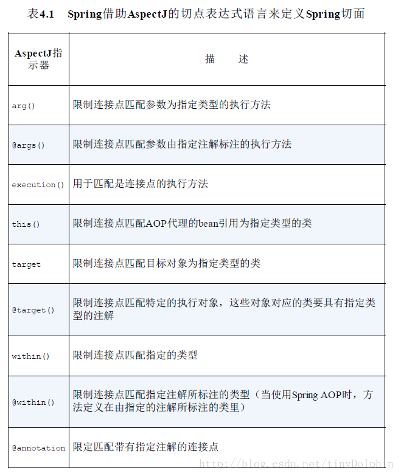
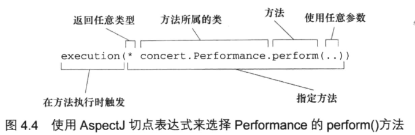

[返回根目录](/README.md)

[返回目录](../README.md)

# 通过切点来选择连接点

**切点**是用于准确定位应该在什么地方应用切面的通知。**通知**是要执行的代码。**通知**和**切点**是切面的最基本元素。



Spring只支持AspectJ的以上指示器，其他指示器不支持，调用将抛出`IllegalArgumentException`异常。

`execution`指示器是实际执行的匹配，而其他指示器都是用来限制匹配的。

## 编写切点

例子：

```
package concert;

public interface Performance{
    public void perform();
}
```

假设我们想编写`Performance`的`perform()`方法出发的通知，以下切点表达式能够设置当`perform()`方法执行时出发通知的调用。



我们可以使用`&&`操作符把`execution()`和`winthin()`指示器连接在一起形成与`（and）`关系\(切点必须匹配所有指示器\)，类似的，我们也可以使用\|\|操作符用来表示或`(or)`关系，而使用`“!”`操作符来标识非`(not)`操作

因为`“&”`在XML中有特殊含义，所以在Spring的XML配置里面描述切点时，我们可以使用`and`代替`“&&”`通用，`or`和 `not`可以分别用来代替`“||”` 和`“!”`

## 

## 在切点中选择bean

Spring引入了一个新的bean\(\)指示器，它允许我们在切点表达式中使用bean的ID来标识bean,bean\(\)使用beanID 或者 bean名称作为参数来限制其切点只匹配特定的bean。

```
//执行Performance的perform方法时应用通知，但限定bean的ID为woodstock
execution(* concert.Performance.perform()) and bean ('woodstock')
```

```
//执行Performance的perform方法时应用通知，但限定bean的ID不能为woodstock
execution(* concert.Performance.perform()) and !bean('woodstock')
```

## **如何处理通知的参数**

```
package concert;

import org.aspectj.lang.annotation.Aspect;
import org.aspectj.lang.annotation.Before;
import org.aspectj.lang.annotation.Pointcut;

import java.util.HashMap;
import java.util.Map;

/**
 * 假设你想记录每个磁道被播放的次数。由于记录磁道的播放次数与播放本身是不同的关注点，因此应该是切面要完成的任务。
 * 使用参数化的通知来记录磁道播放的次数
 */
@Aspect
public class TrackCounter {

    // 记录每个磁道播放次数
    private Map<Integer, Integer> trackCounts = new HashMap<Integer, Integer>();

    // 通知 play() 方法，在切点表达式中声明参数，这个参数传入到通知方法 countTrack() 中
    // args(trackNumber) 表明传递给 play() 方法的 int 类型参数也会传递到通知中（countTrack()方法）去。
    // 参数名称与切点方法签名中的参数相匹配。
    @Pointcut("execution(* soundsystem.CompactDisc.play(int)) && args(trackNumber)")
    public void trackPlayed(int trackNumber) {
    }

    // 在播放之前，为该磁道计数
    // 这个通知方法是通过 @Before 注解和命名切点 trackPlayed(trackNumber) 定义的。
    // 切点定义中的参数与切点方法中的参数名称是一样的，这样就完成了从命名切点到通知方法的参数转移。
    @Before("trackPlayed(trackNumber)")
    public void countTrack(int trackNumber) {
        int currentCount = getPlauCount(trackNumber);
        trackCounts.put(trackNumber, currentCount + 1);
    }

    public int getPlauCount(int trackNumber) {
        return trackCounts.containsKey(trackNumber) ? trackCounts.get(trackNumber) : 0;
    }

}
```

```
package soundsystem;

import concert.TrackCounter;
import org.springframework.context.annotation.Bean;
import org.springframework.context.annotation.Configuration;
import org.springframework.context.annotation.EnableAspectJAutoProxy;

import java.util.ArrayList;
import java.util.List;

/**
 * 在 Spring 配置中将 BlankDisc 和 TrackCounter 定义为 bean，并启用自动代理。
 * 配置 TrackCount 记录每个磁道播放的次数
 */
@Configuration
@EnableAspectJAutoProxy // 启用 AspectJ 自动代理
public class TrackCounterConfig {

    @Bean
    public CompactDisc sgtPeppers(){
        BlankDisc cd = new BlankDisc();
        cd.setTitle("titleValue01");
        cd.setArtist("ArtistValue01");
        List<String> tracks = new ArrayList<String>();
        tracks.add("trackValue01");
        tracks.add("trackValue02");
        tracks.add("trackValue03");
        tracks.add("trackValue04");
        tracks.add("trackValue05");
        cd.setTracks(tracks);
        return cd;
    }

    @Bean
    public TrackCounter trackCounter(){
        return new TrackCounter();
    }

}
```

[返回根目录](/README.md)

[返回目录](../README.md)