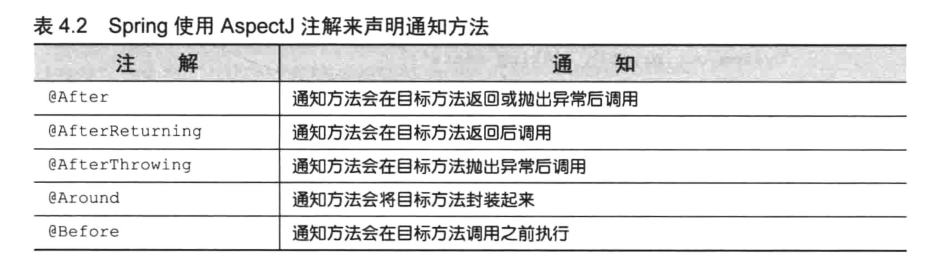
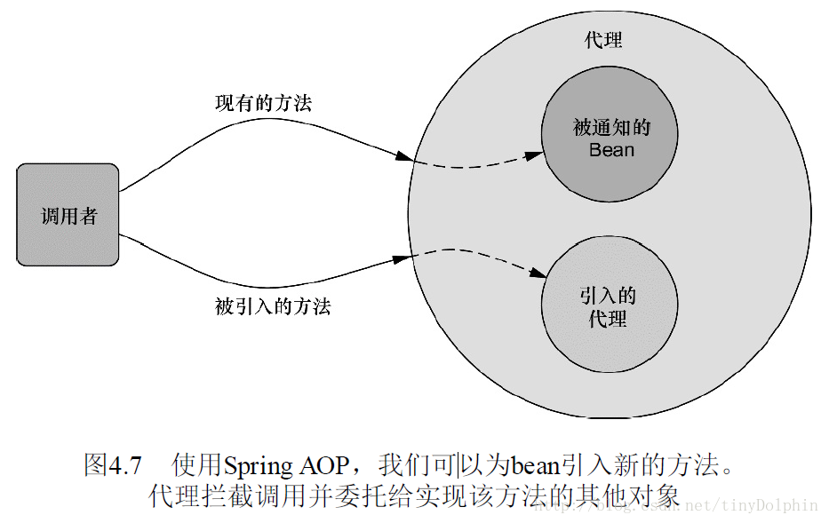

[返回根目录](/README.md)

[返回目录](../README.md)

# 使用注解创建切面



```
package concert;

import org.aspectj.lang.annotation.AfterReturning;
import org.aspectj.lang.annotation.AfterThrowing;
import org.aspectj.lang.annotation.Aspect;
import org.aspectj.lang.annotation.Before;

/**
 * 该类使用 @AspectJ 注解进行了标注。该注解表明该类不仅仅是一个 POJO，还是一个切面。
 * 该类中的方法都使用注解来定义切面的具体行为。
 */
@Aspect
public class Audience {

    //表演之前：将手机调至静音状态
    @Before("execution(**concert.Performance.perform(..))")
    public void silenceCellPhones() {
        System.out.println("Silencing cell phones");
    }

    //表演之前：就座
    @Before("execution(**concert.Performance.perform(..))")
    public void takeSeats() {
        System.out.println("Taking seats");
    }

    //表演之后：精彩的话，观众应该会鼓掌喝彩
    @AfterReturning("execution(**concert.Performance.perform(..))")
    public void applause() {
        System.out.println("CLAP CLAP CLAP!!!");
    }

    //表演失败之后：没有达到观众预期的话，观众会要求退款
    @AfterThrowing("execution(**concert.Performance.perform(..))")
    public void demandRefund() {
        System.out.println("Demanding a refund");
    }

}
```

使用@Pointcut注解能够在一个@AspectJ切面内定义可重用的切点：

通过@Pointcut注解声明频繁使用的切点表达式：

```
package concert;

import org.aspectj.lang.annotation.AfterReturning;
import org.aspectj.lang.annotation.AfterThrowing;
import org.aspectj.lang.annotation.Aspect;
import org.aspectj.lang.annotation.Before;
import org.aspectj.lang.annotation.Pointcut;

/**
 * 简化方案：@Pointcut 注解能够在一个 @AspectJ 切面内定义可重用的切点。
 */
@Aspect
public class Audience {

    //通过在该方法上添加 @Pointcut 注解，我们实际上扩展了切点表达式语言，
    //这样就可以在任何的切点表达式中使用 performance()了。
    //该方法内容并不重要，实际上应该是空的。只是一个标识，供 @Pointcut 注解依附。
    @Pointcut("execution(**concert.Performance.perform(..))")
    public void performance(){}

    //表演之前：将手机调至静音状态
    @Before("performance()")
    public void silenceCellPhones() {
        System.out.println("Silencing cell phones");
    }

    //表演之前：就座
    @Before("performance()")
    public void takeSeats() {
        System.out.println("Taking seats");
    }

    //表演之后：精彩的话，观众应该会鼓掌喝彩
    @AfterReturning("performance()")
    public void applause() {
        System.out.println("CLAP CLAP CLAP!!!");
    }

    //表演失败之后：没有达到观众预期的话，观众会要求退款
    @AfterThrowing("performance()")
    public void demandRefund() {
        System.out.println("Demanding a refund");
    }


}
```

`performance`方法实际内容并不重要，其实该方法本身只是一个标识，供`@Pointcut`注解依附。

除了注解和没有实际操作额`performance`方法，Audience 类依然是个pojo，我们能够将使用其他Java类那样调用它的方法，它的方法能够独立运行单元测试。

将Audience 类声明为Spring中的bean：

```
@Bean
public Audience audience(){
    return new Audience();
}
```

如果Audience 类只是一个Spring容器中的一个bean，即使使用了AspectJ注解，但它并不会被视为切面，这些注解不会解析，也不会创建将其转化为切面的代理。

使用javaConfig启动AspectJ注解的自动代理

```
package concert;

import org.springframework.context.annotation.Bean;
import org.springframework.context.annotation.ComponentScan;
import org.springframework.context.annotation.Configuration;
import org.springframework.context.annotation.EnableAspectJAutoProxy;

/**
 * 如果你使用 JavaConfig 的话，可以在配置类的类级别上通过使用 @EnableAspectJAutoProxy 注解启用自动代理功能。
 */
@Configuration
@EnableAspectJAutoProxy //启用 AspectJ 自动代理
@ComponentScan
public class ConcertConfig {

    @Bean
    public Audience audience(){  // 声明 Audience bean
        return new Audience();
    }
}
```

使用XML文件，通过Spring的aop命名启动AspectJ自动代理

```
<?xml version="1.0" encoding="UTF-8"?>
<beans xmlns="http://www.springframework.org/schema/beans"
       xmlns:xsi="http://www.w3.org/2001/XMLSchema-instance"
       xmlns:context="http://www.springframework.org/schema/context"
       xmlns:aop="http://www.springframework.org/schema/aop"
       xsi:schemaLocation="http://www.springframework.org/schema/beans http://www.springframework.org/schema/beans/spring-beans.xsd http://www.springframework.org/schema/context http://www.springframework.org/schema/context/spring-context.xsd http://www.springframework.org/schema/aop http://www.springframework.org/schema/aop/spring-aop.xsd">

    <context:component-scan base-package="concert"/>

    <!-- 启用 AspectJ 自动代理 -->
    <aop:aspectj-autoproxy/>

    <!-- 声明 Audience bean -->
    <bean class="concert.Audience"/>

</beans>
```

使用上面两种方法中的其中一种，AspectJ自动代理会为使用@Aspect注解的bean创建一个代理，这个代理会围绕着所有的该切面的切点所匹配的bean,在这种情况下，将会为Concert bean 创建一个代理，Audience 类中的通知方法会在perform\(\)调用前后执行。

## **通过注解引入新功能**

Java 不是动态语言，一旦类编译完成了，我们就很难再为该类添加新功能了。但是我们可以使用切面，为对象拥有的方法添加了新功能，而没有为对象添加任何新的方法。实际上，**利用被称为引入的 AOP 概念，切面可以为 Spring bean 添加新的方法**。



注意：当引入接口的方法被调用时，代理会把此调用委托给实现了新接口的某个其他对象。实际上，

**一个 bean 的实现被拆分到了多个类中**。

```
package concert;

/**
 * 为所有的 Performance 实现引入下面的 Encoreable 接口
 *
 * 需要将这个接口应用到 Performance 实现中。
 * 两个问题：不能直接实现 Encoreable 接口，并不是所有的 Performance 都是具有 Encoreable 特性的；
 *           也有可能无法修改所有的 Performance 实现（使用第三方实现并且没有源码时）。
 * 解决方案：借助于 AOP 的引入功能，我可以避免以上两个问题。
 */
public interface Encoreable {
    void performEncore();
}
```

```
package concert;

/**
 * Encoreable 接口的实现类
 */
public class DefaultEncoreable implements Encoreable {
    @Override
    public void performEncore() {

    }
}
```

```
package concert;

import org.aspectj.lang.annotation.Aspect;
import org.aspectj.lang.annotation.DeclareParents;

/**
 * 创建一个切面
 */
@Aspect
public class EncoreableIntroducer {

    // 通过 @DeclareParents 注解，将 Encoreable 接口引入到 Performance bean 中。
    // @DeclareParents 注解由三部分组成：
    // ①、value 属性指定了哪种类型的 bean 要引入该接口。
    //     此处 value 的值，代表所有实现 Performance 的类型。（标记符后面的 "+" 表示是 Performance 的所有子类型，而不是它本身）
    // ②、defaultImpl 属性指定了为引入功能提供实现的类。这里，指定的是 DefaultEncoreable 提供实现。
    // ③、@DeclareParents 注解所标注的静态属性指明了要引入的接口。这里，所引入的是 Encoreable 接口。
    @DeclareParents(value = "concert.Performance+",defaultImpl = DefaultEncoreable.class)
    public static Encoreable encoreable;

}
```

```
   <!-- 将 EncoreableIntroducer 声明为一个 bean -->
    <bean class="concert.EncoreableIntroducer"/>
```

Spring 的**自动代理机制**将会**获取到它的声明**，当 Spring 发现了一个 bean 使用了**@Aspect 注解**时，Spring 就会**创建一个代理**，然后将**调用**委托给**被代理的 bean**或**被引入的实现**，这取决于**调用的方法**属于**被代理的 bean**还是属于**被引入的接口**。**面向注解的切面**声明有一个明显的**劣势**：**你必须能够为通知类添加注解**。为了做到这一点，必须要有源码。如果**没有源码**的话，或者**不想将 AspectJ 注解放到你的代码之中**，我们可以在[**Spring XML 配置文件**](/chapter04/05.md)中声明切面。

[返回根目录](/README.md)

[返回目录](../README.md)