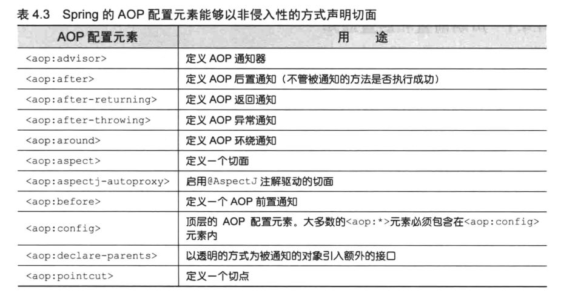

[返回根目录](/README.md)

[返回目录](../README.md)

一般来说，基于注解的配置 &gt; 基于 Java 的配置 &gt; 基于 XML 的配置。

如果你需要**声明切面**，又**不能为通知类添加注解**的时候，那么就**必须转向 XML 配置**了。

Spring 的**aop 命名空间**中，提供了多个元素用来在 XML 中**声明切面**。

将 Audience 类的所有 AspectJ 注解全部移除掉。

```
package concert;

/**
 * 该类已经具备了成为 AOP 通知的所有条件。需要配置一下，就能成功预期的通知了。
 */
public class Audience {

    //表演之前：将手机调至静音状态
    public void silenceCellPhones() {
        System.out.println("Silencing cell phones");
    }

    //表演之前：就座
    public void takeSeats() {
        System.out.println("Taking seats");
    }

    //表演之后：精彩的话，观众应该会鼓掌喝彩
    public void applause() {
        System.out.println("CLAP CLAP CLAP!!!");
    }

    //表演失败之后：没有达到观众预期的话，观众会要求退款
    public void demandRefund() {
        System.out.println("Demanding a refund");
    }

}
```

我们使用 Spring aop 命名空间，将没有注解的 Audience 类转换为切面。

```
<?xml version="1.0" encoding="UTF-8"?>
<beans xmlns="http://www.springframework.org/schema/beans"
       xmlns:xsi="http://www.w3.org/2001/XMLSchema-instance"
       xmlns:context="http://www.springframework.org/schema/context"
       xmlns:aop="http://www.springframework.org/schema/aop"
       xsi:schemaLocation="http://www.springframework.org/schema/beans http://www.springframework.org/schema/beans/spring-beans.xsd http://www.springframework.org/schema/context http://www.springframework.org/schema/context/spring-context.xsd http://www.springframework.org/schema/aop http://www.springframework.org/schema/aop/spring-aop.xsd">

    <!-- 启用 AspectJ 自动代理 -->
    <aop:aspectj-autoproxy/>

    <bean id="audience" class="concert.Audience"/>

    <!-- 大多数的 AOP 配置元素必须在<aop:config> 元素的上下文内使用 -->
    <!-- 在此元素内，我们可以声明一个或多个通知器、切面或者切点 -->
    <aop:config>
        <aop:aspect ref="audience">
            <!-- 表演之前 -->
            <aop:before method="silenceCellPhones" pointcut="execution(**concert.Performance.perform(..))"/>
            <!-- 表演之前 -->
            <aop:before method="takeSeats" pointcut="execution(**concert.Performance.perform(..))"/>
            <!-- 表演之后 -->
            <aop:after-returning method="applause" pointcut="execution(**concert.Performance.perform(..))"/>
            <!-- 表演失败之后 -->
            <aop:after-throwing method="demandRefund" pointcut="execution(**concert.Performance.perform(..))"/>
        </aop:aspect>
    </aop:config>

</beans>
```

可以简化一下，使用**aop:pointcut**元素。

```
<?xml version="1.0" encoding="UTF-8"?>
<beans xmlns="http://www.springframework.org/schema/beans"
       xmlns:xsi="http://www.w3.org/2001/XMLSchema-instance"
       xmlns:context="http://www.springframework.org/schema/context"
       xmlns:aop="http://www.springframework.org/schema/aop"
       xsi:schemaLocation="http://www.springframework.org/schema/beans http://www.springframework.org/schema/beans/spring-beans.xsd http://www.springframework.org/schema/context http://www.springframework.org/schema/context/spring-context.xsd http://www.springframework.org/schema/aop http://www.springframework.org/schema/aop/spring-aop.xsd">

    <!-- 启用 AspectJ 自动代理 -->
    <aop:aspectj-autoproxy/>

    <bean id="audience" class="concert.Audience"/>

    <!-- 使用 <aop:pointcut> 定义命名切点 -->
    <aop:config>
        <aop:aspect ref="audience">
            <!-- 如果想让定义的切点能够在多个切面使用，我们可以把 <aop:pointcut> 元素放在 <aop:config> 元素的范围内 -->
            <aop:pointcut id="performance" expression="execution(**concert.Performance.perform(..))"/>
            <!-- 表演之前 -->
            <aop:before method="silenceCellPhones" pointcut-ref="performance"/>
            <!-- 表演之前 -->
            <aop:before method="takeSeats" pointcut-ref="performance"/>
            <!-- 表演之后 -->
            <aop:after-returning method="applause" pointcut-ref="performance"/>
            <!-- 表演失败之后 -->
            <aop:after-throwing method="demandRefund" pointcut-ref="performance"/>
        </aop:aspect>
    </aop:config>

</beans>
```

#### **声明环绕通知** {#q怎么声明环绕通知}

代码：

```
package concert;

import org.aspectj.lang.ProceedingJoinPoint;

public class Audience {

    public void watchPerformance(ProceedingJoinPoint joinPoint){
        try {
            System.out.println("Silencing cell phones");
            System.out.println("Taking seats");
            joinPoint.proceed();
            System.out.println("CLAP CLAP CLAP!!!");
        } catch (Throwable throwable) {
            System.out.println("Demanding a refund");
        }
    }

}
```

```
<?xml version="1.0" encoding="UTF-8"?>
<beans xmlns="http://www.springframework.org/schema/beans"
       xmlns:xsi="http://www.w3.org/2001/XMLSchema-instance"
       xmlns:context="http://www.springframework.org/schema/context"
       xmlns:aop="http://www.springframework.org/schema/aop"
       xsi:schemaLocation="http://www.springframework.org/schema/beans http://www.springframework.org/schema/beans/spring-beans.xsd http://www.springframework.org/schema/context http://www.springframework.org/schema/context/spring-context.xsd http://www.springframework.org/schema/aop http://www.springframework.org/schema/aop/spring-aop.xsd">

    <!-- 启用 AspectJ 自动代理 -->
    <aop:aspectj-autoproxy/>

    <bean id="audience" class="concert.Audience"/>

    <aop:config>
        <aop:aspect ref="audience">
            <aop:pointcut id="performance" expression="execution(**concert.Performance.perform(..))"/>
            <!-- 声明环绕通知 --> 
            <aop:around method="watchPerformance" pointcut-ref="performance"/>
        </aop:aspect>
    </aop:config>

</beans>
```


#### **为通知创建参数** {#q怎么为通知创建参数}

例子：

我们移除掉 TrackCounter 上所有的 @AspectJ 注解

```
package soundsystem;

import java.util.HashMap;
import java.util.Map;

public class TrackCounter {

    private Map<Integer, Integer> trackCounts = new HashMap<Integer, Integer>();

    public void countTrack(int trackNumber) {
        int currentCount = getPlauCount(trackNumber);
        trackCounts.put(trackNumber, currentCount + 1);
    }

    public int getPlauCount(int trackNumber) {
        return trackCounts.containsKey(trackNumber) ? trackCounts.get(trackNumber) : 0;
    }

}
```

借助一点 Spring XML 配置，我们能够让 TrackCounter 重新变为切面。

```
<?xml version="1.0" encoding="UTF-8"?>
<beans xmlns="http://www.springframework.org/schema/beans"
       xmlns:xsi="http://www.w3.org/2001/XMLSchema-instance"
       xmlns:aop="http://www.springframework.org/schema/aop"
       xsi:schemaLocation="http://www.springframework.org/schema/beans http://www.springframework.org/schema/beans/spring-beans.xsd
       http://www.springframework.org/schema/aop http://www.springframework.org/schema/aop/spring-aop.xsd">

    <bean id="trackCounter" class="soundsystem.TrackCounter"/>

    <bean id="cd" class="soundsystem.BlankDisc">
        <property name="title" value="titleValue01"/>
        <property name="artist" value="artistValue01"/>
        <property name="tracks">
            <list>
                <value>tracksValue01</value>
                <value>tracksValue02</value>
                <value>tracksValue03</value>
                <value>tracksValue04</value>
            </list>
        </property>
    </bean>

    <aop:config>
        <aop:aspect ref="trackCounter">
            <aop:pointcut id="trackPlayed"
                          expression="execution(**soundsystem.CompactDisc.play(int)) and args(trackNumber)"/>
            <aop:before method="countTrack" pointcut-ref="trackPlayed"/>
        </aop:aspect>
    </aop:config>

</beans>
```

使用 Spring aop 命名空间的 aop:declare-parents 元素**引入新的功能**

```
 <bean id="encoreableDelegate" class="concert.DefaultEncoreable"/>

    <aop:config>
        <aop:aspect>
            <!--
                声明了此切面所通知的 bean 要在它的对象层次结构中拥有新的父类型
                本例中，类型匹配 Performance 接口（由 types-matching 属性指定）的那些 bean 在父类结构中会增加 Encoreable 接口（由 implement-interface 属性指定）
                两种方式标识所引入接口的实现。本例中，我们①、使用 default-impl 属性用全限定类名来显示指定 Encoreable 的实现。
                ②、或者还可以使用 delegate-ref 属性来标识
             -->
            <!--<aop:declare-parents types-matching="concert.Performance" implement-interface="concert.Encoreable"
                                 default-impl="concert.DefaultEncoreable"/>-->

            <!-- delegate-ref 属性引用了一个 Spring bean 作为引入的委托 -->
            <aop:declare-parents types-matching="concert.Performance" implement-interface="concert.Encoreable"
                                 delegate-ref="encoreableDelegate"/>
        </aop:aspect>
    </aop:config>
```

使用**default-impl 来直接标识委托**和**间接使用 delegate-ref**的区别在于**后者是 Spring bean**，它本身可以**被注入**、**通知**或**使用其他的 Spring 配置**。

[返回根目录](/README.md)

[返回目录](../README.md)