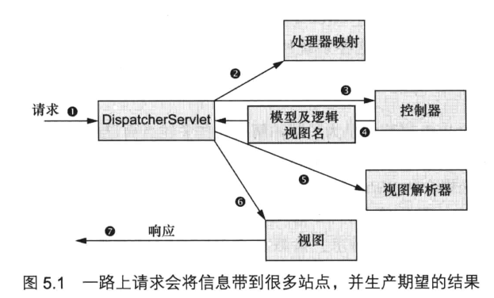

[返回根目录](/README.md)

[返回目录](../README.md)

# 跟踪SpringMVC的请求 {#title}

* 请求到达**DispatcherServlet\(**前端控制器**\)**，收发过来的请求，交给HandlerMapping处理器映射器
* **HandlerMapping**（处理器映射器），根据请求路径找到相应的**HandlerAdapter**（处理器适配器），（处理器适配器就是那些拦截器或Controller）

* **HandlerAdapter**（处理器适配器），处理一些功能请求，返回一个**ModelAndView**对象（包括模型数据、逻辑视图名）

* **ViewResolver**（视图解析器），先根据**ModelAndView**中设置的View解析具体视图

* 然后再将Model模型中的数据渲染到**View**上

[返回根目录](/README.md)

[返回目录](../README.md)