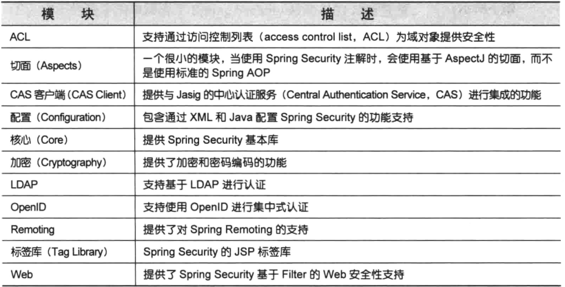

[返回根目录](/README.md)

[返回目录](../README.md)

## SpringSecurity简介

## 理解SpringSecurity的模块

SpringSecurity3.2分为11个模块：

应用程序的类路径下至少要包含Core和Configuration这两个模块，SpringSecurity经常被用于保护Web应用。

## 过滤Web请求

配置Web.xml中的Servlet和Filter

[返回根目录](/README.md)

[返回目录](../README.md)

