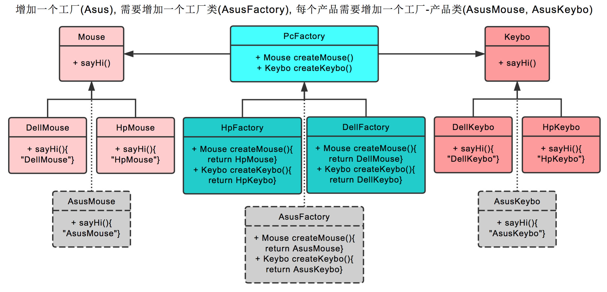

# 抽象工厂模式

## 定义

> 提供一个创建一些列相关或相互依赖对象的接口，而无需指定它们具体的类

## 实例

[参考](http://www.runoob.com/design-pattern/abstract-factory-pattern.html)

抽象工厂模式也就是不仅生产鼠标，同时生产键盘。也就是 PC 厂商是个父类，有生产鼠标，生产键盘两个接口。

戴尔工厂，惠普工厂继承它，可以分别生产戴尔鼠标+戴尔键盘，和惠普鼠标+惠普键盘。

创建工厂时，由戴尔工厂创建。后续工厂.生产鼠标()则生产戴尔鼠标，工厂.生产键盘()则生产戴尔键盘。

## UML

## 新增一个工厂

在抽象工厂模式中，假设我们需要增加一个工厂 

假设我们增加华硕工厂，则我们需要增加华硕工厂，和戴尔工厂一样，继承 PC 厂商。之后创建华硕鼠标，继承鼠标类。创建华硕键盘，继承键盘类即可。

### UML

## 增加一个产品 

假设我们增加耳麦这个产品，则首先我们需要增加耳麦这个父类，再加上戴尔耳麦，惠普耳麦这两个子类。

之后在PC厂商这个父类中，增加生产耳麦的接口。最后在戴尔工厂，惠普工厂这两个类中，分别实现生产戴尔耳麦，惠普耳麦的功能。 以上。

## UML

**优点**：当一个产品族中的多个对象被设计成一起工作时，它能保证客户端始终只使用同一个产品族中的对象。

**缺点**：产品族扩展非常困难，要增加一个系列的某一产品，既要在抽象的 Creator 里加代码，又要在具体的里面加代码

抽象工厂并不符合开闭原则,但是拓展性特别强,强调一系列相关的产品对象(属于同一产品族)一起使用创建对象需要大量的重复代码

提供一个产品类的库,所有的产品以同样的接口出现,从而使客户端不依赖于具体实现