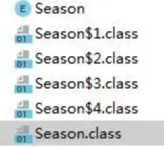

# 枚举单例原理

- [枚举的使用](#枚举的使用)

- [枚举的原理](#枚举的原理)
- [枚举单例的原理](#枚举单例的原理)

## 枚举的使用

JDK 层面就不允许枚举通过反射调用构造器,所以就没有反射攻击风险

这种实现方式还没有被广泛采用，但这是实现单例模式的最佳方法。

- 它更简洁，自动支持序列化机制，绝对防止多次实例化。 
- 这种方式是 Effective Java 作者 Josh Bloch 提倡的方式，它不仅能避免多线程同步问题，而且还自动支持序列化机制，防止反序列化重新创建新的对象，绝对防止多次实例化。
- 不过，由于 JDK1.5 之后才加入 enum 特性，用这种方式写不免让人感觉生疏，在实际工作中，也很少用。 不能通过 reflection attack 来调用私有构造方法。 

```java
public enum Singleton {  
    INSTANCE;  
    private Singleton() {}
}
```

[例子参考](https://blog.csdn.net/gavin_dyson/article/details/70832185)

```java
public enum DataSourceEnum {
    DATASOURCE;
    private DBConnection connection = null;
    private DataSourceEnum() {
        connection = new DBConnection();
    }
    public DBConnection getConnection() {
        return connection;
    }
}  
```

```java
public class Main {
    public static void main(String[] args) {
        DBConnection con1 = DataSourceEnum.DATASOURCE.getConnection();
        DBConnection con2 = DataSourceEnum.DATASOURCE.getConnection();
        System.out.println(con1 == con2);
    }
}
```

```java
/**
 * 枚举方式单例
 *
 * @author EricChen 2019/12/31 23:58
 */
public enum EnumSingleton {
    INSTANCE;
    private Singleton SINGLETON_INSTANCE = new Singleton();

    public Singleton getInstance() {
        return SINGLETON_INSTANCE;
    }
}

```

输出结果为：**true**  结果表明两次获取返回了相同的实例。 

#### 定义一个枚举注意事项

- 一定要把枚举变量的定义放在第一行，并且以分号结尾
- 构造函数必须私有化，但也不是一定要写private，事实上枚举的构造函数默认并强制为private，写public是无法通过编译的。
- ordinal 还是按照它的规则给每个枚举变量按次序赋值，自定义变量与默认的 ordinal 属性并不冲突。

## 枚举的原理

> https://mp.weixin.qq.com/s/U5FkL9zyzr0PkAp8MJJ8BQ

#### 定义一个枚举

```java
public enum Season {
    SPRING() {
        @Override
        public Season getNextSeason() {
            return SUMMER;
        }
    }, SUMMER() {
        @Override
        public Season getNextSeason() {
            return AUTUMN;
        }
    }, AUTUMN() {
        @Override
        public Season getNextSeason() {
            return WINTER;
        }
    }, WINTER() {
        @Override
        public Season getNextSeason() {
            return SPRING;
        }
    };
  
	  //声明了一个抽象方法
    public abstract Season getNextSeason();
}
```

反编译之后，我们可以看到：

```
>javap Season.class
Compiled from "Season.java"
public abstract class Season extends java.lang.Enum<Season> {
  public static final Season SPRING;
  public static final Season SUMMER;
  public static final Season AUTUMN;
  public static final Season WINTER;
  public static Season[] values();
  public static Season valueOf(java.lang.String);
  public abstract Season getNextSeason();
  Season(java.lang.String, int, Season$1);
  static {};
}
```

经过编译器编译之后，**Season是一个继承了Enum类的抽象类**，而且枚举中定义的**枚举变量变成了相应的public static final属性**，**其类型为抽象类Season类型**，名字就是枚举变量的名字。

同时我们可以看到，Season.class的相同路径下看到四个内部类的.class文件：



也就是说，**这四个枚举常量分别使用了内部类来实现**。

同时还**添加了两个方法values()和valueOf(String s)**。我们使用的是默认的无参构造函数，但**现在的构造函数有两个参数**。还**生成了一个静态代码块**。下面我们来详细看下是怎么回事儿：

```java
>javap -c -v Season.class
Classfile /E:/Intellij IDEA/project/JVMTest/src/Season.class
  Last modified 2020-5-6; size 1114 bytes
  MD5 checksum 5fb619a1f14495913ba7820312371ded
  Compiled from "Season.java"
public abstract class Season extends java.lang.Enum<Season>
  minor version: 0
  major version: 52
  flags: ACC_PUBLIC, ACC_SUPER, ACC_ABSTRACT, ACC_ENUM
Constant pool:
   #1 = Methodref          #5.#50         // Season."<init>":(Ljava/lang/String;
I)V
   #2 = Fieldref           #5.#51         // Season.$VALUES:[LSeason;
   #3 = Methodref          #52.#53        // "[LSeason;".clone:()Ljava/lang/Obje
ct;
   #4 = Class              #32            // "[LSeason;"
   #5 = Class              #54            // Season
   #6 = Methodref          #24.#55        // java/lang/Enum.valueOf:(Ljava/lang/
Class;Ljava/lang/String;)Ljava/lang/Enum;
   #7 = Methodref          #24.#50        // java/lang/Enum."<init>":(Ljava/lang
/String;I)V
   #8 = Class              #56            // Season$1
   #9 = String             #26            // SPRING
  #10 = Methodref          #8.#50         // Season$1."<init>":(Ljava/lang/Strin
g;I)V
  #11 = Fieldref           #5.#57         // Season.SPRING:LSeason;
  #12 = Class              #58            // Season$2
  #13 = String             #28            // SUMMER
  #14 = Methodref          #12.#50        // Season$2."<init>":(Ljava/lang/Strin
g;I)V
  #15 = Fieldref           #5.#59         // Season.SUMMER:LSeason;
  #16 = Class              #60            // Season$3
  #17 = String             #29            // AUTUMN
  #18 = Methodref          #16.#50        // Season$3."<init>":(Ljava/lang/Strin
g;I)V
  #19 = Fieldref           #5.#61         // Season.AUTUMN:LSeason;
  #20 = Class              #62            // Season$4
  #21 = String             #30            // WINTER
  #22 = Methodref          #20.#50        // Season$4."<init>":(Ljava/lang/Strin
g;I)V
  #23 = Fieldref           #5.#63         // Season.WINTER:LSeason;
  #24 = Class              #64            // java/lang/Enum
  #25 = Utf8               InnerClasses
  #26 = Utf8               SPRING
  #27 = Utf8               LSeason;
  #28 = Utf8               SUMMER
  #29 = Utf8               AUTUMN
  #30 = Utf8               WINTER
  #31 = Utf8               $VALUES
  #32 = Utf8               [LSeason;
  #33 = Utf8               values
  #34 = Utf8               ()[LSeason;
  #35 = Utf8               Code
  #36 = Utf8               LineNumberTable
  #37 = Utf8               valueOf
  #38 = Utf8               (Ljava/lang/String;)LSeason;
  #39 = Utf8               <init>
  #40 = Utf8               (Ljava/lang/String;I)V
  #41 = Utf8               Signature
  #42 = Utf8               ()V
  #43 = Utf8               getNextSeason
  #44 = Utf8               ()LSeason;
  #45 = Utf8               (Ljava/lang/String;ILSeason$1;)V
  #46 = Utf8               <clinit>
  #47 = Utf8               Ljava/lang/Enum<LSeason;>;
  #48 = Utf8               SourceFile
  #49 = Utf8               Season.java
  #50 = NameAndType        #39:#40        // "<init>":(Ljava/lang/String;I)V
  #51 = NameAndType        #31:#32        // $VALUES:[LSeason;
  #52 = Class              #32            // "[LSeason;"
  #53 = NameAndType        #65:#66        // clone:()Ljava/lang/Object;
  #54 = Utf8               Season
  #55 = NameAndType        #37:#67        // valueOf:(Ljava/lang/Class;Ljava/lan
g/String;)Ljava/lang/Enum;
  #56 = Utf8               Season$1
  #57 = NameAndType        #26:#27        // SPRING:LSeason;
  #58 = Utf8               Season$2
  #59 = NameAndType        #28:#27        // SUMMER:LSeason;
  #60 = Utf8               Season$3
  #61 = NameAndType        #29:#27        // AUTUMN:LSeason;
  #62 = Utf8               Season$4
  #63 = NameAndType        #30:#27        // WINTER:LSeason;
  #64 = Utf8               java/lang/Enum
  #65 = Utf8               clone
  #66 = Utf8               ()Ljava/lang/Object;
  #67 = Utf8               (Ljava/lang/Class;Ljava/lang/String;)Ljava/lang/Enum;

{
  public static final Season SPRING;
    descriptor: LSeason;
    flags: ACC_PUBLIC, ACC_STATIC, ACC_FINAL, ACC_ENUM

  public static final Season SUMMER;
    descriptor: LSeason;
    flags: ACC_PUBLIC, ACC_STATIC, ACC_FINAL, ACC_ENUM

  public static final Season AUTUMN;
    descriptor: LSeason;
    flags: ACC_PUBLIC, ACC_STATIC, ACC_FINAL, ACC_ENUM

  public static final Season WINTER;
    descriptor: LSeason;
    flags: ACC_PUBLIC, ACC_STATIC, ACC_FINAL, ACC_ENUM

  public static Season[] values();
    descriptor: ()[LSeason;
    flags: ACC_PUBLIC, ACC_STATIC
    Code:
      stack=1, locals=0, args_size=0
         0: getstatic     #2                  // Field $VALUES:[LSeason;
         3: invokevirtual #3                  // Method "[LSeason;".clone:()Ljav
a/lang/Object;
         6: checkcast     #4                  // class "[LSeason;"
         9: areturn
      LineNumberTable:
        line 7: 0

  public static Season valueOf(java.lang.String);
    descriptor: (Ljava/lang/String;)LSeason;
    flags: ACC_PUBLIC, ACC_STATIC
    Code:
      stack=2, locals=1, args_size=1
         0: ldc           #5                  // class Season
         2: aload_0
         3: invokestatic  #6                  // Method java/lang/Enum.valueOf:(
Ljava/lang/Class;Ljava/lang/String;)Ljava/lang/Enum;
         6: checkcast     #5                  // class Season
         9: areturn
      LineNumberTable:
        line 7: 0

  public abstract Season getNextSeason();
    descriptor: ()LSeason;
    flags: ACC_PUBLIC, ACC_ABSTRACT

  Season(java.lang.String, int, Season$1);
    descriptor: (Ljava/lang/String;ILSeason$1;)V
    flags: ACC_SYNTHETIC
    Code:
      stack=3, locals=4, args_size=4
         0: aload_0
         1: aload_1
         2: iload_2
         3: invokespecial #1                  // Method "<init>":(Ljava/lang/Str
ing;I)V
         6: return
      LineNumberTable:
        line 7: 0

  static {};
    descriptor: ()V
    flags: ACC_STATIC
    Code:
      stack=4, locals=0, args_size=0
         0: new           #8                  // class Season$1
         3: dup
         4: ldc           #9                  // String SPRING
         6: iconst_0
         7: invokespecial #10                 // Method Season$1."<init>":(Ljava/lang/String;I)V
        10: putstatic     #11                 // Field SPRING:LSeason;
        13: new           #12                 // class Season$2
        16: dup
        17: ldc           #13                 // String SUMMER
        19: iconst_1
        20: invokespecial #14                 // Method Season$2."<init>":(Ljava/lang/String;I)V
        23: putstatic     #15                 // Field SUMMER:LSeason;
        26: new           #16                 // class Season$3
        29: dup
        30: ldc           #17                 // String AUTUMN
        32: iconst_2
        33: invokespecial #18                 // Method Season$3."<init>":(Ljava/lang/String;I)V
        36: putstatic     #19                 // Field AUTUMN:LSeason;
        39: new           #20                 // class Season$4
        42: dup
        43: ldc           #21                 // String WINTER
        45: iconst_3
        46: invokespecial #22                 // Method Season$4."<init>":(Ljava/lang/String;I)V
        49: putstatic     #23                 // Field WINTER:LSeason;
        52: iconst_4
        53: anewarray     #5                  // class Season
        56: dup
        57: iconst_0
        58: getstatic     #11                 // Field SPRING:LSeason;
        61: aastore
        62: dup
        63: iconst_1
        64: getstatic     #15                 // Field SUMMER:LSeason;
        67: aastore
        68: dup
        69: iconst_2
        70: getstatic     #19                 // Field AUTUMN:LSeason;
        73: aastore
        74: dup
        75: iconst_3
        76: getstatic     #23                 // Field WINTER:LSeason;
        79: aastore
        80: putstatic     #2                  // Field $VALUES:[LSeason;
        83: return
      LineNumberTable:
        line 8: 0
        line 13: 13
        line 18: 26
        line 23: 39
        line 7: 52
}
Signature: #47                          // Ljava/lang/Enum<LSeason;>;
SourceFile: "Season.java"
InnerClasses:
     static #20; //class Season$4
     static #16; //class Season$3
     static #12; //class Season$2
     static #8; //class Season$1
```

#### 静态代码块

```java
static {};
    descriptor: ()V
    flags: ACC_STATIC
    Code:
      stack=4, locals=0, args_size=0
      //创建一个Season$1的内部类对象
         0: new           #8                  // class Season$1
         3: dup
         //接下来的两条指令，是将两个参数推送到栈顶，调用Season$1的编译器生成的<init>方法
         4: ldc           #9                  // String SPRING
         6: iconst_0
         //调用Season$1的<init>方法
         7: invokespecial #10                 // Method Season$1."<init>":(Ljava/lang/String;I)V
  //设置SPRING属性的值为新创建的对象
        10: putstatic     #11                 // Field SPRING:LSeason;
        //接下来说是分别初始化另外三个属性SUMMER、AUTUMU、WINTER，此处就不赘述了
        13: new           #12                 // class Season$2
        16: dup
        17: ldc           #13                 // String SUMMER
        19: iconst_1
        20: invokespecial #14                 // Method Season$2."<init>":(Ljava/lang/String;I)V
        23: putstatic     #15                 // Field SUMMER:LSeason;
        26: new           #16                 // class Season$3
        29: dup
        30: ldc           #17                 // String AUTUMN
        32: iconst_2
        33: invokespecial #18                 // Method Season$3."<init>":(Ljava/lang/String;I)V
        36: putstatic     #19                 // Field AUTUMN:LSeason;
        39: new           #20                 // class Season$4
        42: dup
        43: ldc           #21                 // String WINTER
        45: iconst_3
        46: invokespecial #22                 // Method Season$4."<init>":(Ljava/lang/String;I)V
        49: putstatic     #23                 // Field WINTER:LSeason;
        52: iconst_4
        53: anewarray     #5                  // class Season
        56: dup
        57: iconst_0
        58: getstatic     #11                 // Field SPRING:LSeason;
        61: aastore
        62: dup
        63: iconst_1
        64: getstatic     #15                 // Field SUMMER:LSeason;
        67: aastore
        68: dup
        69: iconst_2
        70: getstatic     #19                 // Field AUTUMN:LSeason;
        73: aastore
        74: dup
        75: iconst_3
        76: getstatic     #23                 // Field WINTER:LSeason;
        79: aastore
        //将刚创建的数组设置为属性$VALUES的值
        80: putstatic     #2                  // Field $VALUES:[LSeason;
        83: return
```

静态代码块部分做的工作，就是分别设置生成的四个公共静态常量字段的值，同时编译器还生成一个静态字段$VALUES，保存的是枚举类型定义的所有枚举常量。相当于以下代码：

```java
Season SPRING = new Season1();
Season SUMMER = new Season2();
Season AUTUMN = new Season3();
Season WINTER = new Season4();
Season[] $VALUES = new Season[4];
$VALUES[0] = SPRING;
$VALUES[1] = SUMMER;
$VALUES[2] = AUTUMN;
$VALUES[3] = WINTER;
```

### values()方法

接下来我们来看看编译器为我们生成的values()方法：

```
  public static Season[] values();
    descriptor: ()[LSeason;
    flags: ACC_PUBLIC, ACC_STATIC
    Code:
      stack=1, locals=0, args_size=0
         0: getstatic     #2                  // Field $VALUES:[LSeason;
         3: invokevirtual #3                  // Method "[LSeason;".clone:()Ljav
a/lang/Object;
         6: checkcast     #4                  // class "[LSeason;"
         9: areturn
```

values()方法是一个公共的静态方法，所以我们可以直接调用该方法，返回枚举的数组。而这个方法实现的是，将静态代码块中初始化的$VALUES字段的值克隆出来，并且强制转换成Season[]类型返回，就相当于以下代码：

```java
public static Season[] values(){
 return (Season[])$VALUES.clone();
}
```

#### valueOf()方法

接下来我们来看另一个由编译器生成的valueOf()方法：

```
  public static Season valueOf(java.lang.String);
    descriptor: (Ljava/lang/String;)LSeason;
    flags: ACC_PUBLIC, ACC_STATIC
    Code:
      stack=2, locals=1, args_size=1
         0: ldc           #5                  // class Season
         2: aload_0
         3: invokestatic  #6                  // Method java/lang/Enum.valueOf:(
Ljava/lang/Class;Ljava/lang/String;)Ljava/lang/Enum;
         6: checkcast     #5                  // class Season
         9: areturn
```

valueOf()也是一个公共的静态方法，所以可以直接调用这个方法并返回参数字符串表示的枚举变量，另外，这个方法的实现是调用Enum.valueOf()方法，并把类型强制转换为Season，它相当于如下的代码：

```
public static Season valueOf(String s){
 return (Season)Enum.valueOf(Season.class, s);
}
```

## 内部类

我们以Season$1为例：

```
>javap Season$1.class
Compiled from "Season.java"
final class Season$1 extends Season {
  Season$1(java.lang.String, int);
  public Season getNextSeason();
}
```

可以看到，Season1 继承自 Season , 是 Season 的子类, 但是为什么 Season1 的构造函数有两个入参呢？

关于这个问题，我们还是得从Season的父类Enum说起。

```java
public abstract class Enum<E extends Enum<E>>
        implements Comparable<E>, Serializable {

    private final String name;

    public final String name() {
        return name;
    }

    private final int ordinal;

    public final int ordinal() {
        return ordinal;
    }

    protected Enum(String name, int ordinal) {
        this.name = name;
        this.ordinal = ordinal;
    }
    ......
}
```

从Enum中我们可以看到，每个枚举都定义了两个属性，name和ordinal，name表示枚举变量的名称，而ordinal则是根据变量定义的顺序授予的整型值，从0开始。

**在枚举变量初始化的时候，会自动初始化这两个字段，设置相应的值**，所以会在Season()的构造方法中添加两个参数。

而且我们可以从Enum的源码中看到，大部分的方法都是final修饰的，特别是**clone、readObject、writeObject**这三个方法，**保证了枚举类型的不可变性**，不能通过克隆、序列化和反序列化复制枚举，这就保证了枚举变量只是一个实例，即是单例的。

总结一下，其实**枚举本质上也是通过普通的类来实现的**，只是编译器为我们进行了处理。每个枚举类型都继承自**Enum**类，并由**编译器自动添加了values()和valueOf()方法**，**每个枚举变量是一个静态常量字段，由内部类实现**，而这个内部类继承了此枚举类。

**所有的枚举变量都是通过静态代码块进行初始化**，也就是说在类加载期间就实现了。

另外，**通过把clone、readObject、writeObject这三个方法定义为final，保证了每个枚举类型及枚举常量都是不可变的**，也就是说，可以用枚举实现线程安全的单例。

### 枚举单例的原理

枚举类实现单例模式相当硬核，因为枚举类型是线程安全的，且只会装载一次。使用枚举类来实现单例模式，是所有的单例实现中唯一一种不会被破坏的单例模式实现。

通过

- clone

  > ```java
  > protected final Object clone() throws CloneNotSupportedException {
  >     throw new CloneNotSupportedException();
  > }
  > ```

- readObject

  > ```java
  > private void readObject(ObjectInputStream in) throws IOException,
  >     ClassNotFoundException {
  >     throw new InvalidObjectException("can't deserialize enum");
  > }
  > ```

- writeObject

  > ```java
  > private void readObjectNoData() throws ObjectStreamException {
  >     throw new InvalidObjectException("can't deserialize enum");
  > }
  > ```

这三个方法定义为final，保证了每个枚举类型及枚举常量都是不可变的，也就是说，可以用枚举实现线程安全的单例。

```java
public class SingletonObject {

    private SingletonObject() {
    }

    private enum Singleton {
        INSTANCE;

        private final SingletonObject instance;

        Singleton() {
            instance = new SingletonObject();
        }

        private SingletonObject getInstance() {
            return instance;
        }
    }

    public static SingletonObject getInstance() {
        return Singleton.INSTANCE.getInstance();
    }
}
```

