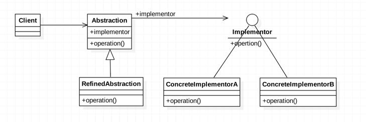
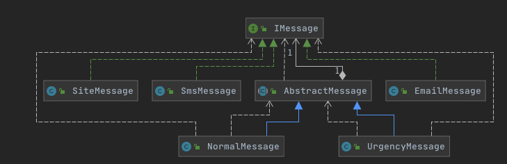
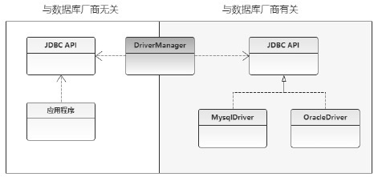

# 桥接模式（Bridge Pattern）

[TOC]

## 简介

**桥接模式**：通过定义一个抽象和实现之间的桥接者来达到解耦的目的 ，将抽象和其实现解耦，使二者可以根据需求独立化

一个抽象类，聚合一个接口实现类

- 桥接模式的主要目的是通过组合的方式建立两个类的关系,而不是继承,但是又类似于多重继承的方案

- 但是多重继承的方案往往违背了类的单一职责原则,复用性差
- 桥接模式是比多重继承方案更好的替代方案
- 桥接模式的核心在于将抽象与实现解耦

## UML



## 角色：

**抽象类**（Abstraction）：它是用于定义抽象类的接口，通常是抽象类而不是接口，其中定义了一个Implementor（实现类接口）类型的对象。

**扩充抽象类**（RefinedAbstraction）：它扩充由Abstraction定义的接口，通常情况下不再是抽象类而是具体类，实现了在Abstraction中声明的抽象业务方法，在RefinedAbstraction中可以调用在Implementor中定义的业务方法。

**实现类接口**：（Implementor）：定义实现类的接口，这个接口可以与Abstraction的接口不同。一般而言，Implementor接口仅提供基本操作，而Abstraction定义的接口可能可以会做更加复杂的操作。

**具体实现类**：（ConcreteImplemetor）：具体操作

## 通用写法

#### 实现类接口

```java
public interface Implementor {
   public void operation();
}
```

#### 具体实现类A

```java
public class ConcreateImplementorA implements Implementor {
     @Override
     public void operation() {
         System.out.println("this is concreteImplementorA's operation...");
     }
 }
```

#### 具体实现类B

```java
public class ConcreateImplementorB implements Implementor {
     @Override
     public void operation() {
         System.out.println("this is concreteImplementorB's operation...");
     }
}
```

#### 抽象类

可以看到抽象类里面引用了实现接口

```java
public abstract class Abstraction {
     private Implementor implementor;
 
     public Implementor getImplementor() {
         return implementor;
     }
 
     public void setImplementor(Implementor implementor) {
         this.implementor = implementor;
     }
 
     protected void operation(){
         implementor.operation();
     }
 }
```

### 抽象修正类

实际上通过重写父类的方法,父类的实现算是一种兜底

```java
public class RefinedAbstraction extends Abstraction {
     @Override
     protected void operation() {
           super.getImplementor().operation();
     }
}
```

```java
public class BridgeTest {
    public static void main(String[] args) {
         Abstraction abstraction = new RefinedAbstraction();
 
         //调用第一个实现类
         abstraction.setImplementor(new ConcreateImplementorA());
         abstraction.operation();
 
         //调用第二个实现类
         abstraction.setImplementor(new ConcreateImplementorB());
         abstraction.operation();
 
     }
 }
```

## 使用桥接模式设计消息复杂系统




```java
public interface IMessage {

    void send(String message, String address);
}
```

```java
public class EmailMessage implements IMessage {

    @Override
    public void send(String message, String address) {
        System.out.println("发送邮件Message");
    }
}
public class SmsMessage implements IMessage {

    @Override
    public void send(String message, String address) {
        System.out.println("发送短信");
    }
}

```

```java
public abstract class AbstractMessage {

    IMessage message;

    public AbstractMessage(IMessage message) {
        this.message = message;
    }

    public void sendMessage(String message, String user) {
        //这里有点像代理模式,差距是这里是抽象类
        this.message.send(message, user);
    }
}

```

```java
public class UrgencyMessage extends AbstractMessage {

    public UrgencyMessage(IMessage message) {
        super(message);
    }

    public void send(String message, String address) {
        System.out.println("加急");
        this.message.send(message, address);
    }
}
```

## JDBC中的桥接



一个抽象类 DriverManager 作为桥接器，注入不同的驱动器，以实现对不同类型的数据库中实现驱动的切换和数据库SQL语句的执行

我们常用的JDBC 和 **DriverManager** 就使用了桥接模式，JDBC在连接数据库时， 在各个数据库之间进行切换而不需要修改代码，因为JDBC 已经提供了提供了统一的接口，每个数据库都提供了各自的实现，通过一个叫做 **数据库驱动** 的程序来桥接即可

## 优点

- 分离抽象接口以及其他实现部分。
- 桥接模式可以取代多层继承的方案
- 桥接模式提高了系统的可拓展性。

## 缺点

- 桥接模式的引入增加了系统的理解和设计难度，由于聚合关联关系建立在抽象层，要求开发者针对抽象进行设计和编程。
- 桥接模式要求正确识别出系统中两个独立变化的维度，因此其使用范围有一定的局限性。