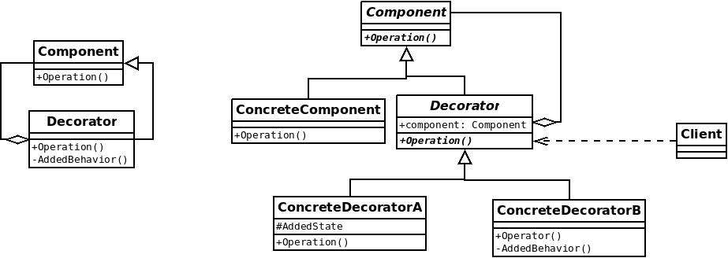
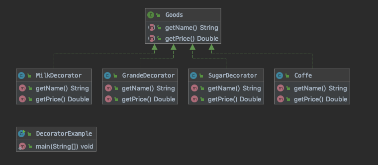

# 装饰模式(Decorator Pattern)

> 装饰模式：动态地给一个对象增加一些额外的职责，就拓展而言，装饰模式提供了一种比使用子类更加灵活的替代方案。

特点，装饰器和被装饰类拥有共同抽象父类。


## UML


## 角色

**Component(抽象构件)**：它是具体构建和抽象装饰类的共同父类，声明了在具体构建中实现的业务方法，它的引入可以使客户端以一致的方式处理未被装饰的对象以及装饰之后的对象，实现客户端的透明操作。

**ConcreteComponent（具体构件）**：是抽象构件的子类，用于定义具体的构件对象，实现了在抽象构件中声明的方法，装饰类可以给它增加额外的职责（方法）。

**Decorator(抽象装饰类)**：抽象构件类的子类，用于给具体构件增加职责，但是具体职责通常在其子类中实现。维护一个指向抽象构件对象的引入。通过该引用可以调用装饰之前构件对象的方法，并通过其子类拓展该方法，达到装饰的作用。

**ConcreteDecorator(具体装饰类)**：它是抽象装饰类的子类，负责向构件添加新的职责。

## 代码示例

```java
public abstract class Component{
    public abstract void operation();
}
```


```java
public ConcreteComponent extends Component{
    @Override
    public void operation(){
        return System.out.println("ConcreteComponent.operation()");
    }
}
```

```java
public class Decorator implements Component {
    public Component component;

    public Decorator(Component component) {
        
        this.component = component;
    }
    
    @Override
    public void operation(){
        return System.out.println("ConcreteComponent.operation()");
    }
}
```

```java
//具体装饰类
public class ConcreteDecorator extends Decorator {

    public ConcreteDecorator(Component component) {
        super(component);
    }
    
    @Override
    public void operation(){
        addedBehavior();
        System.out.println("ConcreteComponent.operation()");
    }
    
    public void addedBehavior(){
        System.out.println("ConcreteDecorator.AddedBehavior()");
    }
}
```

```java
　　//使用装饰器
　　Component component = new ConcreteDecorator(new ConcretComponent());
　　component.operation();

　　//console：
    ConcreteDecorator.AddedBehavior()
    ConcreteComponent.operation()
```

## 装饰者模式和适配器模式的区别

|      | 装饰者模式                                                   | 适配器模式                                                   |
| ---- | ------------------------------------------------------------ | ------------------------------------------------------------ |
| 形式 | 是一种特殊的适配器模式,有层级关系                            | 没有层级关系,                                                |
| 定义 | 装饰者和被装饰者都实现同一个接口,主要目的是拓展之后依然保留 OPP关系 | 适配器和被适配者没有必然的联系,通常是采用集成或者代理的形式进行包装 |
| 关系 | 满足 is-a 关系                                               | 满足 has-a 关系                                              |
| 功能 | 注重覆盖、拓展                                               | 注重兼容、转换                                               |
| 设计 | 前置考虑,在设计的时候,就梳理清楚层级关系                     | 后置考虑,初夏需要拓展的需求的时候使用                        |

## Spring 中的应用

- TransactionAwareCacheDecorator
- HttpHeadResponseDecorator

## Mybatis 中的应用

- org.apache.ibatis.Cache

## 优缺点

### 优点

- 装饰者是继承的有力补充,比继承灵活,不改变原有的对象的情况下动态地给一个对象拓展功能,即插即用
- 通过使用不同的装饰类以及这些装饰类的排列组合可以实现不同的效果
- 装饰者完全遵守开闭原则

### 缺点

- 会增加更多的代码,增加程序的复杂性
- 动态装饰时,多层装饰时会更加复杂

## 装饰器模式实例



咖啡是商品,所以抽象一个商品接口

```java
public interface Goods {
    /**
     * 商品都有名称
     */
    String getName();

    /**
     * 商品都有价格
     */
    Double getPrice();
}

```

咖啡

```java
public class Coffee implements Goods {

    @Override
    public String getName() {
        return "咖啡1杯";
    }

    @Override
    public Double getPrice() {
        return 30D;
    }
}
```

三种装饰器

- 糖装饰器
- 奶装饰器
- 大杯装饰器

```java
/**
 * 大杯装饰器
 *
 * @author EricChen 2020/01/04 13:36
 */
public class GrandeDecorator implements Goods {
    private Goods goods;

    public GrandeDecorator(Goods goods) {
        this.goods = goods;
    }

    @Override
    public String getName() {
        return goods.getName() + "升大杯";
    }

    @Override
    public Double getPrice() {
        return goods.getPrice() + 5.0;
    }
}
```

```java
/**
 * 奶装饰器
 *
 * @author EricChen 2020/01/04 13:36
 */
public class MilkDecorator implements Goods {
    private Goods goods;

    public MilkDecorator(Goods goods) {
        this.goods = goods;
    }

    @Override
    public String getName() {
        return goods.getName() + "加1份奶";
    }

    @Override
    public Double getPrice() {
        return goods.getPrice() + 5.0;
    }
}
```

```java
/**
 * 糖装饰器
 *
 * @author EricChen 2020/01/04 13:36
 */
public class SugarDecorator implements Goods {
    private Goods goods;

    public SugarDecorator(Goods goods) {
        this.goods = goods;
    }

    @Override
    public String getName() {
        return goods.getName() + "加1份糖";
    }

    @Override
    public Double getPrice() {
        return goods.getPrice() + 2.0;
    }
}

```

