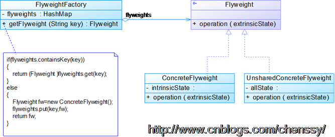

# 享元模式（Flyweight Pattern）

[TOC]

## 享元模式简介

运用共享技术，有效地支持大量粒度对象的复用

当系统中存在大量相同或者相似的对象时，享元模式时一个值得考虑的解决方案，它通过共享技术实现相同或者相似的粒度对象的复用，从而节约内存，提供系统性能。

------

所谓享元模式就是运行共享技术有效地支持大量细粒度对象的复用。系统使用少量对象,而且这些都比较相似，状态变化小，可以实现对象的多次复用。 

在了解享元模式之前我们先要了解两个概念：内部状态、外部状态。

- 内部状态：在享元对象内部不随外界环境改变而改变的共享部分。
- 外部状态：随着环境的改变而改变，不能够共享的状态就是外部状态。

## UML


## 角色

- Flyweight: 抽象享元类。所有具体享元类的超类或者接口，通过这个接口，Flyweight可以接受并作用于外部专题        
- ConcreteFlyweight: 具体享元类。指定内部状态，为内部状态增加存储空间。        
- UnsharedConcreteFlyweight: 非共享具体享元类。指出那些不需要共享的Flyweight子类。        
- FlyweightFactory: 享元工厂类。用来创建并管理Flyweight对象，它主要用来确保合理地共享Flyweight，当用户请求一个Flyweight时，FlyweightFactory就会提供一个已经创建的Flyweight对象或者新建一个（如果不存在）。 

 享元模式的核心在于享元工厂类，享元工厂类的作用在于提供一个用于存储享元对象的享元池，用户需要对象时，首先从享元池中获取，如果享元池中不存在，则创建一个新的享元对象返回给用户，并在享元池中保存该新增对象。 

```java
public abstract class Shape {
    public abstract void draw();
}
```


```java
public class Circle extends Shape{
    private String color;
    public Circle(String color){
        this.color = color;
    }

    public void draw() {
        System.out.println("画了一个" + color +"的圆形");
    }
    
}
```

```java
public class FlyweightFactory{
    static Map<String, Shape> shapes = new HashMap<String, Shape>();
    
    public static Shape getShape(String key){
        Shape shape = shapes.get(key);
        //如果shape==null,表示不存在,则新建,并且保持到共享池中
        if(shape == null){
            shape = new Circle(key);
            shapes.put(key, shape);
        }
        return shape;
    }
    
    public static int getSum(){
        return shapes.size();
    }
}
```

```java
public class Client {
    public static void main(String[] args) {
        Shape shape1 = FlyweightFactory.getShape("红色");
        shape1.draw();
        
        Shape shape2 = FlyweightFactory.getShape("灰色");
        shape2.draw();
        
        Shape shape3 = FlyweightFactory.getShape("绿色");
        shape3.draw();
        
        Shape shape4 = FlyweightFactory.getShape("红色");
        shape4.draw();
        
        Shape shape5 = FlyweightFactory.getShape("灰色");
        shape5.draw();
        
        Shape shape6 = FlyweightFactory.getShape("灰色");
        shape6.draw();
        
        System.out.println("一共绘制了"+FlyweightFactory.getSum()+"中颜色的圆形");
    }
}
```


```
public class FlyweightFactory{
    private HashMap flyweights = new HashMap();
    
    public Flyweight getFlyweight(String key){
        if(flyweights.containsKey(key)){
            return (Flyweight)flyweights.get(key);
        }
        else{
            Flyweight fw = new ConcreteFlyweight();
            flyweights.put(key,fw);
            return fw;
        }
    }
}
```

## 优点：

1. 享元模式的优点在于它能够极大的减少系统中对象的个数。
2. 享元模式由于使用了外部状态，外部状态相对独立，不会影响到内部状态，所以享元模式使得享元对象能够在不同的环境被共享。

## 缺点：

1. 由于享元模式需要区分外部状态和内部状态，使得应用程序在某种程度上来说更加复杂化了。
2. 为了使对象可以共享，享元模式需要将享元对象的状态外部化，而读取外部状态使得运行时间变长。