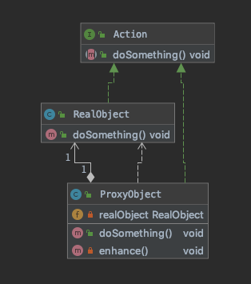

# 代理模式（Proxy Patern）

>  给某一个对象提供一个代理或占位符，并由代理对象来控制对原对象的访问

- 代理对象在客户端与真实对象之间起到了中介的作用,客户端不直接操作真实对象
- 结构性设计模式

主要作用:

- 保护目标对象
- 增强目标对象

## 代理分类

- 静态代理 : 显式地声明被代理对象

- 动态代理

### 静态代理

分为是角色：

* 共同接口
* 真实对象
* 代理对象

##### UML





##### 共同接口

```java
/**
 * 代理对象和真实对象都实现的共同接口
 *
 * @author EricChen 2020/01/01 11:56
 */
public interface Action {
    /**
     * 对象的行为
     */
    void doSomething();
}

```

##### 真实对象

```java
/**
 * 真实对象,也就是被代理的对象
 *
 * @author EricChen 2020/01/01 11:57
 */
public class RealObject implements Action {

    @Override
    public void doSomething() {
        System.out.println("The real object is doing");
    }
}

```

##### 代理对象

```java
/**
 * 代理对象
 *
 * @author EricChen 2020/01/01 11:58
 */
public class ProxyObject implements Action {
    private RealObject realObject;

    public ProxyObject(RealObject realObject) {
        this.realObject = realObject;
    }

    @Override
    public void doSomething() {
        enhance();
        realObject.doSomething();
    }

    private void enhance() {
        System.out.println("Proxy object is enhancing ");
    }

}

```

测试：

```java
/**
 * 静态代理测试
 *
 * @author EricChen 2020/01/01 12:01
 */
public class StaticProxyExample {

    public static void main(String[] args) {
        doWithStaticProxy();
    }


    private static void doWithStaticProxy() {
        ProxyObject proxyObject = new ProxyObject(new RealObject());
        proxyObject.doSomething();
    }
}

```

#### 静态优势与缺陷

优势：业务类只需要关注业务逻辑本身，保证了业务类的重用性，当需要拓展时，使用其代理类。

缺陷：

* 代理对象的一个接口只服务于一种类型的对象，如果要代理的方法有很多，势必要每一种方法都要进行代理，静态代理在程序规模稍大时就无法胜任了
* 如果接口增加一个方法，除了所有实现类都实现这个方法外，所有的代理类也要实现这个方法，增加了代码维护的复杂度。


### 动态代理

- JDK代理，被代理对象必须要**实现接口**，才能产生代理对象，如果没有接口，将不能使用JDK代理
- cglib代理，第三方代理技术，可以对任何类生产代理，代理的原理是对目标对象进行**继承代理**。如果目标对象被`final`修饰，那么该类不能被cglib代理Spring代理

#### JDK代理实现原理

1. 拿到被代理类的引用,并且获取它的所有接口(反射获取)
2. JDK Proxy 类重新生成一个新的类,实现了被代理类的所有接口的方法
3. 动态生成 Java 代码,把增强逻辑加入到新生成的代码中
4. 编译生成新的 Java 代码的 class 文件
5. 加载并重新运行新的 class ,得到类就是全新类

#### JDK 代理代码实例

JDK代理是不需要以来第三方的库，只要要JDK环境就可以进行代理，它有几个要求

* 实现InvocationHandler 
* 使用Proxy.newProxyInstance产生代理对象
* 被代理的对象**必须要实现接口**

```java
/**
 * JDK代理 ,用来生成源代码的工具类
 *
 * @author EricChen 2020/01/01 12:16
 */
public class JDKProxy implements InvocationHandler {

    private Object targetObject;


    public JDKProxy(Object targetObject) {
        this.targetObject = targetObject;
    }

    /**
     * 获取被代理接口实例对象
     *
     * @param <T>
     * @return
     */
    public <T> T getProxy() {
        return (T) Proxy.newProxyInstance(targetObject.getClass().getClassLoader(), targetObject.getClass().getInterfaces(), this);
    }


    @Override
    public Object invoke(Object proxy, Method method, Object[] args) throws Throwable {
        System.out.println("before");
        Object invoke = method.invoke(targetObject, args);
        System.out.println("after");
        return invoke;
    }

}

```

JDK实现代理只需要使用newProxyInstance方法，但是该方法需要接受三个参数，完整的写法是：

```java
/**
 * JDK 代码实例
 *
 * @author EricChen 2020/01/01 12:22
 */
public class JDKProxyExample {

    public static void main(String[] args) {
        // 保存生成的代理类的字节码文件
        System.getProperties().put("sun.misc.ProxyGenerator.saveGeneratedFiles", "true");

        // jdk动态代理测试
        Action action = new JDKProxy(new RealObject()).getProxy();
        action.doSomething();
    }

}

```

注意，该方法是在Proxy类中是静态方法，且接受了三个参数依次为：

* ClassLoader loader，指定当前目标对象使用类加载器，获取加载器的方法是固定的。
* Class<?& \[\] interfaces ，目标对象实现的接口的类型，使用泛型方式确认类型。
* InvocationHandler ，事件处理，执行目标对象的方法时，会触发事件处理器的方法，会把当前执行目标对象的方法作为参数。

代理对象不需要实现接口，但是目标独享一定要实现接口，否则不能用动态代理。

#### 动态生成的 class文件

```java
//
// Source code recreated from a .class file by IntelliJ IDEA
// (powered by Fernflower decompiler)
//

package com.sun.proxy;

import java.lang.reflect.InvocationHandler;
import java.lang.reflect.Method;
import java.lang.reflect.Proxy;
import java.lang.reflect.UndeclaredThrowableException;
import vip.ericchen.study.designpatterns.structural.proxy.staticproxy.Action;

public final class $Proxy0 extends Proxy implements Action {
    private static Method m1;
    private static Method m3;
    private static Method m2;
    private static Method m0;

    public $Proxy0(InvocationHandler var1) throws  {
        super(var1);
    }

    public final boolean equals(Object var1) throws  {
        try {
            return (Boolean)super.h.invoke(this, m1, new Object[]{var1});
        } catch (RuntimeException | Error var3) {
            throw var3;
        } catch (Throwable var4) {
            throw new UndeclaredThrowableException(var4);
        }
    }

    public final void doSomething() throws  {
        try {
            super.h.invoke(this, m3, (Object[])null);
        } catch (RuntimeException | Error var2) {
            throw var2;
        } catch (Throwable var3) {
            throw new UndeclaredThrowableException(var3);
        }
    }

    public final String toString() throws  {
        try {
            return (String)super.h.invoke(this, m2, (Object[])null);
        } catch (RuntimeException | Error var2) {
            throw var2;
        } catch (Throwable var3) {
            throw new UndeclaredThrowableException(var3);
        }
    }

    public final int hashCode() throws  {
        try {
            return (Integer)super.h.invoke(this, m0, (Object[])null);
        } catch (RuntimeException | Error var2) {
            throw var2;
        } catch (Throwable var3) {
            throw new UndeclaredThrowableException(var3);
        }
    }

    static {
        try {
            m1 = Class.forName("java.lang.Object").getMethod("equals", Class.forName("java.lang.Object"));
            m3 = Class.forName("vip.ericchen.study.designpatterns.structural.proxy.staticproxy.Action").getMethod("doSomething");
            m2 = Class.forName("java.lang.Object").getMethod("toString");
            m0 = Class.forName("java.lang.Object").getMethod("hashCode");
        } catch (NoSuchMethodException var2) {
            throw new NoSuchMethodError(var2.getMessage());
        } catch (ClassNotFoundException var3) {
            throw new NoClassDefFoundError(var3.getMessage());
        }
    }
}

```


## Spring 的代理

Spring整合了JDK代理（**优先使用**）和cglib代理（**无接口时使用**），

- 当 bean 有实现接口时,Spring 就会使用 JDK 的动态代理
- 当 bean 没有实现接口时,Spring 会选择 Cglib
- Spring 可以通过配置强制使用 CGlib,只需要在 spring 配置文件中

```xml
<aop:aspectj-autoproxy proxy-target-class="true"</>
```


## Cglib代理

上面的**静态代理**和**动态代理**都是要求目标对象是实现一个接口的对象，但是，有些时候，目标对象知识一个单独的对象，并没有实现任何的接口，这个时候就可以使用以目标对象子类的方式实现代理，这种方法叫做Cglib代理，Cglib代理是**继承代理。**

Cglib代理也叫做**子类代理，**它是在内存中构建一个子类对象从而实现对目标对象功能的拓展。

* JDK的动态代理有一个限制，使用动态代理的对象必须实现一个或者多个接口，如果想代理没有实现接口的类，就可以使用Cglib代理，Cglib代理，也叫做子类代理，它是在内存中构建一个子类对象从而实现对目标对象功能的拓展。
* Cglib是一个强大的高性能代码生成器，它在运行期间拓展Java类与现实Java接口,它广泛的被许多AOP的框架使用，例如Spring AOP 和synaop,为它们提供了方法的interception\(拦截\)
* Cglib包底层是通过使用一个小而快的字节码处理框架ASM来转换字节码并生产新的类，不鼓励直接使用ASM,因为它们要求你必须对JVM的内部结构包括class文件的格式和指令集很熟悉。

### 使用方法：

1. 需要引入cglib的jar文件
2. 代理的类不能为final，否则报错
3. 目标对象的方法如果是final/static，那么久不会被拦截，即不会执行目标对象额外的业务方法。

相关代码：


```java
public class UserServiceCglibProxyFactory implements MethodInterceptor {

    private Logger logger = LoggerFactory.getLogger(UserServiceCglibProxyFactory.class);


    /**
     * 获取Cglib代理对象
     * @return
     */
    public UserService createProxy(Class superclass){
        //创建Cglib核心类
        Enhancer enhancer = new Enhancer();
        //Cglib代理是基于继承的代理
        enhancer.setSuperclass(superclass);
        //设置回调，需要传入一个Callback的接口
        enhancer.setCallback(this);
        //生成代理
        return (UserService)enhancer.create();
    }

    /**
     *
     * 只记录save方法
     * @param proxyobj 代理对象
     * @param method 方法名
     * @param args 代理方法的参数
     * @param methodProxy 代理方法
     * @return
     * @throws Throwable
     */
    public Object intercept(Object proxyobj, Method method, Object[] args, MethodProxy methodProxy) throws Throwable {
        Object o = methodProxy.invokeSuper(proxyobj, args);
        if ("save".equals(method.getName())){
            logger.info("chapter02.proxy.cglibProxy.UserServiceCglibProxyFactory.createProxy");
            return o;
        }

        return o;
    }
```

测试代码：

```java
public class Test {
    public static void main(String[] args) {
        UserService userService = new UserServiceImpl();
        UserServiceCglibProxyFactory proxy = new UserServiceCglibProxyFactory();
        UserService user = proxy.createProxy(userService.getClass());
        user.save();//执行save方法时，调用的是代理对象的方法intercept

    }
}
```

### Cglib 和 JDK 代理的对比

- JDK动态代理是实现了被代理对象的接口,Cglib继承了被代理对象
- JDK 和 CGlib 都是通过动态生成字节码的方式
  - JDK 是直接写 class 字节码
  - CGlib 使用 ASM 框架写字节码
- CGlib 代理实现更加复杂,生成代理类比JDK 效率低
- JDK调用代理都是通过反射
- CGlib 是通过FastClass机制调用方法
- CGlib 执行效率更高

## 代理模式的优缺点

### 优点

- 代理模式能将代理对象与真实被调用的目标对象分离
- 一定程度上江都了系统的耦合程度,易于拓展
- 代理可以起到保护目标对象的作用
- 增强目标对象的职责

### 缺点

- 代理模式会造成系统设计中的类的数目的增加
- 在客户端与目标对象之间增加一个代理对象,会造成请求处理速度变慢
- 增加了系统的复杂度

## 综合案例

```java
/**
 * 案例: 使用不同方式代理 {@link IOrderService} 的默认实现类,使其支持多数据源
 *
 * @author EricChen 2020/01/01 15:03
 * @see OrderServiceImpl 默认的实现
 * @see OrderServiceStaticProxy 静态代理的实现方式
 * @see JdkOrderServiceProxy JDK 代理的方式
 * @see
 */
public interface IOrderService {

    /**
     * 创建订单
     */
    void createOrder();

    /**
     * 设置数据源
     *
     * @param dataSource 设置数据源
     */
    void setDataSource(String dataSource);

}

```

```java
/**
 * 默认的订单实现,被代理对象
 *
 * @author EricChen 2020/01/01 15:04
 */
public class OrderServiceImpl implements IOrderService {

    private String dataSource;

    @Override
    public void createOrder() {
        System.out.println("创建订单,使用数据源[" + dataSource + "]");

    }

    @Override
    public void setDataSource(String dataSource) {
        this.dataSource = dataSource;
    }
}
```

CglibOrderServiceProxy

```java
public class CglibOrderServiceProxy implements MethodInterceptor {
    private static final Logger LOGGER = LoggerFactory.getLogger(CglibOrderServiceProxy.class);

    public <T> T getInstance(Class<T> clazz) {
        Enhancer enhancer = new Enhancer();
        enhancer.setSuperclass(clazz);
        enhancer.setCallback(this);
        return (T) enhancer.create();
    }


    @Override
    public Object intercept(Object targetObject, Method method, Object[] objects, MethodProxy methodProxy) throws Throwable {
        if (!"createOrder".equals(method.getName())) {
            return methodProxy.invokeSuper(targetObject, objects);
        }
        if (!(targetObject instanceof IOrderService)) {
            return methodProxy.invokeSuper(targetObject, objects);
        }
        long currentTimeMillis = System.currentTimeMillis();
        String s = String.valueOf(currentTimeMillis);
        String substring = s.substring(s.length() - 1);
        LOGGER.debug("当前时间为{},切换数据源为{}", s, substring);
        Method setDataSource = targetObject.getClass().getMethod("setDataSource", String.class);
        setDataSource.invoke(targetObject, substring);
        methodProxy.invokeSuper(targetObject, objects);
        return null;
    }
}

```

```java
public class JdkOrderServiceProxy implements InvocationHandler {

    private IOrderService targetObject;
    private static final Logger LOGGER = LoggerFactory.getLogger(JdkOrderServiceProxy.class);


    public JdkOrderServiceProxy(IOrderService targetObject) {
        this.targetObject = targetObject;
    }

    /**
     * 获取被代理接口实例对象
     */
    public IOrderService getProxy() {
        return (IOrderService) Proxy.newProxyInstance(targetObject.getClass().getClassLoader(), targetObject.getClass().getInterfaces(), this);
    }

    @Override
    public Object invoke(Object proxy, Method method, Object[] args) throws Throwable {
        if (!"createOrder".equals(method.getName())) {
            return method.invoke(proxy, args);
        }
        long currentTimeMillis = System.currentTimeMillis();
        String s = String.valueOf(currentTimeMillis);
        String substring = s.substring(s.length() - 1);
        LOGGER.debug("当前时间为{},切换数据源为{}", s, substring);
        targetObject.setDataSource(substring);
        targetObject.createOrder();
        return null;
    }
}
```

```java
/**
 * 通过静态代理的方式切换数据源
 *
 * @author EricChen 2020/01/01 15:07
 */
public class OrderServiceStaticProxy implements IOrderService {

    private String dataSource;

    private static final Logger LOGGER = LoggerFactory.getLogger(OrderServiceStaticProxy.class);

    private IOrderService orderServiceProxy;

    public OrderServiceStaticProxy(IOrderService proxyTarget) {
        this.orderServiceProxy = proxyTarget;
    }

    @Override
    public void createOrder() {
        long currentTimeMillis = System.currentTimeMillis();
        String s = String.valueOf(currentTimeMillis);
        String substring = s.substring(s.length() - 1);
        LOGGER.debug("当前时间为{},切换数据源为{}", s, substring);
        orderServiceProxy.setDataSource(substring);
        orderServiceProxy.createOrder();
    }

    @Override
    public void setDataSource(String dataSource) {
        this.dataSource = dataSource;
    }
}
```