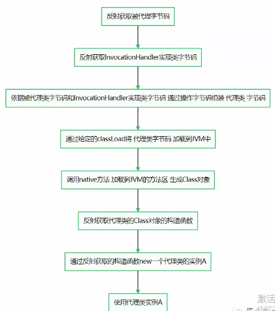
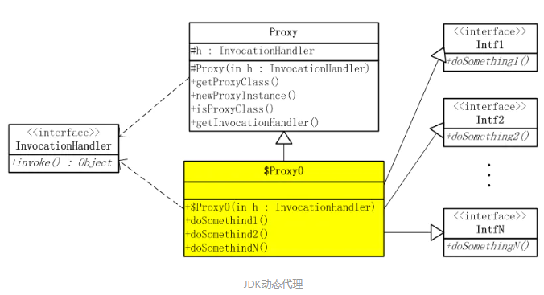
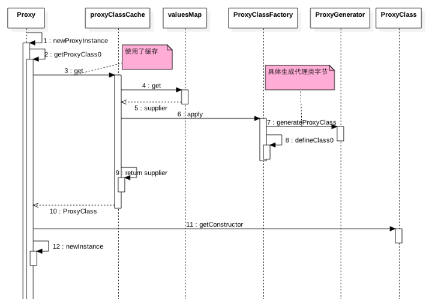
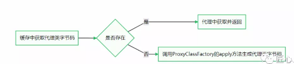

# JDK代理

[TOC]

## JDK代理流程

- 运行时为接口创建代理类的字节码文件

- 通过类加载器将.class 字节码加载到内存

- 创建代理类的实例对象, 执行被代理类的目标方法

## JDK 动态代理特点

JDK 代理必须是接口并且要有实现类

使用 Proxy 创建动态代理类时需要提供类加载器、实现的接口数组、自定义 InvocationHandler 对象作为参数

生成的动态代理类重写了 Object 类中的三大基本方法

使用静态代码块来初始化接口中方法的 Method 对象, 包含被代理类的方法以及 Object 的三个方法

只能代理接口，不能代理类



## 是什么

不修改代码的前提下,动态对一个类进行增强

JDK动态代理的实现是在运行时，根据一组接口定义，使用`Proxy`、`InvocationHandler `等工具类去生成一个代理类和代理类实例。

JDK动态代理的类关系模型和静态代理看起来差不多。也是需要一个或一组接口来定义行为规范。需要一个代理类来实现接口。区别是没有真实类，因为动态代理就是要解决在不知道真实类的情况下依然能够使用代理模式的问题。



## 代码实例

```java
public interface IUserService {
    User getUser(String id);
}

public class DefaultUserService implements IUserService  {
    @Override
    public User getUser(String id) {
        System.out.println("start getUser");
        User eric = new User().setAge(10).setName("eric");
        System.out.println("end getUser");
        return eric;
    }
}
```

代理工厂

```java
public class ProxyFactory<T> {

    private final Class<T> proxyInterface;

    public ProxyFactory(Class<T> proxyInterface) {
        this.proxyInterface = proxyInterface;
    }

    public <T> T  getProxy(MyProxy<T> myproxy){
        return (T) Proxy.newProxyInstance(proxyInterface.getClassLoader(), new Class[] { proxyInterface }, myproxy)
    }
}

```

```java
public class MyProxy<T> implements InvocationHandler {

    private Object target;

    public MyProxy(Object target) {
        this.target = target;
    }

    @Override
    public Object invoke(Object proxy, Method method, Object[] args) throws Throwable {
        System.out.println("-----------------begin-----------------");
        Object result = method.invoke(target, args);
        System.out.println("-----------------end-----------------");
        return result;
    }

}
```


#### 测试类

```java
public class JdkProxy {
    public static void main(String[] args) {
          //生成的代理类保存到磁盘
  System.getProperties().put("sun.misc.ProxyGenerator.saveGeneratedFiles", "true"); 
        IUserService userService  = new DefaultUserService();
        ProxyFactory proxyFactory = new ProxyFactory(IUserService.class);
        MyProxy<IUserService> myProxy = new MyProxy(userService);
        IUserService proxy = (IUserService) proxyFactory.getProxy(myProxy);
        User user = proxy.getUser("123");
        System.out.println(user);
    }
}
```


## 源码



#### 动态代理类生成解析

首先看一下 Proxy.newProxyInstance 方法做了什么操作

```java
public static Object newProxyInstance(ClassLoader loader,
                                      Class<?>[] interfaces,
                                      InvocationHandler h)
        throws IllegalArgumentException {
    // 判断InvocationHandler是否为空, 为空抛出异常
    Objects.requireNonNull(h);
    // 接口复制
    final Class<?>[] intfs = interfaces.clone();
    xxx...
    // ❗️存在缓存返回或生成指定的动态代理类
    Class<?> cl = getProxyClass0(loader, intfs);
    try {
        // 省略代码
        // xxx...
        // 获取以InvocationHandler作为参数的构造方法
        final Constructor<?> cons = cl.getConstructor(constructorParams);
        // 省略代码
        // xxx...
        // 创建动态代理类对象实例, 有参构造方法参数为InvocationHandler
        return cons.newInstance(new Object[]{h});
    } catch xxx...
}
```

看一下 getProxyClass0() 是如何生成动态代理的 class 对象的

```java
private static Class<?> getProxyClass0(ClassLoader loader,
                                       Class<?>... interfaces) {
    // 65535 是JVM规定的继承接口数量最大值
    if (interfaces.length > 65535) {
        throw new IllegalArgumentException("interface limit exceeded");
    }

    // 如果存在指定接口的类加载器定义的代理类缓存, 直接返回, 无则创建
    return proxyClassCache.get(loader, interfaces);
}
```

proxyClassCache 是存储动态代理类的缓存变量, 定义在 Proxy 类中, 这里主要关注 ProxyClassFactory 是如何创建动态代理类即可

```java
private static final WeakCache<ClassLoader, Class<?>[], Class<?>>
        proxyClassCache = new WeakCache<>(new Proxy.KeyFactory(), new Proxy.ProxyClassFactory());
```


ProxyClassFactory 是位于 Proxy 类中的静态类, 实现了 BiFunction 函数式接口中 apply 方法

如果待生成的动态代理类不存在于 WeakCache, 那么便调用 apply 方法进行创建

get 方法就不解读了, 直接看生成动态代理类的 apply 方法内部实现

```java
private static final class ProxyClassFactory
        implements BiFunction<ClassLoader, Class<?>[], Class<?>> {
    // 动态代理类的前缀名称
    private static final String proxyClassNamePrefix = "$Proxy";
    // 用于生成代理类的数字名称
    private static final AtomicLong nextUniqueNumber = new AtomicLong();
    @Override
    public Class<?> apply(ClassLoader loader, Class<?>[] interfaces) {
    // 省略校验代理接口的代码...
    // ...
    // 非 public 接口, 生成代理类的包名
    String proxyPkg = null;
    for (Class<?> intf : interfaces) {
        int flags = intf.getModifiers();
        if (!Modifier.isPublic(flags)) {
            accessFlags = Modifier.FINAL;
            String name = intf.getName();
            int n = name.lastIndexOf('.');
            String pkg = ((n == -1) ? "" : name.substring(0, n + 1));
            if (proxyPkg == null) {
                proxyPkg = pkg;
            } else if (!pkg.equals(proxyPkg)) {
                throw new IllegalArgumentException(
                    "non-public interfaces from different packages");
            }
        }
    }
    // 如果代理公共接口, 包名默认com.sun.proxy
    if (proxyPkg == null) {
        // if no non-public proxy interfaces, use com.sun.proxy package
        proxyPkg = ReflectUtil.PROXY_PACKAGE + ".";
    }
    // 获取报名计数
    long num = nextUniqueNumber.getAndIncrement();
    // 获取包名, 默认全限名称为 com.sun.proxy.$Proxy0, 依次递增 com.sun.proxy.$Proxy1...
    String proxyName = proxyPkg + proxyClassNamePrefix + num;
    // 真正的生成代理类的字节码
    byte[] proxyClassFile = ProxyGenerator.generateProxyClass(
            proxyName, interfaces, accessFlags);
    try {
        // 根据二进制字节码返回相应的Class实例
        return defineClass0(loader, proxyName,
                proxyClassFile, 0, proxyClassFile.length);
    } catch (ClassFormatError e) {
        throw new IllegalArgumentException(e.toString());
    }
}
```

generateProxyClass方法是 static 关键字修饰的, 位于 sun.misc 包下, 在 JDK 源码中无法看到具体实现细节, 从网上找了段反编译的代码

```java
public static byte[] generateProxyClass(final String var0, Class[] var1) {
    ProxyGenerator var2 = new ProxyGenerator(var0, var1);
    // 生成代理类的字节码
    final byte[] var3 = var2.generateClassFile();
    // 根据参数配置, 决定是否把生成的字节码（.class文件）保存到本地磁盘
    // 这也就证明了测试程序为什么设置要设置全局变量
    if(saveGeneratedFiles) {
        AccessController.doPrivileged(new PrivilegedAction() {
            public Void run() {
                try {
                    FileOutputStream var1 = new FileOutputStream(ProxyGenerator.dotToSlash(var0) + ".class");
                    // 将文件写入磁盘
                    var1.write(var3);
                    // 关闭流
                    var1.close();
                    return null;
                } catch (IOException var2) {
                    throw new InternalError("I/O exception saving generated file: " + var2);
                }
            }
        });
    }
    return var3;
}
```

#### 生成的代理类如下

`com/sun/proxy/$Proxy0.class`


```java
//
// Source code recreated from a .class file by IntelliJ IDEA
// (powered by Fernflower decompiler)
//

package com.sun.proxy;

import cn.eccto.study.java.proxy.IUserService;
import cn.eccto.study.java.proxy.User;
import java.lang.reflect.InvocationHandler;
import java.lang.reflect.Method;
import java.lang.reflect.Proxy;
import java.lang.reflect.UndeclaredThrowableException;
//可以看出实际上使用的是继承 Proxy 类 ，实现了 IUserService 接口
public final class $Proxy0 extends Proxy implements IUserService {
    private static Method m1;
    private static Method m2;
    private static Method m3;
    private static Method m0;

    public $Proxy0(InvocationHandler var1) throws  {
        super(var1);
    }

    public final boolean equals(Object var1) throws  {
        try {
          
            return (Boolean)super.h.invoke(this, m1, new Object[]{var1});
        } catch (RuntimeException | Error var3) {
            throw var3;
        } catch (Throwable var4) {
            throw new UndeclaredThrowableException(var4);
        }
    }

    public final String toString() throws  {
        try {
            return (String)super.h.invoke(this, m2, (Object[])null);
        } catch (RuntimeException | Error var2) {
            throw var2;
        } catch (Throwable var3) {
            throw new UndeclaredThrowableException(var3);
        }
    }

    public final User getUser(String var1) throws  {
        try {
            //调用了父类的invoke 方法
            return (User)super.h.invoke(this, m3, new Object[]{var1});
        } catch (RuntimeException | Error var3) {
            throw var3;
        } catch (Throwable var4) {
            throw new UndeclaredThrowableException(var4);
        }
    }

    public final int hashCode() throws  {
        try {
            return (Integer)super.h.invoke(this, m0, (Object[])null);
        } catch (RuntimeException | Error var2) {
            throw var2;
        } catch (Throwable var3) {
            throw new UndeclaredThrowableException(var3);
        }
    }

    static {
        try {
            m1 = Class.forName("java.lang.Object").getMethod("equals", Class.forName("java.lang.Object"));
            m2 = Class.forName("java.lang.Object").getMethod("toString");
            m3 = Class.forName("cn.eccto.study.java.proxy.IUserService").getMethod("getUser", Class.forName("java.lang.String"));
            m0 = Class.forName("java.lang.Object").getMethod("hashCode");
        } catch (NoSuchMethodException var2) {
            throw new NoSuchMethodError(var2.getMessage());
        } catch (ClassNotFoundException var3) {
            throw new NoClassDefFoundError(var3.getMessage());
        }
    }
}


```


通过编译后的动态代理类得知

在生成的动态代理类 **(示例代码中的 addServiceProxy 对象)** 调用被代理类方法 **(示例代码中的 add(Object obj))** 时, 都会由自定义的 InvocationHandler 进行 invoke 调用, 相当于做了一层转发作用

对比静态代理的区别, 静态代理中使用对象对被代理方法进行调用, 动态代理统一由 InvocationHandler 进行方法反射调用

类似 aop 中的前置通知和后置通知, 只要在 method.invoke() 调用前后做出处理即可实现对应功能


## 源码分析

我们可以看出生成的代理类是一个 `java.lang.reflect.Proxy` 类的子类

- **`问题1`：代理类为什么可以在运行的时候自动生成呢？如何生成的呢？**
- `问题2`：为什么调用代理类的相应的代理方法就可以调用到InvocationHandler实现类的invoke方法呢？
- `问题3`：为什么jdk proxy只支持代理有接口实现的类呢？


我们就从两个核心：`InvocationHandler`和`Proxy`来进行分析整个脉络，他们都在`java.lang.reflect`包下

### InvocationHandler源码

```java
public interface InvocationHandler {
    public Object invoke(Object proxy, Method method, Object[] args) throws Throwable;
}
```

上述就是InvocationHandler的源码，没什么其他的就是一个接口，里面有一个待实现方法invoke，处理类实现此接口重写invoke方法

#### Proxy源码

```java
public class Proxy implements java.io.Serializable {
    // 处理类实例 变量
    protected InvocationHandler h;
    // 用于存储 已经通过动态代理获取过的代理类缓存
    private static final WeakCache<ClassLoader, Class<?>[], Class<?>>  proxyClassCache = new WeakCache<>(new KeyFactory(),new ProxyClassFactory());
    // 私有无参构造，使得只能通过传入InvocationHandler参数来创建该对象
    private Proxy() {}
    // 保护 构造函数，入参InvocationHandler处理类
    protected Proxy(InvocationHandler h) {
        Objects.requireNonNull(h);
        this.h = h;
    }
    public static Class<?> getProxyClass(ClassLoader loader,Class<?>... interfaces) throws IllegalArgumentException{
        ...
    }
    public static boolean isProxyClass(Class<?> cl) {
        ...
    }
    public static InvocationHandler getInvocationHandler(Object proxy)  throws IllegalArgumentException {
        ...
    }
    // 生成代理类的实现方法
    public static Object newProxyInstance(ClassLoader loader,Class<?>[] interfaces,InvocationHandler h) throws IllegalArgumentException{
        ...
    }
    // 各种私有方法
    private ... ...
}
```

`Proxy`类的整体的架构就类似于上述，`InvocationHandler h`参数和`两个构造函数`、`四个上述已经介绍过的共有方法`，还有一系列的私有方法，**getProxyClass**、**isProxyClass**、**getInvocationHandler**功能就和上面介绍的一样，就不再详细介绍了

**我们下面来主要看一下`newProxyInstance`方法 **, **newProxyInstance** 方法，我在方法内添加上了对应的注释：

```java
 public static Object newProxyInstance(ClassLoader loader, Class<?>[] interfaces, InvocationHandler h) throws IllegalArgumentException{
        // 1. 克隆对应的接口，用于代理类实现的接口数组
        final Class<?>[] intfs = interfaces.clone();
        ...
        /*
         * Look up or generate the designated proxy class.  源码中的介绍
         * 2. 查找或者生成指定的代理类， 下面会详细介绍
         */
        Class<?> cl = getProxyClass0(loader, intfs);
        /*
         * Invoke its constructor with the designated invocation handler.
         * 3. 上面代码已经生成了代理类 cl，cl其中包含一个参数为传入的InvocationHandler h的构造函数， 获取该构造函数并通过该构造函数创建一个类的实例对象并返回
         */
        try {
            // 4. 通过《反射》获取参数为 InvocationHandler 的构造函数
            final Constructor<?> cons = cl.getConstructor(constructorParams);
            final InvocationHandler ih = h;
            // 5. 判断构造函数是否为私有的，如果为私有的则需要设置私有可访问权限
            if (!Modifier.isPublic(cl.getModifiers())) {
                AccessController.doPrivileged(new PrivilegedAction<Void>() {
                    public Void run() {
                        cons.setAccessible(true);
                        return null;
                    }
                });
            }
            // 6. 通过上述获取的构造函数创建对应的 实例对象，并返回！over~
            return cons.newInstance(new Object[]{h});
        } catch (IllegalAccessException|InstantiationException e) {
           // 各种异常处理
        }
    }
```

在上面的代码中，我简单的标注了一下每行代码的作用，下面我们来详细分析一下；

**代理类的字节码生成逻辑**

我们知道，在加载jvm前，java文件都已经被编译成了`class字节码`文件， 然后jvm通过`类加载器`将字节码文件加载到jvm中；

我们的代理类也是这样，不同的是动态代理的类是在程序运行时产生的，我们要做的就是如何在程序运行的时候，通过`被代理类`的字节码生成`代理类`的字节码！

我们接下来详细分析`newProxyInstance`方法：

在 **newProxyInstance** 中调用了`Class<?> cl = getProxyClass0(loader, intfs);`语句生成了`代理类的字节码`，此处调用了 getProxyClass0 方法，传入了指定的类加载器和对应要实现的接口

那么， 我们看看`getProxyClass0`方法的实现：

```java
    private static Class<?> getProxyClass0(ClassLoader loader, Class<?>... interfaces) {
        if (interfaces.length > 65535) {
            throw new IllegalArgumentException("interface limit exceeded");
        }
        // proxyClassCache是WeakCache弱引用缓存类，如果之前就生成过对应的代理类就从缓存中取，如果没生成过就重新生成
        return proxyClassCache.get(loader, interfaces);
    }
```

`proxyClassCache`是Proxy类中的静态变量，是WeakCache类，里面封装了两个类KeyFactory、ProxyClassFactory，都是BiFunction函数式接口(如果不清楚函数式接口，请自行google)；

将其拿过来看一下

```java
proxyClassCache = new WeakCache<>(new KeyFactory(),new ProxyClassFactory())
```

 其中调用了 proxyClassCache.get(loader, interfaces) 方法的实现

未避免代码过长，只粘贴了核心代码：

```java
  public V get(K key, P parameter) {
        ...
        // 这部分主要是获取对应的 函数式接口，如果不明白函数式接口，google一下吧~
        Object subKey = Objects.requireNonNull(subKeyFactory.apply(key, parameter));
        Supplier<V> supplier = valuesMap.get(subKey);
        Factory factory = null;
        while (true) {  // 此处为什么是while循环呢， 主要是supplier不为空的话，则执行下面的语句赋值后，再循环执行下一次则supplier不为空
            if (supplier != null) {
                // 如果存在对应的函数式接口，  调用函数式接口对应的代码
                // 重点！！！调用函数式接口！！
                V value = supplier.get();
                if (value != null) {
                    return value;
                }
            }
            if (factory == null) {
                // 创建一个 专门创建代理类字节码的工厂类，实现类是ProxyClassFactory
                factory = new Factory(key, parameter, subKey, valuesMap);
            }
            if (supplier == null) {
                supplier = valuesMap.putIfAbsent(subKey, factory);
                if (supplier == null) {
                    // 将supplier赋值factory
                    supplier = factory;
                }}}} }
```

总结一下上述方法的流程：




接着`ProxyClassFactory.apply`方法看一下：

```java
  public Class<?> apply(ClassLoader loader, Class<?>[] interfaces) {
            Map<Class<?>, Boolean> interfaceSet = new IdentityHashMap<>(interfaces.length);
            // 获取接口对应的接口class对象
            for (Class<?> intf : interfaces) {
                Class<?> interfaceClass = null;
                try {
                    interfaceClass = Class.forName(intf.getName(), false, loader);
                } 
                if (interfaceSet.put(interfaceClass, Boolean.TRUE) != null) { }
            }

            String proxyPkg = null;
            int accessFlags = Modifier.PUBLIC | Modifier.FINAL;
            // 判断是否包含公有的接口对象，判断是否可以通过jdk proxy的方式进行生成代理类
            for (Class<?> intf : interfaces) {
                int flags = intf.getModifiers();
                if (!Modifier.isPublic(flags)) {
                    accessFlags = Modifier.FINAL;
                    String name = intf.getName();
                    int n = name.lastIndexOf('.');
                    String pkg = ((n == -1) ? "" : name.substring(0, n + 1));
                    if (proxyPkg == null) {
                        proxyPkg = pkg;
                    } else if (!pkg.equals(proxyPkg)) {
                    }
                }
            }
            // 如果没有公有接口类，需要使用CGLib来实现。。。
            if (proxyPkg == null) {
                proxyPkg = ReflectUtil.PROXY_PACKAGE + ".";
            }
            // 组装代理类的类名称
            long num = nextUniqueNumber.getAndIncrement();
            String proxyName = proxyPkg + proxyClassNamePrefix + num;
            // 重点！！ 此处生成代理类的字节码数组
            byte[] proxyClassFile = ProxyGenerator.generateProxyClassproxyName, interfaces, accessFlags);
            try {
               // 通过类加载器将字节码数组加载到JVm的方法区中生成Class对象！
                return defineClass0(loader, proxyName,
                                    proxyClassFile, 0, proxyClassFile.length);
            } catch (ClassFormatError e) {
            }
        }
```

上述的`byte[] proxyClassFile = ProxyGenerator.generateProxyClass(proxyName, interfaces, accessFlags);` 为生成代理类字节码数组的方法，调用的方法中调用了`generateClassFile`方法；

```java
private byte[] generateClassFile() {
        // 首先，默认代理的三个方法：hashCode\equals\toString
        this.addProxyMethod(hashCodeMethod, Object.class);
        this.addProxyMethod(equalsMethod, Object.class);
        this.addProxyMethod(toStringMethod, Object.class);
        // 获取所有的要被代理类实现的接口
        Class[] var1 = this.interfaces;
        int var2 = var1.length;
        int var3;
        Class var4;
        // 遍历上述获取的接口
        for(var3 = 0; var3 < var2; ++var3) {
            // 赋值： 将接口的Class对象赋值！
            var4 = var1[var3];
            // 通过“反射”获取所有方法
            Method[] var5 = var4.getMethods();
            int var6 = var5.length;

            for(int var7 = 0; var7 < var6; ++var7) {
                Method var8 = var5[var7];
                // 将方法添加到 要被代理的方法中
                this.addProxyMethod(var8, var4);
            }
        }
        // 获取要代理方法后，开始组装字节码
        var14.writeInt(-889275714);
        var14.writeShort(0);
        var14.writeShort(this.accessFlags);
        var14.writeShort(this.cp.getClass(dotToSlash(this.className)));
        // 注意！！！  .... 此处省略了绝大部分 字节码的组装过程，只给出了几行代码展示一下字节码的组装
        // 最终返回组装好的字节码文件
        return var13.toByteArray();
        }
    }
```

在`generateClassFile`中，你会发现里面全部是重组字节码的代码， 主要是获取`被代理类`字节码和`操作类InvocationHandler`字节码组装出`代理类`的字节码，在重组的过程因为是在`运行时`进行了代理类的创建，无法像往常一样new一个被代理类的实例获取他的方法，让代理类进行调用。

获取字节码后，接下来就要将代理类的字节码加载进JVM中了，这里调用的是一个`return defineClass0(loader, proxyName, proxyClassFile, 0, proxyClassFile.length)` 其中的`defineClass0`是一个本地native 方法，传入了`代理类名称、类加载器、代理类的字节码文件、文件长度参数`，从而将字节码加载进JVM中！ 代码如下：

```java
private static native Class<?> defineClass0(ClassLoader loader, String name,
                                                byte[] b, int off, int len);
```

将代理类的字节码加载进JVM后，会在方法区内生成一个`Class对象`，标识这个代理类；

**代理类的实例生成逻辑**
上面，我们知道了通过字节码技术生成了代理类字节码，并通过类加载器将字节码文件加载到了JVM的方法区中生成了一个Class对象，我们如何在运行时获取这个Class对象的实例呢？ 只有获取了对象实例才可以使用不是~

还是回到`newProxyInstance`方法中，上面我们分析了`Class<?> cl = getProxyClass0(loader, intfs)`这部分逻辑，生成了Class对象`cl`，下面生辰该实例代码，过程很简单，相关逻辑我就直接在代码中注释了

```java
    // 定义构造函数的参数类型，下面的一个语句使用
    private static final Class<?>[] constructorParams =    { InvocationHandler.class };

    // 通过反射获取上述获取的Class对象的带参构造函数，参数必须是上述定义的 InvocationHandler.class类型
    final Constructor<?> cons = cl.getConstructor(constructorParams);
    // 检查权限，如果是私有权限，设为可被访问
    if (!Modifier.isPublic(cl.getModifiers())) {
         AccessController.doPrivileged(new PrivilegedAction<Void>() {
               public Void run() {
                   cons.setAccessible(true);
                    return null;
                }
          });
     }
     // 通过构造函数传入对应 处理类h 参数，生成实例！
    return cons.newInstance(new Object[]{h});
```

上述就是生成实例的代码，生成实例后`newProxyInstance`就返回该实例了，就可以使用了~

#### 反射：在运行时获取被代理类的字节码

**那如何才能在运行时获取到被代理类的构造函数、方法、属性等字节码呢？** 此时“`反射！`”登场了！我们通过反射可以在运行时获取到类的所有信息，所有哦。
**定义：** JAVA反射机制是在运行状态中，对于任意一个类，都能够知道这个类的所有属性和方法；对于任意一个对象，都能够调用它的任意方法和属性；这种动态获取信息以及动态调用对象方法的功能称为`java语言的反射机制`。

比如，在上述所说的组装代理类字节码时，在获取被代理类的所有方法时，就调用了`Method[] var5 = var4.getMethods();` 反射中的`getMethods`方法，通过反射获取到了被代理类的所有方法，这样我们就可以在运行时获取到任何类的所有的字节码信息了! 从而可以组装出我们想要的代理类字节码！

所以说，`反射`也为`动态代理`的实现提供了`理论支持`！！因为只有在运行时能获取到对应类的信息，才可以通过信息创造出对应的我们所需要的代理类；

### 源码分析总结

总而言之，`动态代理`的理论支持是可以通过`反射机制`在`运行时`获取到类的所有信息，如果运行时获取不到被代理类的信息，那还咋生成代理类。
**动态代理的大致流程：**


通过上述流程。我们就获得了一个代理类对象了，调用代理类对应的方法，就会执行我们规定的执行逻辑，实现对被代理类的运行时动态增强和扩展！

此时，我们再拿出刚开始我们用JDK proxy实现的动态代理代码中的生成代理类的代码：

```java
ImplA proxyA = (ImplA)Proxy.newProxyInstance(A.getClass().getClassLoader(), A.getClass().getInterfaces(), myHandler)
```

 每个参数的作用，是不是就很清晰了

#### 代理类为什么可以在运行的时候自动生成呢？如何生成的呢？

对于第二个`为什么调用代理类的相应的代理方法就可以调用到InvocationHandler实现类的invoke方法呢？`和第三个`为什么jdk proxy只支持代理有接口实现的类呢？`

问题，我们需要反编译一下我们通过字节码技术产生的`代理类`，如下：

```java
final class $Proxy0 extends Proxy implements ImplA {
    private static Method m1;
    private static Method m3;
    private static Method m2;
    private static Method m0;

    static {
        try {
            m1 = Class.forName("java.lang.Object").getMethod("equals", Class.forName("java.lang.Object"));
            m3 = Class.forName("com.test.ImplA").getMethod("methoda");
            m2 = Class.forName("java.lang.Object").getMethod("toString");
            m0 = Class.forName("java.lang.Object").getMethod("hashCode");
        } catch (NoSuchMethodException var2) {
           // ..
        }
    }

    public $Proxy0(InvocationHandler var1) throws  {
        super(var1);
    }
    // 需要被加强的方法methoda
    public final void methoda() throws  {
        try {
            super.h.invoke(this, m3, (Object[])null);
        } catch (RuntimeException | Error var2) {
            throw var2;
        } catch (Throwable var3) {
            throw new UndeclaredThrowableException(var3);
        }
    }

    public final boolean equals(Object var1) throws  {
        // 省略部分代码。。。
        return (Boolean)super.h.invoke(this, m1, new Object[]{var1});
    }
    public final String toString() throws  {
        // 省略部分代码。。。
        return (String)super.h.invoke(this, m2, (Object[])null);
    }
    public final int hashCode() throws  {
        // 省略部分代码。。。
        return (Integer)super.h.invoke(this, m0, (Object[])null);
    }
}
```

上述代码包含几个关键点：

1. 方法为`final`类型，不可再被继承
2. 代理名称为 `$Proxy` 代理类前缀 + 递增数字
3. 继承动态代理的核心类`Proxy`， 实现了我们指定的接口`ImplA`
4. 一个带参构造方法`$Proxy0(InvocationHandler var1)` 传入InvocationHandler内部调用了父类的`Proxy`的构造函数
5. methoda、toString、hashCode、equals全部调用的传入的InvocationHandler参数的 `invoke`方法！！！

现在回答第二个问题`为什么调用代理类的相应的代理方法就可以调用到InvocationHandler实现类的invoke方法呢？`

显而易见，代理类内部的代理方法全部显式调用的InvocationHandler实现类的invoke方法

#### 第三个问题`为什么jdk proxy只支持代理有接口实现的类呢？`

因为代理类在使用JDK proxy方式生成代理类时，默认继承Proxy类，又因为java语言是单继承不支持多继承，那怎样才能标识我要代理什么类型的类或是代理什么方法呢？ 接口呗，java支持接口的多继承，多少个都ok~

好了，上述将动态代理的使用方式 和 实现原理统一过了一遍，也回答了几个容易疑惑的问题，下面我们简单说下动态代理在现实的java框架大家庭中的一些典型应用

### 动态代理的应用

**`spring aop`** ： 这可以说是spring框架中最典型的应用了，通过动态代理在运行时产生代理类，完成对被代理类的增强和功能附加
**`RPC框架的实现`** ： 远程过程调用，RPC使得调用远程方法和调用本地方法一样，这是怎么搞的呢？服务方对外放出服务的接口api，调用方拿到接口api，通过动态代理的方式生成一个代理类，代理类的处理类的invoke方法可以通过websocket连接远程服务器调用对应的远程接口； 这样我们再用代理对象进行调用对应方法时时，就像调用本地方法一样了
**`mybatis框架中`** ： mapper.xml中编写sql语句，mapper.java接口写上对应的方法签名；我们直接调用mapper.java中的方法就可以执行对应的sql语句，有没有想过为什么？ 框架使用动态代理创建一个mapper.java的代理对象，代理对象的处理类invoke中执行sql，就ok了


## JDK 动态代理特点

JDK 代理必须是接口并且要有实现类

使用 Proxy 创建动态代理类时需要提供类加载器、实现的接口数组、自定义 InvocationHandler 对象作为参数

生成的动态代理类重写了 Object 类中的三大基本方法

使用静态代码块来初始化接口中方法的 Method 对象, 包含被代理类的方法以及 Object 的三个方法

## 问题列表

### Proxy

**为什么只能代理接口, 不能直接代理指定类**

在反编译了生成的动态代理类中看出, 继承了 Proxy 对象, 由于 Java 不支持多继承, 所以不能代理类

**为什么要重写 Object 类的三个方法**

这里假设一下, 如果动态代理类不重写 Object 的三个方法, 而 AddServiceImpl 重写了 Object 的 equals、toString 与 hashCode

那么动态代理类调用的还是 Object 的三个方法, 就无法调用到被代理重写的方法

**叁. 为什么动态代理类要继承 Proxy**

没有找到很好的资料证明, 可能是为了判断一个类是否为动态代理类, 另外也节省了一些内存开销

有明确答案和自己想法的可以通过留言区回复

###  InvocationHandler

**invoker 方法中第一个参数 Proxy 是什么**

invoker 方法中 Proxy 就是生成的动态代理对象, 如果打印 proxy, 那么就是上文提到的 com.sun.proxy.$Proxy0

同时也可以将 proxy 当作返回值返回进行连续调用, 这也是网上比较多的说法

**method.invoke(proxy,args) 这么写有什么结果**

这是我在看动态代理时, 被绕着的一个点

结果就是会循环调取 method 方法, 如果是 proxy 参数执行

动态代理内部还是调用到自己本身, 最终导致死循环栈溢出