# 为什么CGLIB动态代理效率高于JDK

因为 CGlib 采用了 FastClass 机制

#### 什么是 FastClass机制

简单来说就是为代理类和被代理类各生成一个类,这个类会为代理类或者被代理类的方法分配一个 index.这个 index 会被当做入参,FastClass可以直接定位要调用的方法并直接进行调用

省去了反射调用,因此效率比 JDK动态代理反射效率高

第一次执行 MethodProxy 的 invoke 或者 invokeSuper 方法时生成,并加入缓存

## 原理

当调用 getInstance 时,  enhancer.create() 方法会创建三个类

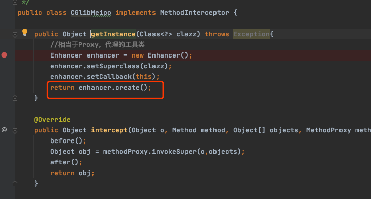

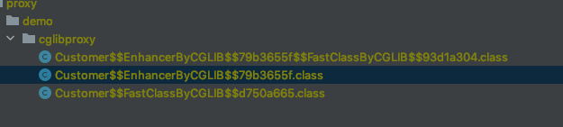

## 生成三个class文件

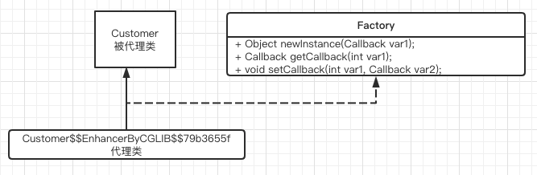

一个代理类, 继承了被代理对象, 实现了Factory接口, factory接口主要是用来设置拦截器, 

- [步骤1](#步骤1),调用被代理类的接口时, `Customer$$EnhancerByCGLIB$$79b3655f` 里的findLove方法
- [步骤2](#步骤2), 找到拦截器(我们自定义的实现 MethodInterceptor的 CGlibMeipo) ,并执行
- 步骤3, 寻找

#### 步骤1

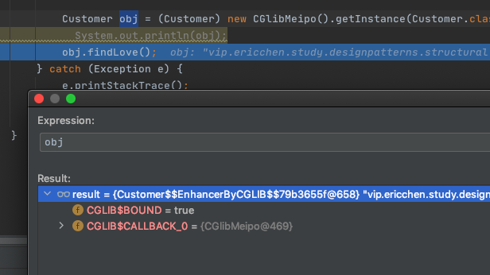

可以看到这里是调用的代理类的finLove方法

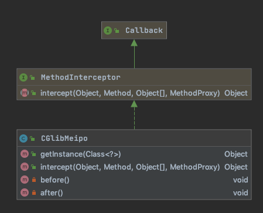

### 步骤2

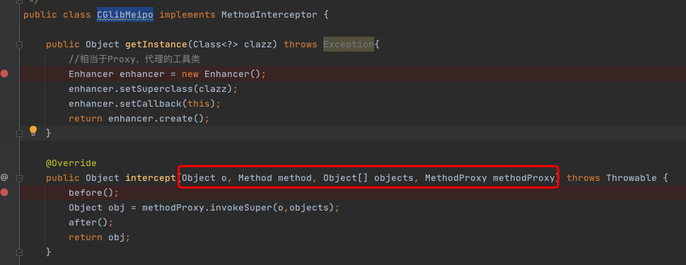

这三个类的作用

- [生成的字节码1:代理类](#生成的字节码1:代理类)
- [生成的字节码2:被代理类的FastClass](#生成的字节码2:被代理类的FastClass)
- [生成的字节码3:代理类的FastClass](#生成的字节码3:代理类的FastClass)

- Customer$$EnhancerByCGLIB$$79b3655f$$FastClassByCGLIB$$93d1a304`

  

- `Customer$$FastClassByCGLIB$$d750a665` extends FastClass 

## 生成的字节码1:代理类

`Customer$$EnhancerByCGLIB$$79b3655f ` 是代理类

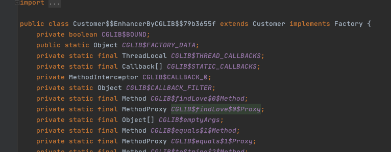

## 生成的字节码2:被代理类的FastClass

主要对所有

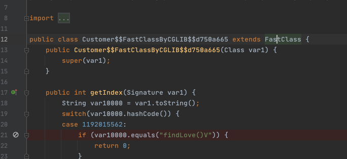

## 生成的字节码3:代理类的FastClass

最长的一个class文件

我们在实际调用时,是调用的代理类`Customer$$EnhancerByCGLIB$$79b3655f.class`,创建的也是这个代理类

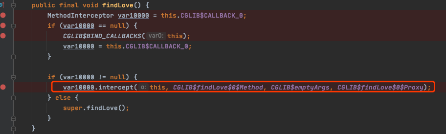

当调用它的 findlove 方法时,实际上走的方法拦截,就会调用到我们的 intercept 方法上

我么的 intercept 方法又调用了 methodProxy 方法, 这个方法实际是哪个

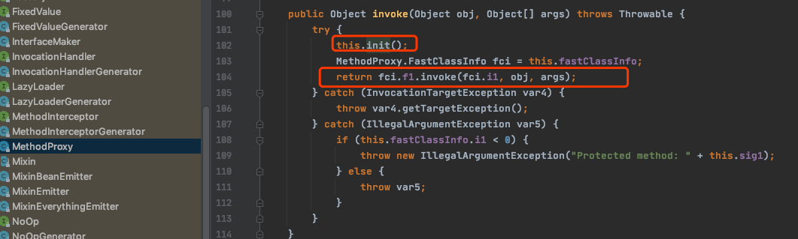

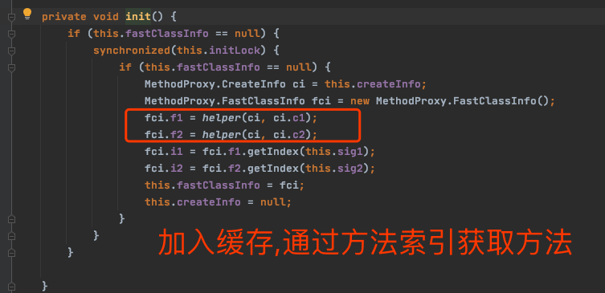

这里加入了缓存以后,实际上我们下次再执行时,就可以直接执行,而不用通过反射

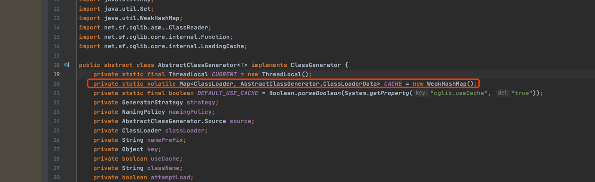