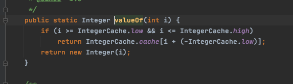
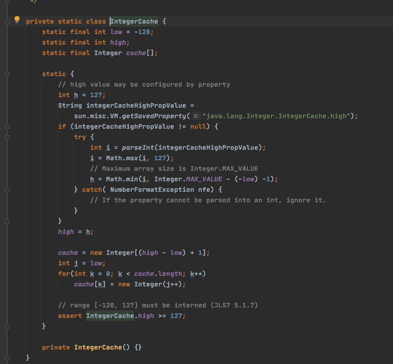

# 020-Integer中的享元模式

```java
public class IntegerTest {
    public static void main(String[] args) {
        Integer a = Integer.valueOf(127);
        Integer b = 127;

        Integer c = Integer.valueOf(128);
        Integer d = 128;

        System.out.println(a == b); //true
        System.out.println(c == d); //false
    }

}
```

Integer 会缓存 -128-127  ,因为使用频繁





