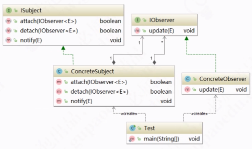

# 观察者模式（observer Pattern）

一种行为型模式,又称**发布订阅模式**

>  定义对象之间的一种一对多依赖关系，使得每当一个对象状态发生变化时，其相关依赖的对象都能得到通知并自动更新。

## UML



## 角色

- **Subject(目标)**: 目标又称为主题，它是被观察的对象。JDK中可以通过继承`Observable`类来实现被观察的需求。其中定义了一个观察者的集合`private Vector<Observer> obs;` 当目标发生变化时，调用`setChange`标记，并使用`notifyObservers`方法循环通知Observers。
- **Observer（观察者对象）**：观察者，可以通过实现JDK中的`Observer`类建立，当目标发生变化后，会调用`update`方法。

## 观察者模式的适用范围

- 当一个抽象模型包含两个方面的内容,其中一个方面依赖于另一个方面
- 其他一个或者多个对象的变化依赖于另一个对象的变化
- 实现类似于广播机制的功能,无需知道具体收听者,只需要分散广播,系统中感兴趣的对象会自动接收该广播
- 多级嵌套使用,形成一种链式触发机制,使得事件具备跨域(跨两种观察类型)的通知

## 代码实例

#### Java中的实现

 [README.md](../../04-java/06-Java事件-监听器编程模型/README.md) 

#### 观察目标

```java
public class GPer extends Observable {
    private String name = "GPer生态圈";
    private static final GPer gper = new GPer();

    private GPer() {}

    public static GPer getInstance(){
        return gper;
    }

    public String getName() {
        return name;
    }

    public void publishQuestion(Question question){
        System.out.println(question.getUserName() + "在" + this.name + "上提交了一个问题。");
        setChanged();
        notifyObservers(question);
    }
}
```

#### 观察者

```java
/**
 * @author Chen 2018/9/3
 */
public class Teacher implements Observer {

    private String name;

    public Teacher(String name) {
        this.name = name;
    }

    public void update(Observable o, Object arg) {
        GPer gper = (GPer)o;
        Question question = (Question)arg;
        System.out.println("======================");
        System.out.println(name + "老师，你好！\n" +
                        "您收到了一个来自" + gper.getName() + "的提问，希望您解答。问题内容如下：\n" +
                        question.getContent() + "\n" +
                        "提问者：" + question.getUserName());
    }
}


```

#### 客户端代码

```java
/**
 * @author Chen 2018/9/4
 */
public class Test {
    public static void main(String[] args) {
        GPer gper = GPer.getInstance();
        Teacher tom = new Teacher("Tom");
        Teacher jerry = new Teacher("Jerry");

        gper.addObserver(tom);
        gper.addObserver(jerry);

        //用户行为
        Question question = new Question();
        question.setUserName("张三");
        question.setContent("观察者模式适用于哪些场景？");

        gper.publishQuestion(question);
    }
}

```

## 优势

- 观察者模式实现表示层和数据逻辑层的分离。
- 在目标和观察者之间建立一个抽象的耦合，观察目标只需要维持一个抽象观察者的集合，无需了解其具体的观察者。
- 观察者模式支持广播通讯，观察目标会向所有已注册的观察者发送通知，简化一对多系统的设计难度，
- 观察者模式符合开闭原则

## 缺点

- 如果存在循环依赖，系统将有可能崩溃
- 观察者之间有过多的细节依赖,提高时间消耗以及程序的复杂度


# 监听器模式


## JDK 中的例子

```java
/**
 * JDK 中的观察者模式测试
 *
 * @author EricChen 2020/01/04 14:29
 */
public class JdkObserverExample {
    public static void main(String[] args) {
        YouTuber observer = new YouTuber();
        observer.addObserver(new Eric());
        observer.addObserver(new Tom());
        observer.postVideo();
        observer.notifyObservers();
    }

}

```

```java
/**
 * 视频订阅者
 *
 * @author EricChen 2020/01/04 14:20
 */
public abstract class VideoObserver implements Observer {

    @Override
    public void update(Observable o, Object arg) {
        System.out.println("视频更新啦,快来看");
        watch(o, arg);
    }

    protected abstract void watch(Observable o, Object arg);


}
public class Eric extends VideoObserver {


    @Override
    protected void watch(Observable o, Object arg) {
        System.out.println("Eric 搬起小板凳,开始看");
    }
}
public class Tom extends VideoObserver {

    @Override
    protected void watch(Observable o, Object arg) {
        System.out.println("Tom 抢占前排,开始看");
    }
}

```

```java
public class YouTuber extends Observable {

    /**
     * 发布视频
     */
    public void postVideo(){
        super.setChanged();
    }
}
```

输出

```
视频更新啦,快来看
Tom 抢占前排,开始看
视频更新啦,快来看
Eric 搬起小板凳,开始看
```

## Guava 

```
/**
 * guava test
 *
 * @author EricChen 2020/01/04 14:43
 */
public class GuavaObserverExample {

    public static void main(String[] args) {
        EventBus eventBus = new EventBus();
        eventBus.register(new Eric());
        eventBus.post("123");
    }
}

```

使用 Subscribe 注解标注订阅

```java
public class Eric {

    @Subscribe // 使用注解
    public void guava(String message){
        System.out.println("Eric" +message );
    }
}
```

## 监听器模式


ServletContextListener

ContextLoadListener

ContextListener

# 优点

- 观察者和被观察者是松耦合的,符合依赖导致原则
- 分离了表示层(观察者) 和数据逻辑层(被观察者) ,并且建立了一套触发机制,使得数据的变化可以响应到多个表示层
- 实现了一对多的通讯机制,支持时间注册机制,支持兴趣分发机制,当被观察者触发事件时,只有感兴趣的观察者可以接收到通知

# 缺点

- 如果观察者数量过多,则事件通知会耗时较长
- 事件通知呈线性关系,如果其中一个观察者处理事件卡壳,会影响后续的观察者接收该事件
- 如果观察者和被观察者之间存在循环依赖,则可能会造成两者之间循环调用,导致系统崩溃