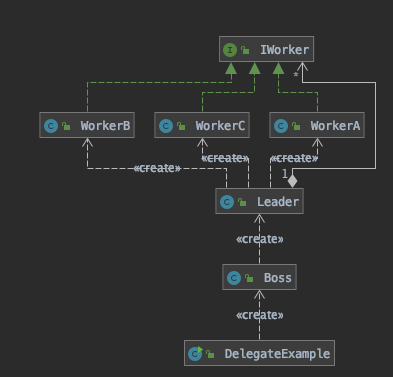

# 委派模式(Delegation Pattern)

## 定义

委派模式(Delegate Pattern) 的基本作用就是负责任务的调度与分配任务,跟代理模式很像,可以看做是一种特殊情况的静态代理的全权代理

- 代理模式注重过程

使用代理对象来执行目标对象的方法并在代理对象中增强目标对象方法。

- 委派模式注重结果

委派模式通常与策略模式一起使用

策略模式是针对一组算法，将每一个算法封装到具有共同接口的独立的类中，从而使得它们可以相互替换。策略模式使得算法可以在不影响到客户端的情况下发生变化。

Spring 中的 DispatcherServlet 就是使用的委派模式

## 解决问题

多任务,统筹调度问题,使用中间类(委派类)来调度任务,对客户端隐藏所有调度细节(黑盒)




```java
/**
 * 委派模式代码示例
 *
 * @author EricChen 2020/01/02 21:32
 */
public class DelegateExample {

    public static void main(String[] args) {
        new Boss().build("wash", "快点干完");
    }
}

```

```java
/**
 * BOSS ,只发布命令,让 leader 来给他干活,不知道谁干活
 *
 * @author EricChen 2020/01/02 21:23
 */
public class Boss {


    public void build(String job, String command) {
        new Leader().dispatcher(job, command);
    }

}
```

```java
/**
 * Leader 维护了谁可以干什么活,得到老板的命令后进行分配
 *
 * @author EricChen 2020/01/02 21:23
 */
public class Leader {
    private Map<String, IWorker> workers = new HashMap<>();

    {
        workers.put("paint", new WorkerA());
        workers.put("build", new WorkerB());
        workers.put("wash", new WorkerC());
    }

    public void dispatcher(String job, String command) {
        workers.get(job).work(command);
    }


}

```

```java
public interface IWorker {

    void work(String command);
}

public class WorkerA implements IWorker {

    @Override
    public void work(String command) {
        System.out.println("I can do painting" + ",收到命令:"+command);
    }
}
public class WorkerB implements IWorker{

    @Override
    public void work(String command) {
        System.out.println("I can build things"  + ",收到命令:"+ command);
    }
}
public class WorkerC implements IWorker {
    @Override
    public void work(String command) {
        System.out.println("I can do washing"  + ",收到命令:"+ command);

    }
}
```

