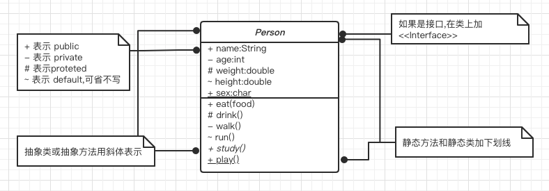
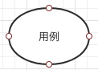
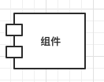
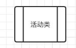

# 结构事物

#### 总架构镇楼

------

结构事务是模型中的静态部分,用以呈现概念或实体的表现元素

- [类](#类)

- 接口

  > 仅给出了一个类或者构件的操作集合,仅仅定义了一组操作范围

- [用例](#用例)

- [协作](#协作)

- [组件](#组件)

- [活动类](#活动类)

- [节点](#节点)

## 类

>  类 Class , 具有相同属性,方法,关系和语义的对象集合

##### 图例

## 用例

> 对一组动作序列的描述,系统执行这些动作将产生一个特定的 对于参与者 有价值且可观察的结果

## 协作

> 定义元素之间相互作用

## 组件

> 描述物理系统的一部分

## 活动类

> 值对象又一个或者多个进程或线程, 活动类和类很像,只是他的对象代表的元素的行为和其他元素是同时存在的

## 节点

> 定义为运行时存在的物理变量

