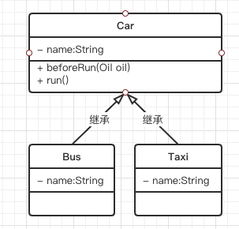
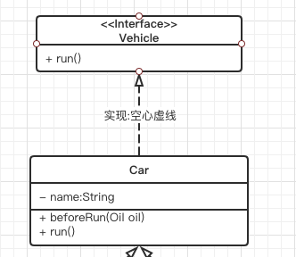
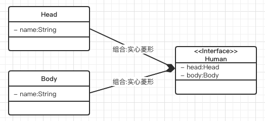
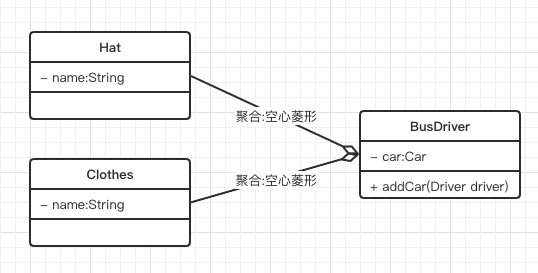
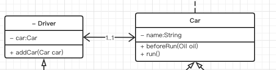
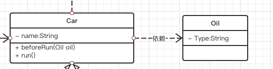
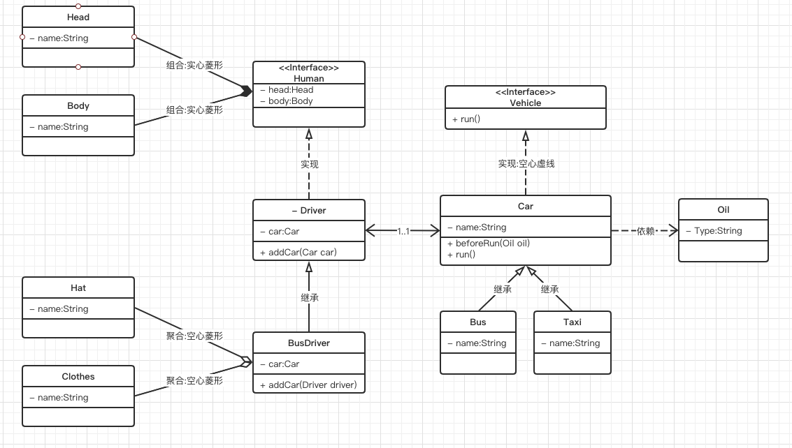

# 类图

类图是使用频率最高的 UML图之一,详细描述了系统中的类以及类之间的关系

## 关系

- [继承关系](#继承关系):空心实线
- [实现关系](#实现关系) : 空心虚线
- [组合关系](#组合关系): 实心菱形
- [聚合关系](#聚合关系): 空心菱形
- [关联关系](#关联关系) 实心箭头
- [依赖关系](#依赖关系) 虚心箭头

## 继承关系

继承 (Generallzation) 又叫做泛化,关系中,子类继承父类的所有功能

## 实现关系

实现接口或者抽象类: 空心虚线

## 组合关系

组合(Combination) 关系表示类之间整体与部分的关系, 整体与部分有一致的生存期,一旦整体对象不存在, 部分对象也将不存在,整体和部分是同生共死的关系,

例如

- 人 由 头和身体组成 , 不可分割

## 聚合

聚合关系也表示类之间整体与部分的关系,成员对象时整体对象的一部分,但是成员对象可以脱离整体对象独立存在, 例如 公交车司机与工作服,工作帽

## 关联关系

- 1..1 一对一
- 0..* 一对多
- 1..* 一个或者多个
- 0..1 没有或者只有一个
- m..n 最少 m, 最多 n个(m <=n)

## 依赖关系

依赖关系是一种使用关系, 特定事物的改变可能会影响到只用该事物的其他事务,当需要表示一个事物使用另一个事物时,要使用依赖关系,

- 汽车依赖汽油

## 实现

