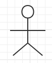
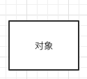
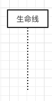
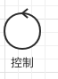
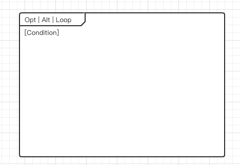
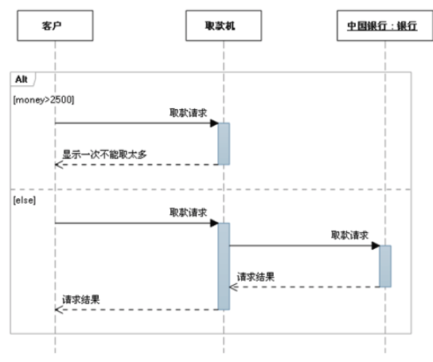
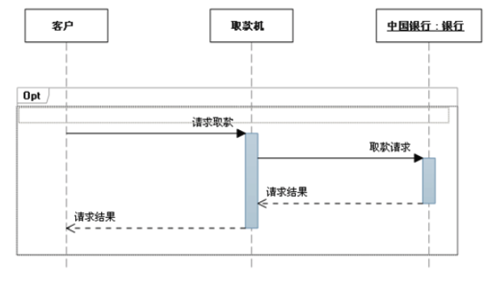
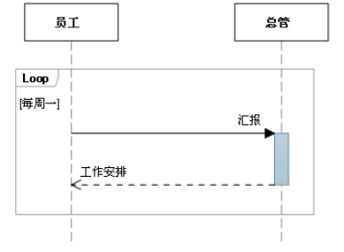
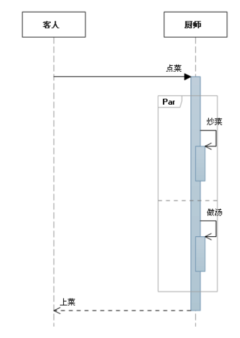

# 时序图

[TOC]

时序图描述对象之间消息的发送顺序,强调时间顺序,时序图是一个二维图,横轴表示对象,纵轴表示时间,消息在个对象之间横向传递,按照时间顺序纵向排列

- 箭头表示消息
- 竖虚线表示对象生命线

## 时序图的作用

- 展示对象花间的交互顺序
- 相对于其他 UML, 时序图更强调交互的时间顺序
- 可以直观的描述并发进程

### 时序图的组成元素

- [角色](#角色)
- [对象](#对象)
- [生命线](#生命线)
- [控制焦点](#控制焦点)
- [消息](@消息)

### 时序图的组合片段

- [抉择](#抉择)
- [选项](#选项)
- [循环](#循环)
- [并行](#并行)

## 时序图的组成元素

#### 角色

#### 对象

#### 生命线

#### 控制焦点

又称为激活期,表示时间段的符号,表示在这个时间段内对象将执行相应的操作

可以理解为 Java 中一对大括号的意义

#### 消息

同步消息和异步消息和返回消息

## 时序图的组合片段

#### 抉择

抉择用来指明在两个或更多的消息序列之间的互斥的选择，相当于经典的if..else..。

抉择在任何场合下只发生一个序列。 可以在每个片段中设置一个临界来指示该片段可以运行的条件。 **else** 的临界指示其他任何临界都不为 True 时应运行的片段。 如果所有临界都为 False 并且没有 **else**，则不执行任何片段。

#### 选项

包含一个可能发生或不发生的序列

#### 循环

片段重复一定次数。 可以在临界中指示片段重复的条件。

#### 并行

**下表列出了常用的组合片段：**

| 片段类型     | 名称   | 说明                                                         |
| ------------ | ------ | ------------------------------------------------------------ |
| **Opt**      | 选项   | 包含一个可能发生或可能不发生的序列。 可以在临界中指定序列发生的条件。 |
| **Alt**      | 抉择   | 包含一个片段列表，这些片段包含备选消息序列。 在任何场合下只发生一个序列。可以在每个片段中设置一个临界来指示该片段可以运行的条件。 **else** 的临界指示其他任何临界都不为 True 时应运行的片段。 如果所有临界都为 False 并且没有 **else**，则不执行任何片段。 |
| **Loop**     | 循环   | 片段重复一定次数。 可以在临界中指示片段重复的条件。Loop 组合片段具有**“Min”**和**“Max”**属性，它们指示片段可以重复的最小和最大次数。 默认值是无限制。 |
| **Break**    | 中断   | 如果执行此片段，则放弃序列的其余部分。 可以使用临界来指示发生中断的条件。 |
| **Par**      | 并行   | 并行处理。 片段中的事件可以交错。                            |
| **Critical** | 关键   | 用在 Par 或 Seq 片段中。 指示此片段中的消息不得与其他消息交错。 |
| **Seq**      | 弱顺序 | 有两个或更多操作数片段。 涉及同一生命线的消息必须以片段的顺序发生。 如果消息涉及的生命线不同，来自不同片段的消息可能会并行交错。 |
| **Strict**   | 强顺序 | 有两个或更多操作数片段。 这些片段必须按给定顺序发生。        |

**有关如何解释序列的片段**

默认情况下，序列图表明可能发生的一系列消息。 在运行的系统中，可能会出现您未选择显示在关系图上的其他消息。

以下片段类型可用于更改此释义：

| 片段类型     | 名称 | 说明                                                         |
| ------------ | ---- | ------------------------------------------------------------ |
| **Consider** | 考虑 | 指定此片段描述的消息列表。 其他消息可发生在运行的系统中，但对此描述来说意义不大。在**“Messages”**属性中键入该列表。 |
| **Ignore**   | 忽略 | 此片段未描述的消息列表。 这些消息可发生在运行的系统中，但对此描述来说意义不大。在**“Messages”**属性中键入该列表。 |
| **Assert**   | 断言 | 操作数片段指定唯一有效的序列。 通常用在 Consider 或 Ignore 片段中。 |
| **Neg**      | 否定 | 此片段中显示的序列不得发生。 通常用在 Consider 或 Ignore 片段中。 |