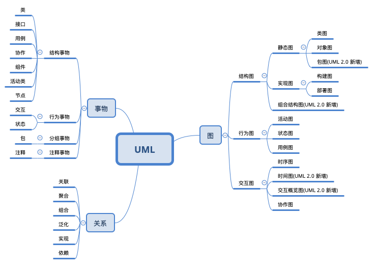

# UML

## UML定义

统一建模语言(Unifed Modeling Language,UML) 是一种对面向对象系统的产品进行**说明、可视化和编制文档的标准语言**,是非专利的第三代建模和规约语言

- 是一种面向对象设计的建模工具
- 是在开发阶段说明,可视化,构建和熟悉恶一个面向对象软件密集系统的制品的开放方法
- 独立于任何程序设计语言

## 应用场景

**UML 最佳的应用是工程实践面对大规模,复杂系统进行建模方法,特别是软件架构层次,已经被验证有效**

## UML 基本构建

## 笔记的结构

### [事物](010-事物) 

| 事务名称                             | 解释 |
| ------------------------------------ | ---- |
| [结构事物](010-事物/010-结构事物.md) |      |
| [行为事物](010-事物/020-行为事物.md) |      |
| [分组事物](010-事物/030-分组事物.md) |      |
| [注释事物](010-事物/040-注释事物.md) |      |

### 关系

| 关系名称                                      | 解释 |
| --------------------------------------------- | ---- |
| [关联  (Association)](020-关系/010-关联.md)   |      |
| [聚合 (Aggregate)](020-关系/020-聚合.md)      |      |
| [组合 (Conbination)](020-关系/030-组合.md)    |      |
| [泛化 (Generalization)](020-关系/040-泛化.md) |      |
| [实现 (Realization)](020-关系/050-实现.md)    |      |
| [依赖 (Dependency)](020-关系/060-依赖.md)     |      |

### 图

#### 静态图

| 图名称                                                       | 解释                                                         |
| ------------------------------------------------------------ | ------------------------------------------------------------ |
| [类图 (Class Diagrams)](030-图/010-结构图/010-静态图/010-类图.md) | 用于定义系统中的类                                           |
| [对象图 (Object Diagrams)](030-图/010-结构图/010-静态图/020-对象图.md) | 类图的一个实例,描述了系统在具体时间点上所包含的对象以及各个对象之间的关系 |
| [包图 (Package Diagrams)](030-图/010-结构图/010-静态图/030-包图.md) |                                                              |

#### 实现图

| 图名称                                                       | 解释                                     |
| ------------------------------------------------------------ | ---------------------------------------- |
| [构件图 (Component Diagrams)](030-图/010-结构图/020-实现图/010-构件图.md) | 一种特殊的 UML 图,描述系统的静态实现视图 |
| [部署图 (Deployment Diagrams)](030-图/010-结构图/020-实现图/020-部署图.md) | 定义系统中软硬件的物理体系结构           |

#### 组合结构图

| 图名称                                                       | 解释 |
| ------------------------------------------------------------ | ---- |
| [组合结构图 (Composite Structure Diagrams)](030-图/010-结构图/030-组合结构图/010-组合结构图.md) |      |

#### 行为图

| 图名称                                                       | 解释                                                   |
| ------------------------------------------------------------ | ------------------------------------------------------ |
| [活动图 (Actvivty Diagrams)](030-图/020-行为图/010-活动图.md) | 用来描述满足用例要求所要进行的活动以及活动间的约束条件 |
| [状态图 (State Chart Diagrams)](030-图/020-行为图/020-状态图.md) |                                                        |
| [用例图 (Usecase Diagrams)](030-图/020-行为图/030-用例图.md) |                                                        |

#### 交互图

| 图名称                                                       | 解释 |
| ------------------------------------------------------------ | ---- |
| [时序图 (Sequence Diagrams)](030-图/030-交互图/010-时序图.md) |      |
| [时间图 (Timing Diagrams)](030-图/030-交互图/020-时间图.md)  |      |
| [交互概览图 (Interaction Overview Diagrams)](030-图/030-交互图/030-交互概览图.md) |      |
| [协作图 (Collabration Diagrams)](030-图/030-交互图/040-协作图.md) |      |

