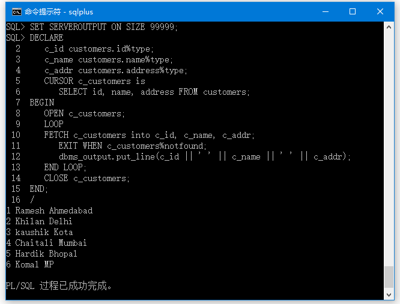

[返回目录](/README.md)

转载 [原文链接](http://www.oraok.com/plsql/plsql_cursors.html)

# 游标

游标是指向此上下文区域的指针。PL/SQL通过游标控制上下文区域，游标保存SQL语句返回的行\(一个或多个\)。 游标所在的行集称为活动集。

可以命名一个游标，以便在程序中引用它来获取和处理SQL语句返回的行，一次处理一个\(行\)。PL/SQL中有两种类型的游标 -

* 隐式游标
* 显式游标

## 隐式游标

当执行SQL语句时，如果语句没有显式游标，则Oracle会自动创建隐式游标。程序员无法控制隐式游标及其信息。

每当发出DML语句\(`INSERT`，`UPDATE`和`DELETE`\)时，隐式游标与此语句相关联。 对于`INSERT`操作，游标保存需要插入的数据。对于`UPDATE`和`DELETE`操作，游标标识将受到影响的行。

在PL/SQL中，可以将最近的隐式游标引用为SQL游标，它始终具有`%FOUND`，`%ISOPEN`，`%NOTFOUND`和`%ROWCOUNT`等属性。 SQL游标具有额外的属性`%BULK_ROWCOUNT`和`%BULK_EXCEPTIONS`，旨在与`FORALL`语句一起使用。下表提供了游标中最常用属性的描述 -

| 编号 |
| :--- |


|  | 属性 | 描述 |
| :--- | :--- | :--- |
| 1 | `%FOUND` | 如果`INSERT`，`UPDATE`或`DELETE`语句影响一行或多行，或老兄`SELECT INTO`语句返回一行或多行，则返回`TRUE`，否则返回`FALSE`。 |
| 2 | `%NOTFOUND` | 与`%FOUND`的逻辑相反。 如果INSERT，UPDATE或DELETE语句没有影响任何行，或SELECT INTO语句未返回任何行，则返回TRUE。 否则返回FALSE。 |
| 3 | `%ISOPEN` | 由于Oracle在执行关联的SQL语句后会自动关闭SQL游标，因此总是为隐式游标返回`FALSE`。 |
| 4 | `%ROWCOUNT` | 返回受`INSERT`，`UPDATE`或`DELETE`语句，或者受`SELECT INTO`语句影响的行数。 |

任何SQL游标属性将被访问为

`sql％attribute_name`，如下例所示。

```
CREATE TABLE CUSTOMERS( 
   ID   INT NOT NULL, 
   NAME VARCHAR (20) NOT NULL, 
   AGE INT NOT NULL, 
   ADDRESS CHAR (25), 
   SALARY   DECIMAL (18, 2),        
   PRIMARY KEY (ID) 
);

-- 插入数据
INSERT INTO CUSTOMERS (ID,NAME,AGE,ADDRESS,SALARY) 
VALUES (1, 'Ramesh', 32, 'Ahmedabad', 2000.00 );  

INSERT INTO CUSTOMERS (ID,NAME,AGE,ADDRESS,SALARY) 
VALUES (2, 'Khilan', 25, 'Delhi', 1500.00 );  

INSERT INTO CUSTOMERS (ID,NAME,AGE,ADDRESS,SALARY) 
VALUES (3, 'kaushik', 23, 'Kota', 2000.00 );

INSERT INTO CUSTOMERS (ID,NAME,AGE,ADDRESS,SALARY) 
VALUES (4, 'Chaitali', 25, 'Mumbai', 6500.00 ); 

INSERT INTO CUSTOMERS (ID,NAME,AGE,ADDRESS,SALARY) 
VALUES (5, 'Hardik', 27, 'Bhopal', 8500.00 );  

INSERT INTO CUSTOMERS (ID,NAME,AGE,ADDRESS,SALARY) 
VALUES (6, 'Komal', 22, 'MP', 4500.00 );
```

以下程序将表中每个客户的工资增加`500`，并使用`SQL%ROWCOUNT`属性来确定受影响的行数 -

```
SET SERVEROUTPUT ON SIZE 99999;
DECLARE  
   total_rows number(2); 
BEGIN 
   UPDATE customers 
   SET salary = salary + 500; -- 一次性全部加500
   IF sql%notfound THEN 
      dbms_output.put_line('没有找到客户信息~'); 
   ELSIF sql%found THEN 
      total_rows := sql%rowcount;
      dbms_output.put_line('一共有：' || total_rows || ' 个客户的工资被更新！ '); 
   END IF;  
END; 
/
```

## 显式游标

显式游标是用于获得对上下文区域的更多控制的程序员定义的游标。应在PL/SQL块的声明部分中定义一个显式游标。它是在一个返回多行的`SELECT`语句中创建的。

创建显式游标的语法是 -

```
CURSOR cursor_name IS select_statement;
```

使用显式游标包括以下步骤 -

* 声明游标初始化内存
* 打开游标分配内存
* 从游标获取数据
* 关闭游标以释放分配的内存

**声明游标**

声明游标使用名称和相关的1SELECT1语句来定义游标。 例如 -

```
CURSOR c_customers IS 
SELECT id, name, address FROM customers;
```

**打开游标**

打开游标将为游标分配内存，并使其准备好将SQL语句返回的行记录数据提取到其中。例如，打开上面定义的游标，如下所示：

```
OPEN c_customers;
```

**获取游标**  
获取游标一次仅访问一行。 例如，从上面打开的游标中获取行，如下所示代码：

```
FETCH c_customers INTO c_id, c_name, c_addr;
```

**关闭游标**

关闭游标意味着释放分配的内存。例如，关闭上面打开的游标，如下所示：

```
CLOSE c_customers;
```

### 示例 {#h3-u793Au4F8B}

以下是一个完整的例子来说明显式游标的概念。

```
SET SERVEROUTPUT ON SIZE 99999;
DECLARE 
   c_id customers.id%type; -- 获取到id的类型
   c_name customers.name%type;  -- 获取到name的类型
   c_addr customers.address%type;  -- 获取到address的类型
   CURSOR c_customers is 
      SELECT id, name, address FROM customers; 
BEGIN 
   OPEN c_customers; -- 开启游标
   LOOP 
   FETCH c_customers into c_id, c_name, c_addr; -- 获取游标中的数据
      EXIT WHEN c_customers%notfound;  -- c_customers无数据时退出
      dbms_output.put_line(c_id || ' ' || c_name || ' ' || c_addr); 
   END LOOP; 
   CLOSE c_customers; 
END; 
/
```



## 带有参数的游标

例子：根据ID查询某个员工的工资和姓名：

```
declare

  cursor cemp (dno number) is select name,salary from customers where id =  dno;
  pename customers.name%type;
  psal customers.salary%type;

begin
  open cemp(6);
  loop 
    fetch cemp into pename,psal;
    exit when cemp%notfound;
    dbms_output.put_line(pename||'的工资为'||psal);
  end loop;
  close cemp;
end;
```


