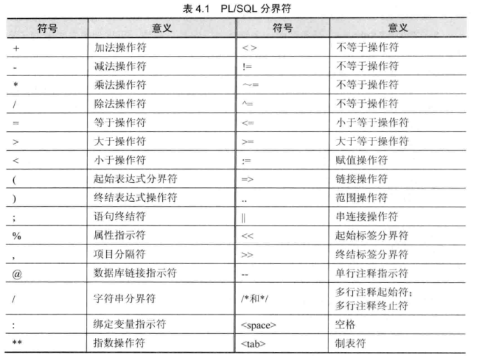

[返回目录](/README.md)

## 基本结构

```
DECLARE
    -- 声明一些变量、常量、用户定义的数据类型以及游标等
    -- 这一部分可选，如果不需要可以不写
BEGIN
    -- 主程序体，在这可以加入各种合法语句
EXCEPTION
    -- 异常处理程序，当程序中出现错误时执行这一部分
END; -- 程序体结束
```

* 声明部分（Declarative Section）
* 执行部分（Exceutable Section）
* 异常处理部分（Exception Section）

其中，只有执行部分是必须的，其他两个部分是可选的。

## **Hello World示例**

```
DECLARE 
   message  varchar2(20):= 'Hello, World!'; 
BEGIN 
   dbms_output.put_line(message); 
END; 
/
```

`END;`

行表示PL/SQL块的结尾。要从SQL命令行运行代码，需要在代码的最后一行之后键入`/`字符。当上述代码在SQL提示符下执行时，它会产生以下结果 -

```
Hello World  

PL/SQL procedure successfully completed.
```

## 分界符

分界符（Deliniter）是对PL/SQL有特殊意义的符号（单字符或者字符序列）。它们用来将标识符相互分割开，表4.1列出了PL/SQL中的可以使用的分界符




