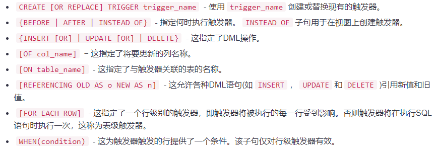

[返回目录](/README.md)

# 触发器

触发器是为了响应以下任何事件而被执行的 -

* 数据库操作\(DML\)语句\(`DELETE`，`INSERT`或`UPDATE`\)
* 数据库定义\(DDL\)语句\(`CREATE`，`ALTER`或`DROP`\)。
* 数据库操作\(`SERVERERROR`，`LOGON`，`LOGOFF`，`STARTUP`或`SHUTDOWN`\)。

可以在事件关联的表，视图，模式或数据库上定义触发器。

**使用触发器的好处**

触发器可以用于以下目的 -

* 自动生成一些派生列值
* 强化参照完整性
* 事件记录和存储表访问信息
* 审计
* 表的同步复制
* 实施安全授权
* 防止无效的事务

## 创建触发器

语法：

```
CREATE [OR REPLACE ] TRIGGER trigger_name  
{BEFORE | AFTER | INSTEAD OF }  
{INSERT [OR] | UPDATE [OR] | DELETE}  
[OF col_name]  
ON table_name  
[REFERENCING OLD AS o NEW AS n]  
[FOR EACH ROW]  
WHEN (condition)   
DECLARE 
   Declaration-statements 
BEGIN  
   Executable-statements 
EXCEPTION 
   Exception-handling-statements 
END;
```

## 例子

```
CREATE TABLE CUSTOMERS( 
   ID   INT NOT NULL, 
   NAME VARCHAR (20) NOT NULL, 
   AGE INT NOT NULL, 
   ADDRESS CHAR (25), 
   SALARY   DECIMAL (18, 2),        
   PRIMARY KEY (ID) 
);
-- 插入示例数据
INSERT INTO CUSTOMERS (ID,NAME,AGE,ADDRESS,SALARY) 
VALUES (1, 'Ramesh', 32, 'Ahmedabad', 2000.00 );  

INSERT INTO CUSTOMERS (ID,NAME,AGE,ADDRESS,SALARY) 
VALUES (2, 'Khilan', 25, 'Delhi', 1500.00 );  

INSERT INTO CUSTOMERS (ID,NAME,AGE,ADDRESS,SALARY) 
VALUES (3, 'kaushik', 23, 'Kota', 2000.00 );

INSERT INTO CUSTOMERS (ID,NAME,AGE,ADDRESS,SALARY) 
VALUES (4, 'Chaitali', 25, 'Mumbai', 6500.00 ); 

INSERT INTO CUSTOMERS (ID,NAME,AGE,ADDRESS,SALARY) 
VALUES (5, 'Hardik', 27, 'Bhopal', 8500.00 );  

INSERT INTO CUSTOMERS (ID,NAME,AGE,ADDRESS,SALARY) 
VALUES (6, 'Komal', 22, 'MP', 4500.00 );
```

```
下面的程序为customers表创建一个行级触发器，该触发器将触发在customers表上执行的INSERT，UPDATE或DELETE操作
。这个触发器将显示旧值和新值之间的工资差异 -

SET SERVEROUTPUT ON SIZE 999999;
CREATE OR REPLACE TRIGGER display_salary_changes 
BEFORE DELETE OR INSERT OR UPDATE ON customers 
FOR EACH ROW 
WHEN (NEW.ID > 0) 
DECLARE 
   sal_diff number; 
BEGIN 
   sal_diff := :NEW.salary  - :OLD.salary; 
   dbms_output.put_line('Old salary: ' || :OLD.salary); 
   dbms_output.put_line('New salary: ' || :NEW.salary); 
   dbms_output.put_line('Salary difference: ' || sal_diff); 
END; 
/
```

这里需要考虑以下几点 -

* `OLD`和`NEW`引用不可用于表级触发器，而是可以将它们用于记录级触发器。
* 如果要在同一个触发器中查询表，则应该使用`AFTER`关键字，因为触发器只能在应用初始更改并且表返回一致状态后才能查询表或进行更改。
* 上面的触发器是这样：在表上执行任何`DELETE`或`INSERT`或`UPDATE`操作之前触发，但是可以在一个或多个操作上编写触发器，例如`BEFORE DELETE`，当表中的一条记录被删除时，自动触发。

**触发一个触发器**

现在，在`customers`表上执行一些DML操作。这里以执行一个`INSERT`语句作为示例，它将在表中创建一个新记录 -

```
INSERT INTO CUSTOMERS (ID,NAME,AGE,ADDRESS,SALARY) 
VALUES (7, 'Hinew', 23, 'Oracle', 9500.00 );
```

```
SQL> INSERT INTO CUSTOMERS (ID,NAME,AGE,ADDRESS,SALARY)
  2  VALUES (7, 'Hinew', 23, 'Oracle', 9500.00);
Old salary:
New salary: 9500
Salary difference:

已创建 1 行。

SQL>
```

因为这是一个新的记录，旧的薪水\(`salary`\)列是不可用的，上述结果为空。下面再向`CUSTOMERS`表上执行另一个更多的DML操作。这次使用`UPDATE`语句来更新表中的现有记录 -

```
UPDATE customers 
SET salary = salary + 500 
WHERE id = 2;
```

```
SQL> UPDATE customers
  2  SET salary = salary + 500
  3  WHERE id = 2;
Old salary: 1500
New salary: 2000
Salary difference: 500

已更新 1 行。
```


