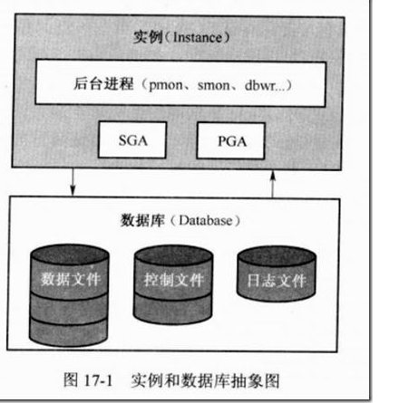
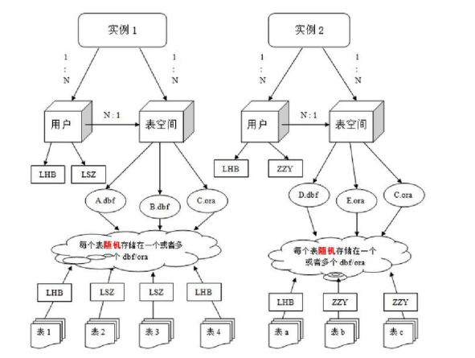
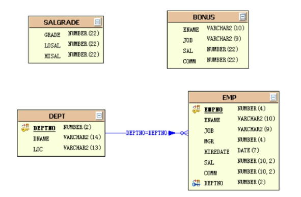
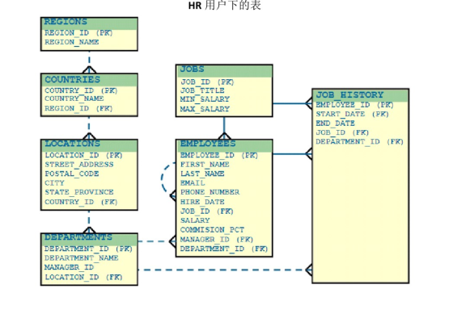

[返回目录](/README.md)

# Oracle数据库的体系结构

* SGA:System global area 系统全局区
* PGA:Process gobal area  进程全局区

客户端commit后，数据由PGA进入SGA.

SGA通过写进程把数据写入到数据库中

## 数据库（database）

Oracle数据库是数据的物理存储，这就包括（**数据文件ORA或者DBF**）、\(**控制文件CTL**\)、（**联机日志.LOG**）、（**参数文件**）。其实Oracle数据库的概念和其他数据库不一样，这里的数据库是一个操作系统只有一个库。可以看做是Oracle就只有一个大数据库。

## 实例（Instance）

一个Oracle实例（Oracle Instance）有一系列的**后台进程**（BackGround Processes），和**内存结构**（Memory Structures）组成，一个数据库可以由N个实例。

## 数据文件（dbf）

数据文件是数据库的物理存储单位。数据库的数据是存储在表空间的，真正是在某一个或者多个数据文件组成，一个数据文件只能属于一个表空间。一旦数据文件被加入到某个表空间后，就不能删除这个文件，如果要删除某个数据文件，只能删除其所属的表空间才行。

## 表空间

表空间是Oracle对物理数据库上相关数据文件（ORA或者DBF文件）的逻辑映射。一个数据库在逻辑上被划分成一到若干个表空间，每个表空间包含了在逻辑上相关联的一组结构。每个数据库至少有一个表空间（称之为system表空间）

每个表空间由同一磁盘上的一个或者多个文件组成，这些文件叫数据文件（dataFile）。**一个数据文件只能属于一个表空间。**

**表空间是逻辑概念，数据文件为物理概念。**

## 用户

用户是在实例下建立的，不同实例中可以建相同名字的用户。

表的数据是有用户放入某一个表空间的，而这个表空间会随机把这些表数据放到一个或者多个数据文件中，

由于Oracle的数据库不是普通的概念，Oracle是有用户和表空间对数据进行管理和存的。但是表不是有表空间去查询的，而是由用户去查的。因为不同的用户可以在同一个表空间建立同一个名字的表，这里区分就是用户。

# 

# SCOTT用户和HR用户

Oracle为了让学习者更好的进行学习，在安装成功后，也创建了初始的用户，其中SCOTT与HR就是初始的普通用户，这些用户下面都默认存在了表结构，我们重点掌握SCOTT用户下的所有表，如图：

上图为SCOTT用户下的表

上图为HR用户下的表

