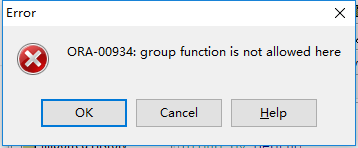

[返回目录](/basic/where&having.md)

# Where和Having的区别

* where 后面不能有分组函数

```
select deptno,avg(sal) from emp
having avg(sal) > 200
group by deptno;
```

可以正常运行

```
select deptno,avg(sal) from emp
where avg(sal) > 200
group by deptno;
```

不能正常运行




