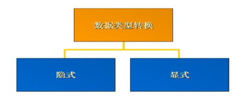
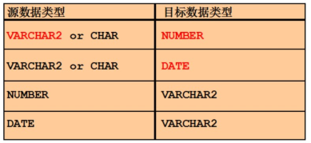
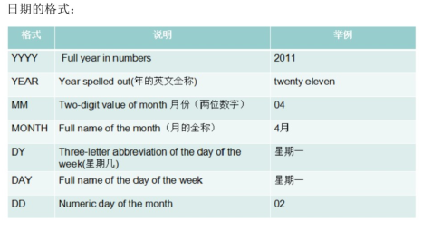
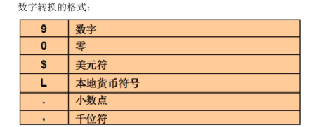

[返回目录](/README.md)

# 转换函数




## 隐式数据类型转换

Oracle自动完成数据类型的转换。



## 显示数据类型转换


## TO\_CHAR函数对日期的转换

```
TO_CHAR(date,'format_model')
```



## TO\_CHAR函数对数字的转换



## TO\__NUMBER 和 TO_\_DATE函数

使用TO\_NUMBER函数将字符转换为数字

```
TO_NUMBER(char[,'format_model'])
```

使用TO\_DATE函数将字符转化成日期

```
TO_DATE(char[,'format_model'])
```

示例：

### **1.TO\_CHAR：字符串转换函数**

范例：查询所有的雇员将年月日分开，此时可以使用TO\_CHAR函数来拆分，拆分时需要使用通配符。

年：y,年是四位使用yyyy

月：m，月是12位使用mm

日：d,日是2位使用dd

```
select empno,ename, to_char(hiredate,'yyyy-mm-dd') from emp 

       EMPNO    ENAME    TO_CHAR(HIREDATE,'YYYY-MM-DD')
1    7369    SMITH    1980-12-17
2    7499    ALLEN    1981-02-20
3    7521    WARD    1981-02-22
4    7566    JONES    1981-04-02
5    7654    MARTIN    1981-09-28
6    7698    BLAKE    1981-05-01
7    7782    CLARK    1981-06-09
8    7788    SCOTT    1987-04-19
9    7839    KING    1981-11-17
10    7844    TURNER    1981-09-08
11    7876    ADAMS    1987-05-23
```

在结果中10以下的月前面有0，可以使用fm去掉前导零。

```
select empno,ename, to_char(hiredate,'fmyyyy-mm-dd') from emp 

       EMPNO    ENAME    TO_CHAR(HIREDATE,'FMYYYY-MM-DD
1    7369    SMITH    1980-12-17
2    7499    ALLEN    1981-2-20
3    7521    WARD    1981-2-22
4    7566    JONES    1981-4-2
5    7654    MARTIN    1981-9-28
6    7698    BLAKE    1981-5-1
7    7782    CLARK    1981-6-9
8    7788    SCOTT    1987-4-19
9    7839    KING    1981-11-17
10    7844    TURNER    1981-9-8
11    7876    ADAMS    1987-5-23
```

TO\_CHAR还可以给数字做格式化

范例：把雇员的工资按照三位用“ ,”分隔，在oracle中“9”代表一位数字

```
select ename,to_char(sal,'99,999') from emp
       ENAME    TO_CHAR(SAL,'99,999')
1    SMITH        800
2    ALLEN      1,600
3    WARD      1,250
4    JONES      2,975
5    MARTIN      1,250
6    BLAKE      2,850
7    CLARK      2,450
8    SCOTT      3,000
9    KING      5,000
10    TURNER      1,500
11    ADAMS      1,100
```

可以在钱上面加上$，代表是美元，如果要使用本地的前的单位使用L

```
select ename,to_char(sal,'L99,999') from emp
       ENAME    TO_CHAR(SAL,'L99,999')
1    SMITH                 $800
2    ALLEN               $1,600
3    WARD               $1,250
4    JONES               $2,975
5    MARTIN               $1,250
6    BLAKE               $2,850
7    CLARK               $2,450
8    SCOTT               $3,000
9    KING               $5,000
10    TURNER               $1,500
11    ADAMS               $1,100
```

### TO\_NUMBER：数值转换函数

```
select to_number('10')+to_number('10') from dual 
   	TO_NUMBER('10')+TO_NUMBER('10'
1	20

```

### TO\_DATE：日期转换函数

TO\_DATE可以把字符串的数据转换为日期类型

```
select to_date('1985-04-22','yyyy-mm-dd') from dual
   	TO_DATE('1985-04-22','YYYY-MM-
1	1985-4-22


```


