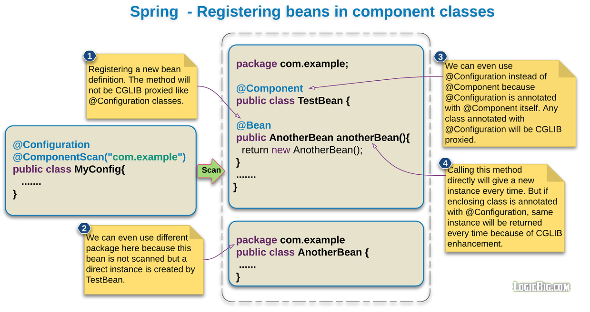

## 使用`@Component`注册 bean

> 版权声明
>
> 此篇文章参考于[logicbig](https://www.logicbig.com/),引用其文字/代码/图片仅用于学习笔记,不用于商业用途

元注解(`@Component`,` @Service`, `@Repository` etc)标注的类都可以使用`@Bean`暴露新的 bean

建议还是使用`@Configuration`类去标注 bean

- 如果不使用`@Configuration`标注的 bean 会被标注为`lite`模式

- 在`lite`模式下,这个标注`@bean`的方法不能够声明内部 bean 依赖.通常情况下`@Bean` 方法不应该调用其他的`@Bean` 方法

  

## `@Component`class 不使用 CGLIB 代理

`@Component`类没有增强`CGILIB`来拦截bean方法调用，这意味着直接调用不会通过容器路由，而是每次返回一个新实例。

## 使用场景

- 想要把 component bean 注册为类似一个 factory
- 其他情况还是不推荐使用