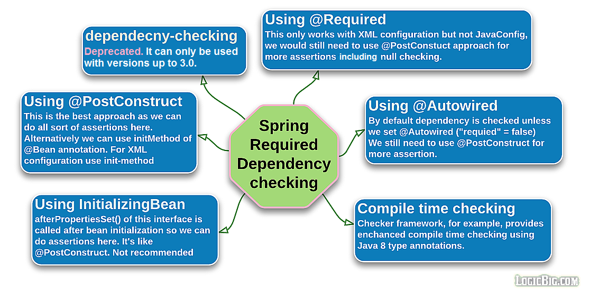

# 必须依赖检测

> 版权声明
>
> 此篇文章参考于[logicbig](https://www.logicbig.com/),引用其文字/代码/图片仅用于学习笔记,不用于商业用途

在一个大型的项目中,许多开发者并行开发,会有以下需求:

- 框架级别的机制去检测必须属性设置与否
- 这个检测应该是在编译时进行
- 如果无法再编译时解决,那么应该在启动时报空指针异常

Spring 提供了许多启动时依赖检测机制

## 构造注入还是 setter 注入

- 构造注入:用于bean 必填属性,可以设一些属性检查,例如抛出异常
- setter 注入: 用于可选属性,在注入时检测是否需要必填

## 如何检测必填属性



我们有很多可选方案,来检测必填属性:

- 使用属性`dependency-check`来 检测

在 Spring 3.0就过时了

- 使用`@PostConstruct(init-method)`,然后使用 assert 断言机制
- 使用`InitialzingBean`,然后使用断言机制
- 使用`@Required`注解,如果属性没有设置就会抛出

```
Caused by: org.springframework.beans.factory.BeanInitializationException: Property 'serviceBean' is required for bean 'clientBean'

```

如果想要使用这个机制,那么我们得注册一个`RequiredAnnotationBeanPostProcessor`并且重写`shouldSkip`方法

```java
 @Bean
    public RequiredAnnotationBeanPostProcessor processor () {
        return new RequiredAnnotationBeanPostProcessor() {
            @Override
            protected boolean shouldSkip (ConfigurableListableBeanFactory beanFactory,
                                          String beanName) {
                if (beanName.equals("clientBean")) {
                    return false;
                }
                return super.shouldSkip(beanFactory, beanName);
            }
        };
    }
```

- 使用`@Autowired`注解,这个注解,其中`required`注解默认是 true,如果不存在,就会抛出

```
Caused by: org.springframework.beans.factory.NoSuchBeanDefinitionException: No qualifying bean of type [ServiceBean] found for dependency [ServiceBean]: expected at least 1 bean which qualifies as autowire candidate for this dependency. Dependency annotations: {}

```

- 使用构造器注入
- 使用编译时间检查框架