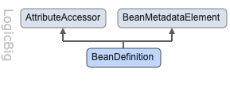
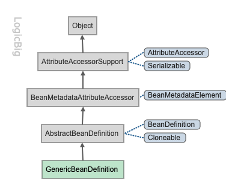

# 动态注册 bean

dynamically register beans

如果客户端需要注册不被 Spring 容器管理的对象,我们需要手动使用`BeanDefinition`的实例

一个 Spring 应用可以使用  [BeanDefinitionRegistry](http://docs.spring.io/spring/docs/current/javadoc-api/org/springframework/beans/factory/support/BeanDefinitionRegistry.html) 注册一个 BeanDefinition

BeanDefinitionRegistry中的方法:

```java
 void registerBeanDefinition(String beanName, BeanDefinition beanDefinition)
```

## BeanDefinition




BeanDefinition 描述了一个 bean 实例,它的 setter方法可以用来硬编码方式设置 Spring bean 到一个 bean ,例如 [BeanDefinition #setScope(String scope)](http://docs.spring.io/spring/docs/current/javadoc-api/org/springframework/beans/factory/config/BeanDefinition.html#setScope-java.lang.String-) 可以设置一个 scope

## GenericBeanDefinition



这是一个标准的 BeanDefinition 实现类

它允许指定bean类、bean特征、构造函数参数值和属性值。

```java
/**
 * 此案例展示了如何使用 {@link GenericBeanDefinition} 手动注册 bean 到 {@link DefaultListableBeanFactory}
 * 并且使用{@link MutablePropertyValues} 设置 bean 的属性 date
 *
 * @author EricChen 2019/11/27 19:03
 */
public class GenericBeanDefinitionExample {
    public static void main(String[] args) {
        DefaultListableBeanFactory context = new DefaultListableBeanFactory();

        GenericBeanDefinition gbd = new GenericBeanDefinition();
        gbd.setBeanClass(MyBean.class);

        MutablePropertyValues mpv = new MutablePropertyValues();
        mpv.add("date", new Date());

        //alternatively we can use:
        // gbd.getPropertyValues().addPropertyValue("date", new Date());
        gbd.setPropertyValues(mpv);

        context.registerBeanDefinition("myBeanName", gbd);

        MyBean bean = context.getBean(MyBean.class);
        bean.doSomething();
    }

    private static class MyBean {
        private Date date;

        public void doSomething () {
            System.out.println("from my bean, date: " + date);
        }

        public void setDate (Date date) {
            this.date = date;
        }
    }
}

```

## 使用 BeanDefinitionBuilder

使用建造者模式  [05-builder-pattern.md](../../../../01-design-patterns/02-creational-patterns/05-builder-pattern.md) 

```java
/**
 * 代码实例: 根据{@link BeanDefinitionBuilder} 建造者模式来构建一个啊 bean 并注册到 {@link DefaultListableBeanFactory}
 *
 * @author EricChen 2019/11/27 19:09
 */
public class BeanDefinitionBuilderExample {

    public static void main(String[] args) {
        DefaultListableBeanFactory factory = new DefaultListableBeanFactory();
        BeanDefinitionBuilder beanDefinitionBuilder = BeanDefinitionBuilder
                .rootBeanDefinition(MyBean.class)
                .addPropertyValue("str", "hello")
                .setScope(ConfigurableBeanFactory.SCOPE_PROTOTYPE);
        factory.registerBeanDefinition("myBean", beanDefinitionBuilder.getBeanDefinition());

        MyBean bean = factory.getBean(MyBean.class);
        bean.doSomething();
    }

    public static class MyBean {
        private String str;

        public void setStr(String str) {
            this.str = str;
        }

        public void doSomething() {
            System.out.println("from MyBean " + str);
        }
    }
}

```

## Injecting other bean references

```java
/**
 * 将 {@link MyOtherBean} 注入到 {@link MyBean}中
 *
 * @author EricChen 2019/11/27 17:17
 */
public class InjectingOtherBeans {
    public static void main(String[] args) {
        DefaultListableBeanFactory context = new DefaultListableBeanFactory();

        //define and register MyOtherBean
        GenericBeanDefinition beanOtherDef = new GenericBeanDefinition();
        beanOtherDef.setBeanClass(MyOtherBean.class);
        context.registerBeanDefinition("other", beanOtherDef);

        //definine and register myBean
        GenericBeanDefinition beanDef = new GenericBeanDefinition();
        beanDef.setBeanClass(MyBean.class);
        MutablePropertyValues mpv = new MutablePropertyValues();
        mpv.addPropertyValue("otherBean", context.getBean("other"));
        beanDef.setPropertyValues(mpv);
        context.registerBeanDefinition("myBean", beanDef);

        //using MyBean instance
        MyBean bean = context.getBean(MyBean.class);
        bean.doSomething();
    }

    private static class MyBean {
        private MyOtherBean otherBean;

        public void setOtherBean(MyOtherBean otherBean) {
            this.otherBean = otherBean;
        }

        public void doSomething() {
            otherBean.doSomething();
        }
    }

    private static class MyOtherBean {

        public void doSomething() {
            System.out.println("from other bean ");
        }
    }
}
```

## 使用 BeanFactoryPostProcessor

[BeanFactoryPostProcessor](http://docs.spring.io/spring/docs/current/javadoc-api/org/springframework/beans/factory/config/BeanFactoryPostProcessor.html)  我们可以使用它控制 bean 定义,这个方法`BeanFactoryPostProcessor.postProcessBeanFactory` 在 spring 启动流程时,在锁头 bean 定义都load 以后,但是还没有实例化之前

```java
/**
 * 代码实例
 * 标注有 @Configuration 注解的类 实现 {@link BeanFactoryPostProcessor} 接口 实现 postProcessBeanFactory()
 * 方法可在所有 bean load 之后 ,初始化之前执行
 *
 * @author EricChen 2019/11/27 17:22
 */
@Configuration
public class BeanFactoryPostProcessorExample implements BeanFactoryPostProcessor {
    public static void main(String[] args) {
        AnnotationConfigApplicationContext context = new AnnotationConfigApplicationContext(BeanFactoryPostProcessorExample.class);
        MyBean bean = context.getBean(MyBean.class);
        bean.doSomething();
    }


    @Override
    public void postProcessBeanFactory(ConfigurableListableBeanFactory beanFactory) throws BeansException {
        GenericBeanDefinition bd = new GenericBeanDefinition();
        bd.setBeanClass(MyBean.class);
        bd.getPropertyValues().add("strProp", "my string property");
        ((DefaultListableBeanFactory) beanFactory).registerBeanDefinition("myBeanName", bd);
    }

    private static class MyBean {
        private String strProp;

        public void setStrProp(String strProp) {
            this.strProp = strProp;
        }

        public void doSomething() {
            System.out.println("from MyBean:  " + strProp);
        }
    }
}

```

## 使用BeanDefinitionRegistryPostProcessor

这是`BeanFactoryPostProcessor`的一个子类

它允许注册bean定义。它的方法`postProcessBeanDefinitionRegistry`在`BeanFactoryPostProcessor#postProcessBeanFactory`之前被调用。这个接口更关注于`BeanDefinition`注册，而不是通用的`BeanFactoryPostProcessor`。

```java
/**
 * 代码实例
 * 标注有 @Configuration 注解的类 实现 {@link BeanFactoryPostProcessor} 接口 实现 postProcessBeanFactory()
 * 方法可在所有 bean load 之后 ,初始化之前执行
 *
 * @author EricChen 2019/11/27 17:22
 */
@Configuration
public class BeanFactoryPostProcessorExample implements BeanFactoryPostProcessor {
    public static void main(String[] args) {
        AnnotationConfigApplicationContext context = new AnnotationConfigApplicationContext(BeanFactoryPostProcessorExample.class);
        MyBean bean = context.getBean(MyBean.class);
        bean.doSomething();
    }

    @Override
    public void postProcessBeanFactory(ConfigurableListableBeanFactory beanFactory) throws BeansException {
        GenericBeanDefinition bd = new GenericBeanDefinition();
        bd.setBeanClass(MyBean.class);
        bd.getPropertyValues().add("strProp", "my string property");
        ((DefaultListableBeanFactory) beanFactory).registerBeanDefinition("myBeanName", bd);
    }

    private static class MyBean {
        private String strProp;

        public void setStrProp(String strProp) {
            this.strProp = strProp;
        }

        public void doSomething() {
            System.out.println("from MyBean:  " + strProp);
        }
    }
}

```

