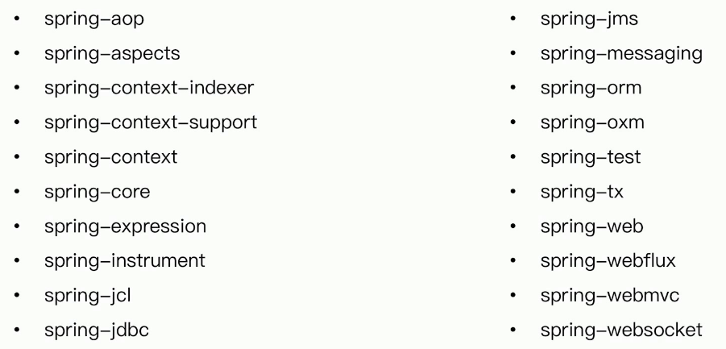

# Spring模块划分

| 模块                  | 介绍                                             |
| --------------------- | ------------------------------------------------ |
| context               | Ioc核心实现                                      |
| core                  | 核心,Java语法的支持                              |
| expression(3版本以后) | SpEL表达式                                       |
| instrument            | java装配的支持,java agent的支持                  |
| gcl (5开始支持)       | 对日志的统一                                     |
| JDBC                  |                                                  |
| JMS                   | java message service 消息服务, ActiveMQ, JMS规范 |
| messaing              | Spring想统一消息的实现,RabbitMQ,JMS, Kafka       |
| orm                   | hibernate                                        |
| oxm                   | xml的编列,marshal 和unmarshal                    |
| tx                    | 事务实现                                         |
| web                   | 传统Servlet(MVC) , JAX-RS注解驱动开发(Flux)      |
| websocket             |                                                  |
| webmvc                |                                                  |
| webflux               |                                                  |

