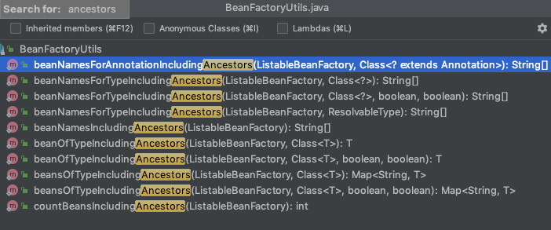

# 040-层次性依赖查找-HierarchicalBeanFactory

---

[TOC]

## 目录

- HierarchicalBeanFactory简介
  - 双亲BeanFactory
  - [层次性查找](#层次性查找)
    - 根据Bean名称查找是否存在
    - 根据Bean的类型查找实例列表
      - [单一类型](#单一类型)
      - 集合类型
    - 根据Java注解查找名称列表

## HierarchicalBeanFactory简介

BeanFactory的直接子接口, 

- 设计的目的是支持 **具有父子上下级层次关系的容器**的能力,实际上就是
  - 层次性查找能力
  - 获取父容器的能力

为了实现这个功能 

- HierarchicalBeanFactory
- 工具类BeanFactoryUtils


## 双亲BeanFactory

```java
//获取双亲BeanFactory
HierarchicalBeanFactory#getParentBeanFactory
```

## 层次性查找

#### 根据Bean名称查找

```java
//根据Bean名称查找是否存在
HierarchicalBeanFactory#containsLocalBean(String name);
```

#### 根据Bean类型查找实例列表

```java
//获取单一类型
BeanFactoryUtils#beanOfType(ListableBeanFactory, java.lang.Class<T>);
//获取集合类型
BeanFactoryUtils#beanOfTypeIncludingAncestors(ListableBeanFactory, java.lang.Class<T>)
```

## 根据Java注解查找名称列表



```java
//@since 4.2 根据类型查找
BeanFactoryUtils#beanNamesForTypeIncludingAncestors(ListableBeanFactory, ResolvableType)
BeanFactoryUtils#beanNamesForTypeIncludingAncestors(ListableBeanFactory, java.lang.Class<?>)
BeanFactoryUtils#beanNamesForTypeIncludingAncestors(ListableBeanFactory, java.lang.Class<?>, boolean, boolean)
```

## 层次查找实战

```java
ClassPathXmlApplicationContext parent = new ClassPathXmlApplicationContext("classpath:tutorials/hierarchical/dependency-parent.xml");
ClassPathXmlApplicationContext child = new ClassPathXmlApplicationContext("classpath:tutorials/hierarchical/dependency-child.xml");
child.setParent(parent);
final Map<String, Apple> beansOfType = child.getBeansOfType(Apple.class);
System.out.println("Apple in child :");

//Apple{name='child', age=25}
beansOfType.forEach((k, v) -> System.out.println(v));
final Map<String, Apple> beansOfType1 = parent.getBeansOfType(Apple.class);
System.out.println("Apple in Parent :");

//Apple{name='parent', age=25}
beansOfType1.forEach((k, v) -> System.out.println(v)); 
final Map<String, Apple> stringAppleMap = BeanFactoryUtils.beansOfTypeIncludingAncestors(child, Apple.class);

//全查出来了
System.out.println("Apple use BeanFactoryUtils :");
stringAppleMap.forEach((k, v) -> System.out.println(v)); 
```

