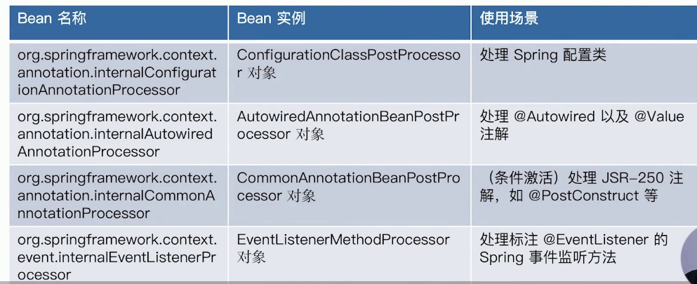
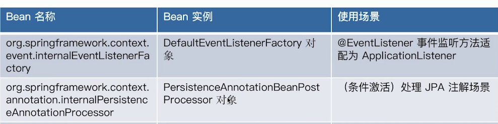
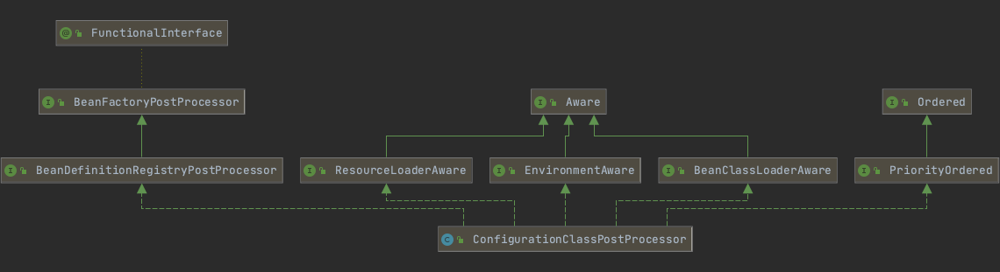
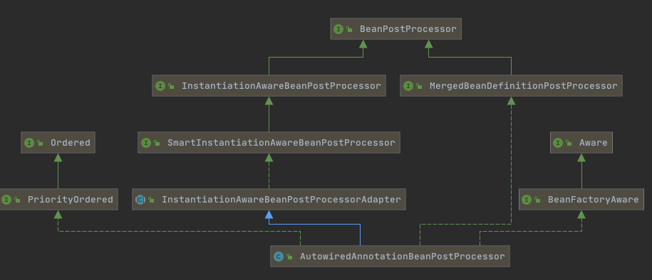
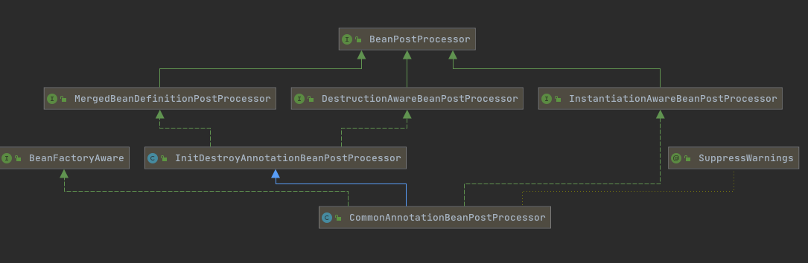
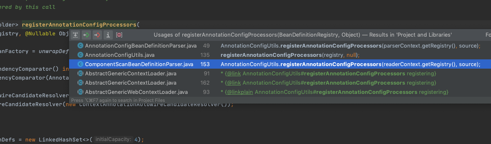

# 080-依赖查找中的内建可查找的依赖

- [AbstractApplicationContext内建可查找的依赖](#AbstractApplicationContext内建可查找的依赖)
- [注解驱动Spring应用上下文可查找的依赖](#注解驱动Spring应用上下文可查找的依赖)

## AbstractApplicationContext内建可查找的依赖

| Bean名称                    | Bean实例                        | 使用场景               |
| --------------------------- | ------------------------------- | ---------------------- |
| environment                 | Environment对象                 | 外部化配置以及Profiles |
| systemProperties            | java.util.Properties对象        | Java系统属性           |
| systemEnvironment           | java.util.Map对象               | 操作系统环境变量       |
| messageSource               | MessageSource对象               | 国际化文案             |
| lifecycleProcessor          | LifecycleProcessor对象          | Lifecycle Bean处理器   |
| applicationEventMulticaster | ApplicationEventMulticaster对象 | Spring事件广播器       |

## 注解驱动Spring应用上下文可查找的依赖





## ConfigurationClassPostProcessor

```java
org.springframework.context.annotation.ConfigurationClassPostProcessor
```

主要作用是用来处理`@Configuration`注解标注的类,也就是Sprng配置类



从类图中可以看出ConfigurationClassPostProcessor 是一个BeanFactoryPorstProcessor, 也就是说它是一个Bean容器的声明周期后置处理器,

我们可以通过工具类 AnnotationConfigUtils 来查看相关的注册信息,我们可以看到其中一段逻辑

```java
//AnnotationConfigUtils#registerAnnotationConfigProcessors(BeanDefinitionRegistry, java.lang.Object)		
if (!registry.containsBeanDefinition(CONFIGURATION_ANNOTATION_PROCESSOR_BEAN_NAME)) {
			RootBeanDefinition def = new RootBeanDefinition(ConfigurationClassPostProcessor.class);
			def.setSource(source);
			beanDefs.add(registerPostProcessor(registry, def, CONFIGURATION_ANNOTATION_PROCESSOR_BEAN_NAME));
}
```

- 查找容器中是否有name是`org.springframework.context.annotation.internalConfigurationAnnotationProcessor`的Bean
- 如果没有则注册


## AutowiredAnnotationBeanPostProcessor



处理@Autowired以及@Value注解

```java
	public AutowiredAnnotationBeanPostProcessor() {
		this.autowiredAnnotationTypes.add(Autowired.class);  //支持Autowired
		this.autowiredAnnotationTypes.add(Value.class);     //支持配置
		try {
      //JSR-330的支持
			this.autowiredAnnotationTypes.add((Class<? extends Annotation>)
					ClassUtils.forName("javax.inject.Inject", AutowiredAnnotationBeanPostProcessor.class.getClassLoader()));
			logger.trace("JSR-330 'javax.inject.Inject' annotation found and supported for autowiring");
		}
		catch (ClassNotFoundException ex) {
			// JSR-330 API not available - simply skip.
		}
	}
```

## CommonAnnotationBeanPostProcessor



操作系统环境变量

```java
	public CommonAnnotationBeanPostProcessor() {
		setOrder(Ordered.LOWEST_PRECEDENCE - 3);
		setInitAnnotationType(PostConstruct.class); //支持
		setDestroyAnnotationType(PreDestroy.class); //支持
		ignoreResourceType("javax.xml.ws.WebServiceContext");
	}
```

## EventListenerMethodProcessor

处理标注@EventListener的Spring事件监听方法

具体看时间监听章节

## DefaultEventListenerFactory

@EventListener 事件监听方法适配为ApplicationListener

具体看时间监听章节

## PresistenceAnnotationBeanPostProcessor

(条件激活)处理JPA注解场景

## 创建的时机

```java
/**
	 *注册所有的与注解驱动有关的BeanPost 处理器
	 * @param registry 注册中心
	 * @param 已经被读取的配置文件,可以为空
	 * @return 本次注册后产升的BeanDifintionHolder
	 */
	public static Set<BeanDefinitionHolder> registerAnnotationConfigProcessors(
			BeanDefinitionRegistry registry, @Nullable Object source) {

		DefaultListableBeanFactory beanFactory = unwrapDefaultListableBeanFactory(registry);
		if (beanFactory != null) {
			if (!(beanFactory.getDependencyComparator() instanceof AnnotationAwareOrderComparator)) {
				beanFactory.setDependencyComparator(AnnotationAwareOrderComparator.INSTANCE);
			}
			if (!(beanFactory.getAutowireCandidateResolver() instanceof ContextAnnotationAutowireCandidateResolver)) {
				beanFactory.setAutowireCandidateResolver(new ContextAnnotationAutowireCandidateResolver());
			}
		}

		Set<BeanDefinitionHolder> beanDefs = new LinkedHashSet<>(4);

		if (!registry.containsBeanDefinition(CONFIGURATION_ANNOTATION_PROCESSOR_BEAN_NAME)) {
      //处理包含 @Configurtion 注解标注的相关类的Post处理器
			RootBeanDefinition def = new RootBeanDefinition(ConfigurationClassPostProcessor.class);
			def.setSource(source);
			beanDefs.add(registerPostProcessor(registry, def, CONFIGURATION_ANNOTATION_PROCESSOR_BEAN_NAME));
		}

    //处理包含 @Autowired 注解标注的相关类的Post处理器
		if (!registry.containsBeanDefinition(AUTOWIRED_ANNOTATION_PROCESSOR_BEAN_NAME)) {
			RootBeanDefinition def = new RootBeanDefinition(AutowiredAnnotationBeanPostProcessor.class);
			def.setSource(source);
			beanDefs.add(registerPostProcessor(registry, def, AUTOWIRED_ANNOTATION_PROCESSOR_BEAN_NAME));
		}

    //处理包含 @required 注解标注的相关类的Post处理器
		if (!registry.containsBeanDefinition(REQUIRED_ANNOTATION_PROCESSOR_BEAN_NAME)) {//@required
			RootBeanDefinition def = new RootBeanDefinition(RequiredAnnotationBeanPostProcessor.class);
			def.setSource(source);
			beanDefs.add(registerPostProcessor(registry, def, REQUIRED_ANNOTATION_PROCESSOR_BEAN_NAME));
		}

     //处理包含 jsr250 注解标注的相关类的Post处理器
		// Check for JSR-250 support, and if present add the CommonAnnotationBeanPostProcessor.
		if (jsr250Present && !registry.containsBeanDefinition(COMMON_ANNOTATION_PROCESSOR_BEAN_NAME)) {//jsr250
			RootBeanDefinition def = new RootBeanDefinition(CommonAnnotationBeanPostProcessor.class);
			def.setSource(source);
			beanDefs.add(registerPostProcessor(registry, def, COMMON_ANNOTATION_PROCESSOR_BEAN_NAME));
		}

    //处理包含 jpa 注解标注的相关类的Post处理器
		// Check for JPA support, and if present add the PersistenceAnnotationBeanPostProcessor.
		if (jpaPresent && !registry.containsBeanDefinition(PERSISTENCE_ANNOTATION_PROCESSOR_BEAN_NAME)) { //jpa
			RootBeanDefinition def = new RootBeanDefinition();
			try {
				def.setBeanClass(ClassUtils.forName(PERSISTENCE_ANNOTATION_PROCESSOR_CLASS_NAME,
						AnnotationConfigUtils.class.getClassLoader()));
			}
			catch (ClassNotFoundException ex) {
				throw new IllegalStateException(
						"Cannot load optional framework class: " + PERSISTENCE_ANNOTATION_PROCESSOR_CLASS_NAME, ex);
			}
			def.setSource(source);
			beanDefs.add(registerPostProcessor(registry, def, PERSISTENCE_ANNOTATION_PROCESSOR_BEAN_NAME));
		}

    //处理包含 @EventListener 注解标注的相关类的Post处理器
		if (!registry.containsBeanDefinition(EVENT_LISTENER_PROCESSOR_BEAN_NAME)) { // 
			RootBeanDefinition def = new RootBeanDefinition(EventListenerMethodProcessor.class);
			def.setSource(source);
			beanDefs.add(registerPostProcessor(registry, def, EVENT_LISTENER_PROCESSOR_BEAN_NAME));
		}
		if (!registry.containsBeanDefinition(EVENT_LISTENER_FACTORY_BEAN_NAME)) {
			RootBeanDefinition def = new RootBeanDefinition(DefaultEventListenerFactory.class);
			def.setSource(source);
			beanDefs.add(registerPostProcessor(registry, def, EVENT_LISTENER_FACTORY_BEAN_NAME));
		}

		return beanDefs;
	}
```

## 注册时机

| 注册时机                                             | 入口                                                         | ApplicationContext                 |
| ---------------------------------------------------- | ------------------------------------------------------------ | ---------------------------------- |
| `<context:annotation-config/>`                       | AnnotatedBeanDefinitionReader#AnnotatedBeanDefinitionReader() | AnnotationConfigApplicationContext |
| `<context:component-scan base-package="org.acme" />` | ClassPathBeanDefinitionScanner#scan                          | AnnotationConfigApplicationContext |
|                                                      |                                                              |                                    |

xml驱动

```xml
<!-- org.springframework.context.annotation.AnnotationConfigApplicationContext   -->
<context:annotation-config/>

<!-- org.springframework.context.annotation.ComponentScan -->
<context:component-scan base-package="org.acme" />
```

两个注册时机



