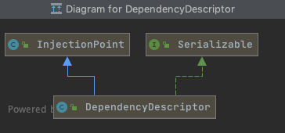
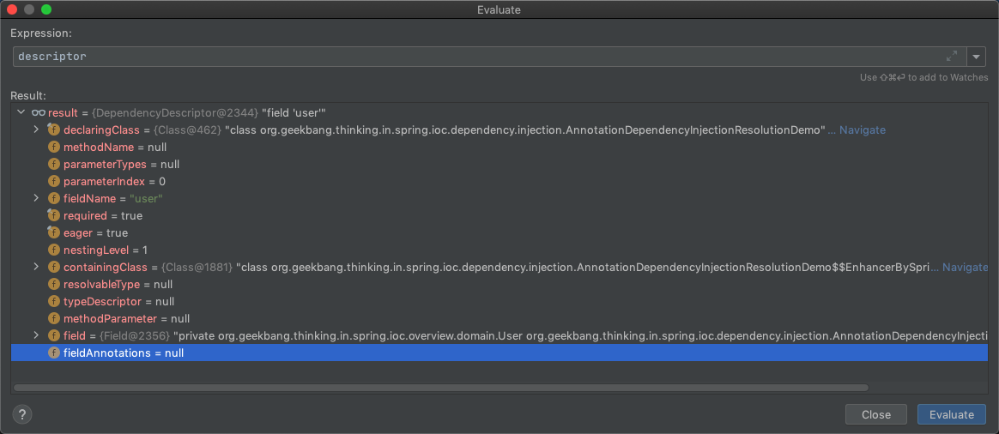

# 依赖处理过程-解析依赖

## 先入为主

- [核心类和核心方法](#核心类和核心方法)

  - [AutowireCapableBeanFactory-resolveDependency](#AutowireCapableBeanFactory-resolveDependency)


## 核心类和核心方法

#### AutowireCapableBeanFactory-resolveDependency

在AutowireCapableBeanFactory中有两个重载

- 针对此工厂中定义的bean解析指定的依赖项

```java
@Nullable
Object resolveDependency(DependencyDescriptor descriptor, @Nullable String requestingBeanName) throws BeansException;
```

- 解析多个指定的依赖项

```java
@Nullable
AutowireCapableBeanFactory#resolveDependency(DependencyDescriptor descriptor, String requestingBeanName, Set<java.lang.String> autowiredBeanNames, TypeConverter typeConverter)
```

从上面可以看出形参

| 形参类型                                      | 形参解释                           |
| --------------------------------------------- | ---------------------------------- |
| [DependencyDescriptor](#DependencyDescriptor) | 依赖描述符,用来描述依赖            |
| TypeConverter                                 | 类型转换器,参考类型转化器章节      |
| requestingBeanName                            | 所需要注入的bean的名称(容器内存在) |
| Set<java.lang.String> autowiredBeanNames      | 多个bean的名称                     |

### DependencyDescriptor




依赖描述符,是对依赖的抽象

```java
public class DependencyDescriptor extends InjectionPoint implements Serializable {
	//当前声明的注入描述符,Class类型,容器类
	private final Class<?> declaringClass;
	//方法名称	
	@Nullable
	private String methodName;
	//参数类型
	@Nullable
	private Class<?>[] parameterTypes;
	//参数索引
	private int parameterIndex;
	//属性名称
	@Nullable
	private String fieldName;
	//是否必须  是否标注有@Autowired#required
	private final boolean required;
	//是否饥饿加载 是否标注有@Lazy
	private final boolean eager;
	//嵌套层数
	private int nestingLevel = 1;
	//是否包含Class文件
	@Nullable
	private Class<?> containingClass;
	//解析类型,泛型处理
	@Nullable
	private transient volatile ResolvableType resolvableType;
	//类型描述符,描述类型
	@Nullable
	private transient volatile TypeDescriptor typeDescriptor;

```

父类InjectionPoint主要包含了注入点的信息

```java
public class InjectionPoint {
	//方法参数
	@Nullable
	protected MethodParameter methodParameter;
	//属性
	@Nullable
	protected Field field;
	//属性标注的注解
	@Nullable
	private volatile Annotation[] fieldAnnotations;
```

### DependencyDescriptor表示的是什么

```java
    // DependencyDescriptor ->
      // 必须（required=true）
      // 实时注入（eager=true)
      // 通过类型（User.class）
      // 字段名称（"user"）
      // 是否首要（primary = true)
    @Autowired          // 依赖查找（处理）
    private User user;
```

所构建的DependencyDescriptor可以看到是



| 属性            | 值                                                           |
| --------------- | ------------------------------------------------------------ |
| declaringClass  | AnnotationDependencyInjectionResolutionDemo                  |
| fieldName       | user                                                         |
| nestingLevel    | 1                                                            |
| containingClass | AnnotationDependencyInjectionResolutionDemo$$EnhancerBySpringCGLIB$$ca95a7b7 |
| field           | private AnnotationDependencyInjectionResolutionDemo.user     |
| eager           | 是否是饥饿加载                                               |

## ListableBeanFactory的标准实现

可以处理的封装

- Optional
- ObjectFactory或者ObjectProvider
- JSR330-@Inject
- 单体Bean
- 集合Bean
  - 

```java
@Override
@Nullable
public Object resolveDependency(DependencyDescriptor descriptor, @Nullable String requestingBeanName,@Nullable Set<String> autowiredBeanNames, @Nullable TypeConverter typeConverter) throws BeansException {

    descriptor.initParameterNameDiscovery(getParameterNameDiscoverer());
    //是不是Option对象
    if (Optional.class == descriptor.getDependencyType()) {
        //处理Option对象
        return createOptionalDependency(descriptor, requestingBeanName);
    }
    //是不是ObjectFactory对象,如果是应该是走延迟加载
    else if (ObjectFactory.class == descriptor.getDependencyType() ||
             ObjectProvider.class == descriptor.getDependencyType()) {
        return new DependencyObjectProvider(descriptor, requestingBeanName);
    }
    //是不是JSR330标注的依赖注入
    else if (javaxInjectProviderClass == descriptor.getDependencyType()) {
        return new Jsr330Factory().createDependencyProvider(descriptor, requestingBeanName);
    }
    else {
        //如果都不是则解析代理
        Object result = getAutowireCandidateResolver().getLazyResolutionProxyIfNecessary(
            descriptor, requestingBeanName);
        if (result == null) {
            //解析
            result = doResolveDependency(descriptor, requestingBeanName, autowiredBeanNames, typeConverter);
        }
        return result;
    }
}
```

```java
//进行依赖注入
@Nullable
public Object doResolveDependency(DependencyDescriptor descriptor, @Nullable String beanName,
      @Nullable Set<String> autowiredBeanNames, @Nullable TypeConverter typeConverter) throws BeansException {

			...
        
        //将要被依赖注入的bean
      Map<String, Object> matchingBeans = findAutowireCandidates(beanName, type, descriptor);
			...
        
      //如果候选bean多余一个
      if (matchingBeans.size() > 1) {
        //获取primary的,决定是用哪个
         autowiredBeanName = determineAutowireCandidate(matchingBeans, descriptor);
         instanceCandidate = matchingBeans.get(autowiredBeanName);
      }

      if (autowiredBeanNames != null) {
         autowiredBeanNames.add(autowiredBeanName);
      }
      if (instanceCandidate instanceof Class) {
        //获取bean的实例
         instanceCandidate = descriptor.resolveCandidate(autowiredBeanName, type, this);
      }
      Object result = instanceCandidate;
			...
        
      return result;
   }
}
```


