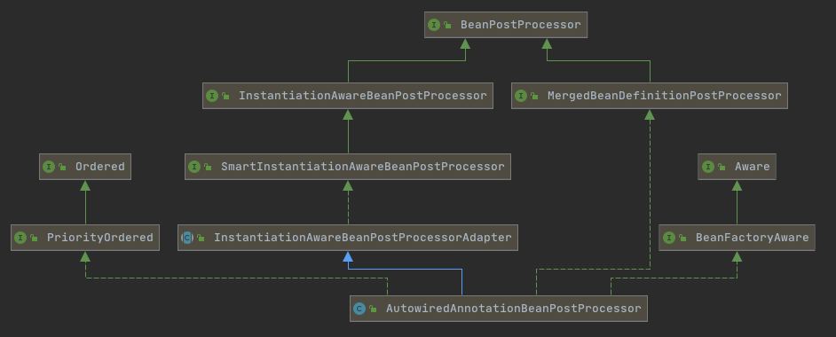
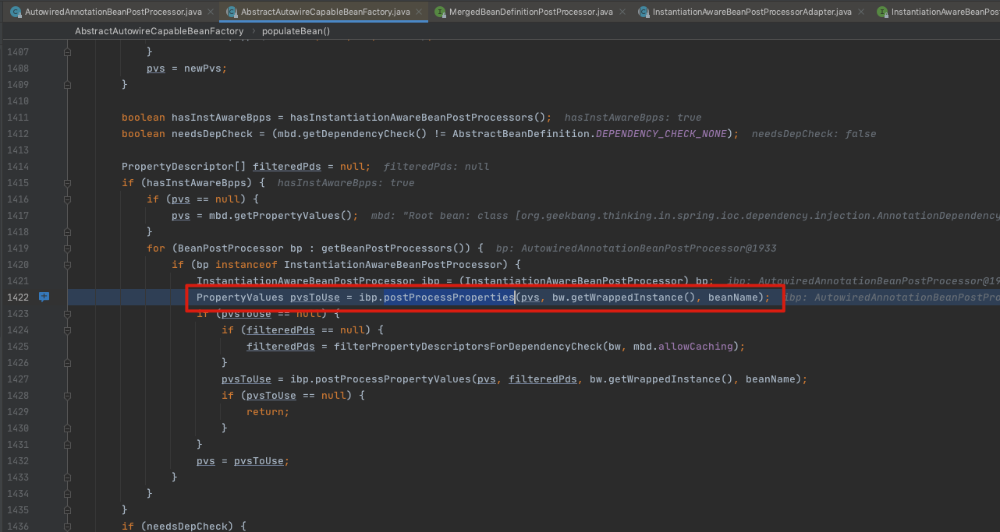

# 140-@Autowired注入

[TOC]

## @Autowired注入步骤

- [元信息解析](#元信息解析)(谁要注入)
- [依赖查找](#依赖查找和注入)(注入谁)
- [依赖注入](#依赖查找和注入)(字段、方法)(具体注入)

## 元信息解析

核心入口

```java
org.springframework.beans.factory.annotation.AutowiredAnnotationBeanPostProcessor#postProcessMergedBeanDefinition
```

## AutowiredAnnotationBeanPostProcessor



- AutowiredAnnotationBeanPostProcessor 是一个

主要是将配置文件的属性进行merge , 比如配置了层级关系的user和SuperUser, 经过这个方法就会合并

```xml
    <!-- 经过合并后 GenericBeanDefinition 变成 RootBeanDefinition -->
    <bean id="user" class="org.geekbang.thinking.in.spring.ioc.overview.domain.User">
        <property name="id" value="1"/>
        <property name="name" value="小马哥"/>
        <property name="city" value="HANGZHOU"/>
        <property name="workCities" value="BEIJING,HANGZHOU"/>
        <property name="lifeCities">
            <list>
                <value>BEIJING</value>
                <value>SHANGHAI</value>
            </list>
        </property>
        <property name="configFileLocation" value="classpath:/META-INF/user-config.properties"/>
    </bean>

    <!-- 普通 beanDefinition GenericBeanDefinition -->
    <!-- 合并后 GenericBeanDefinition 变成 RootBeanDefinition，并且覆盖 parent 相关配置-->
    <!-- primary = true , 增加了一个 address 属性 -->
    <bean id="superUser" class="org.geekbang.thinking.in.spring.ioc.overview.domain.SuperUser" parent="user"
          primary="true">
        <property name="address" value="杭州"/>
    </bean>
```

经过这个方法后superUser也拥有了User相关的元信息

## 依赖查找和注入

主要包含两个步骤

- 获取注入点的信息, 也就是给定一个Bean, 里面有多少个标注有@Autowired注解的属性
- 获取后封装成为InjectionMetadata
- 根据InjectionMetadata注入信息
  - 查找BeanFactory中要注入的Bean的实例
  - 将实例通过反射注入进去



依赖查找和注入的核心入口

```java
org.springframework.beans.factory.annotation.AutowiredAnnotationBeanPostProcessor#postProcessPropertyValues(PropertyValues pvs, Object bean, String beanName)
```

```java
//org.springframework.beans.factory.annotation.AutowiredAnnotationBeanPostProcessor#postProcessPropertyValues		
@Override
public PropertyValues postProcessPropertyValues(PropertyValues pvs, Object bean, String beanName) {
  //获取注入点的信息,实际上这里就是依赖查找
  InjectionMetadata metadata = findAutowiringMetadata(beanName, bean.getClass(), pvs);
  try {
    //根据注入点信息注入
    metadata.inject(bean, beanName, pvs);
  }
  return pvs;
}
```

### 获取注入点的信息

```java
private InjectionMetadata findAutowiringMetadata(String beanName, Class<?> clazz, @Nullable PropertyValues pvs) {
  // Fall back to class name as cache key, for backwards compatibility with custom callers.
  //实际上是使用缓存机机制进行获取
  String cacheKey = (StringUtils.hasLength(beanName) ? beanName : clazz.getName());
  // Quick check on the concurrent map first, with minimal locking.
  InjectionMetadata metadata = this.injectionMetadataCache.get(cacheKey);
  if (InjectionMetadata.needsRefresh(metadata, clazz)) {
    synchronized (this.injectionMetadataCache) {
      metadata = this.injectionMetadataCache.get(cacheKey);
      if (InjectionMetadata.needsRefresh(metadata, clazz)) {
        if (metadata != null) {
          metadata.clear(pvs);
        }
        //通过反射的方式构建注入点,实际上是获取到被注入bean的所有字段,注意这里获取的是Cglib增强类的字段,所以有可能是
        metadata = buildAutowiringMetadata(clazz);
        this.injectionMetadataCache.put(cacheKey, metadata);
      }
    }
  }
  //这里的metadata就是包含了@Autowired注解的字段的信息
  return metadata;
}
```

### 根据注入点信息注入

```java
//org.springframework.beans.factory.annotation.InjectionMetadata#inject
public void inject(Object target, @Nullable String beanName, @Nullable PropertyValues pvs) throws Throwable {
  Collection<InjectedElement> checkedElements = this.checkedElements;
  Collection<InjectedElement> elementsToIterate =
    (checkedElements != null ? checkedElements : this.injectedElements);
  if (!elementsToIterate.isEmpty()) {
    for (InjectedElement element : elementsToIterate) {
      //遍历后调用inject方法
      element.inject(target, beanName, pvs);
    }
  }
}
```

这里使用到了依赖处理过程 [133-依赖处理过程-解析依赖.md](133-依赖处理过程-解析依赖.md) 

```java
//org.springframework.beans.factory.annotation.AutowiredAnnotationBeanPostProcessor.AutowiredFieldElement#inject
@Override
protected void inject(Object bean, @Nullable String beanName, @Nullable PropertyValues pvs) throws Throwable {
  Field field = (Field) this.member;
  Object value;
  if (this.cached) {
    value = resolvedCachedArgument(beanName, this.cachedFieldValue);
  }
  else {
    DependencyDescriptor desc = new DependencyDescriptor(field, this.required);
    desc.setContainingClass(bean.getClass());
    Set<String> autowiredBeanNames = new LinkedHashSet<>(1);
    Assert.state(beanFactory != null, "No BeanFactory available");
    TypeConverter typeConverter = beanFactory.getTypeConverter();
    try {
      //依赖处理 133-依赖处理过程-解析依赖.md
      value = beanFactory.resolveDependency(desc, beanName, autowiredBeanNames, typeConverter);
    }
    catch (BeansException ex) {
      throw new UnsatisfiedDependencyException(null, beanName, new InjectionPoint(field), ex);
    }
    //加锁加缓存
    synchronized (this) {
      if (!this.cached) {
        if (value != null || this.required) {
          this.cachedFieldValue = desc;
          registerDependentBeans(beanName, autowiredBeanNames);
          if (autowiredBeanNames.size() == 1) {
            String autowiredBeanName = autowiredBeanNames.iterator().next();
            if (beanFactory.containsBean(autowiredBeanName) &&
                beanFactory.isTypeMatch(autowiredBeanName, field.getType())) {
              this.cachedFieldValue = new ShortcutDependencyDescriptor(
                desc, autowiredBeanName, field.getType());
            }
          }
        }
        else {
          this.cachedFieldValue = null;
        }
        this.cached = true;
      }
    }
  }
  if (value != null) {
    //获取到解析后的依赖,使用反射注入
    ReflectionUtils.makeAccessible(field);
    field.set(bean, value);
  }
}
}
```

