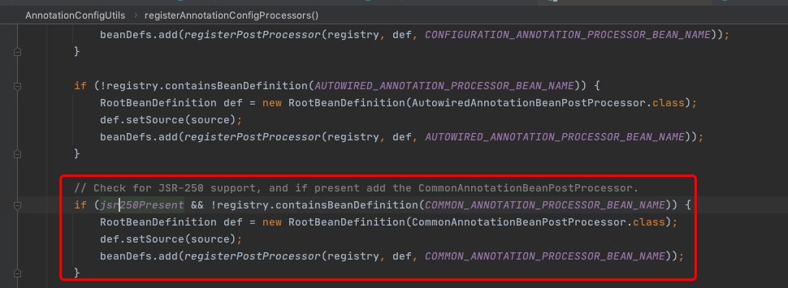

# 160-Java通用注解注入原理-CommonAnnotationBeanPostProcessor

## 目录

------

[TOC]

## 先入为主的核心类

 [120-SpringBean初始化阶段.md](../008-SpringBean生命周期/120-SpringBean初始化阶段.md) 

- CommonAnnotationBeanPostProcessor

  - 注入注解
    - javax.xml.ws.WebServiceRef
    - java.ejb.EJB
    - java.annotation.Resource

  - 声明周期注解
    - java.annotation.PostConstruct
    - java.annotation.PreDestory

## 什么是Java通用注解

Java6之后的通用注解,而不是JavaEE 相关的注解


## 构造方法

静态代码块提供了对支持注解的解析,实际上是一种Condition的解析

```java
	static {
		try {
      //支持WebServiceRef接口
			@SuppressWarnings("unchecked")
			Class<? extends Annotation> clazz = (Class<? extends Annotation>)
					ClassUtils.forName("javax.xml.ws.WebServiceRef", CommonAnnotationBeanPostProcessor.class.getClassLoader());
			webServiceRefClass = clazz;
		}
		catch (ClassNotFoundException ex) {
			webServiceRefClass = null;
		}

		try {
      
      //支持 EJB 接口
			@SuppressWarnings("unchecked")
			Class<? extends Annotation> clazz = (Class<? extends Annotation>)
					ClassUtils.forName("javax.ejb.EJB", CommonAnnotationBeanPostProcessor.class.getClassLoader());
			ejbRefClass = clazz;
		}
		catch (ClassNotFoundException ex) {
			ejbRefClass = null;
		}

		resourceAnnotationTypes.add(Resource.class);
		if (webServiceRefClass != null) {
			resourceAnnotationTypes.add(webServiceRefClass);
		}
		if (ejbRefClass != null) {
			resourceAnnotationTypes.add(ejbRefClass);
		}
	}
```

构造方法中添加了解析注释

- setInitAnnotationType 添加构造注释
- setDestroyAnnotationType 设置销毁构造
- ignoreResourceType 设置忽略

```java
//生命周期的方法
public CommonAnnotationBeanPostProcessor() {
   setOrder(Ordered.LOWEST_PRECEDENCE - 3);
  //初始化的注解
   setInitAnnotationType(PostConstruct.class);
  //销毁的注解支持
   setDestroyAnnotationType(PreDestroy.class);
   ignoreResourceType("javax.xml.ws.WebServiceContext");
}
```

## CommonAnnotationBeanPostProcessor-加载阶段

装载的核心入口是`AnnotationConfigUtils#registerAnnotationConfigProcessors` 

这个工具类主要是负责将注解驱动的相关预置的Processor进行初始化



这里注释的意思是判断JSR250的支持是否存在,如果存在的话就注册CommonAnnotationBeanPostProcessor

而这个装载的核心工具类有两个地方调用

- org.springframework.context.annotation.AnnotationConfigBeanDefinitionParser#parse // 基于注解驱动的BeanDefinition解析

- org.springframework.context.annotation.ComponentScanBeanDefinitionParser#registerComponents // 基于包扫描的解析

可以看到两个类都是BeanDefinitionParser的子类

#### 执行堆栈

```java
postProcessMergedBeanDefinition:297, CommonAnnotationBeanPostProcessor (org.springframework.context.annotation)
applyMergedBeanDefinitionPostProcessors:1044, AbstractAutowireCapableBeanFactory (org.springframework.beans.factory.support)
doCreateBean:550, AbstractAutowireCapableBeanFactory (org.springframework.beans.factory.support)
createBean:498, AbstractAutowireCapableBeanFactory (org.springframework.beans.factory.support)
lambda$doGetBean$0:320, AbstractBeanFactory (org.springframework.beans.factory.support)
getObject:-1, 1346343363 (org.springframework.beans.factory.support.AbstractBeanFactory$$Lambda$6)
getSingleton:222, DefaultSingletonBeanRegistry (org.springframework.beans.factory.support)
doGetBean:318, AbstractBeanFactory (org.springframework.beans.factory.support)
getBean:224, AbstractBeanFactory (org.springframework.beans.factory.support)
resolveNamedBean:1114, DefaultListableBeanFactory (org.springframework.beans.factory.support)
resolveBean:407, DefaultListableBeanFactory (org.springframework.beans.factory.support)
getBean:341, DefaultListableBeanFactory (org.springframework.beans.factory.support)
getBean:335, DefaultListableBeanFactory (org.springframework.beans.factory.support)
main:23, SpringBeanInitializationDemo (cn.eccto.study.springframework.lifecycle)
```

可以看到postProcessMergedBeanDefinition方法是是在

- 创建Bean实例之后
- 设置属性之前

#### postProcessMergedBeanDefinition

```java
	protected void applyMergedBeanDefinitionPostProcessors(RootBeanDefinition mbd, Class<?> beanType, String beanName) {
		for (BeanPostProcessor bp : getBeanPostProcessors()) {
      //强转后执行
			if (bp instanceof MergedBeanDefinitionPostProcessor) {
				MergedBeanDefinitionPostProcessor bdp = (MergedBeanDefinitionPostProcessor) bp;
				bdp.postProcessMergedBeanDefinition(mbd, beanType, beanName);
			}
		}
	}
```

#### CommonAnnotationBeanPostProcessor#postProcessMergedBeanDefinition

```java
//CommonAnnotationBeanPostProcessor#postProcessMergedBeanDefinition
@Override
public void postProcessMergedBeanDefinition(RootBeanDefinition beanDefinition, Class<?> beanType, String beanName) {
  super.postProcessMergedBeanDefinition(beanDefinition, beanType, beanName);
  //获取Common关注的资源元信息
  InjectionMetadata metadata = findResourceMetadata(beanName, beanType, null);
  metadata.checkConfigMembers(beanDefinition);
}
```

重写了父子属性merge 逻辑

```java
private InjectionMetadata findResourceMetadata(String beanName, final Class<?> clazz, @Nullable PropertyValues pvs) {
  // Fall back to class name as cache key, for backwards compatibility with custom callers.
  String cacheKey = (StringUtils.hasLength(beanName) ? beanName : clazz.getName());
  // Quick check on the concurrent map first, with minimal locking.
  InjectionMetadata metadata = this.injectionMetadataCache.get(cacheKey);
  if (InjectionMetadata.needsRefresh(metadata, clazz)) {
    synchronized (this.injectionMetadataCache) {
      metadata = this.injectionMetadataCache.get(cacheKey);
      if (InjectionMetadata.needsRefresh(metadata, clazz)) {
        if (metadata != null) {
          metadata.clear(pvs);
        }
        metadata = buildResourceMetadata(clazz);
        this.injectionMetadataCache.put(cacheKey, metadata);
      }
    }
  }
  return metadata;
}
```

**到这里为止呢就已经读取到了Bean里面的所有标注有指定注解的方法,存到了injectionMetadataCache中,至此,准备阶段结束**

## CommonAnnotationBeanPostProcessor-执行阶段

```
testPostConstruct:21, BeanInitializationDemo (cn.eccto.study.springframework.lifecycle.demoBean)
invoke0:-1, NativeMethodAccessorImpl (sun.reflect)
invoke:62, NativeMethodAccessorImpl (sun.reflect)
invoke:43, DelegatingMethodAccessorImpl (sun.reflect)
invoke:498, Method (java.lang.reflect)
invoke:363, InitDestroyAnnotationBeanPostProcessor$LifecycleElement (org.springframework.beans.factory.annotation)
//调用初始化方法
invokeInitMethods:307, InitDestroyAnnotationBeanPostProcessor$LifecycleMetadata (org.springframework.beans.factory.annotation)
//调用 //CommonAnnotationBeanPostProcessor的父类 InitDestroyAnnotationBeanPostProcessor的初始化方法
postProcessBeforeInitialization:136, InitDestroyAnnotationBeanPostProcessor (org.springframework.beans.factory.annotation)
//初始化之前执行的PostProcesser
applyBeanPostProcessorsBeforeInitialization:419, AbstractAutowireCapableBeanFactory (org.springframework.beans.factory.support)
//初始化bean
initializeBean:1737, AbstractAutowireCapableBeanFactory (org.springframework.beans.factory.support)
//创建bean
doCreateBean:576, AbstractAutowireCapableBeanFactory (org.springframework.beans.factory.support)
createBean:498, AbstractAutowireCapableBeanFactory (org.springframework.beans.factory.support)
lambda$doGetBean$0:320, AbstractBeanFactory (org.springframework.beans.factory.support)
getObject:-1, 1346343363 (org.springframework.beans.factory.support.AbstractBeanFactory$$Lambda$6)
getSingleton:222, DefaultSingletonBeanRegistry (org.springframework.beans.factory.support)
doGetBean:318, AbstractBeanFactory (org.springframework.beans.factory.support)
getBean:224, AbstractBeanFactory (org.springframework.beans.factory.support)
resolveNamedBean:1114, DefaultListableBeanFactory (org.springframework.beans.factory.support)
resolveBean:407, DefaultListableBeanFactory (org.springframework.beans.factory.support)
getBean:341, DefaultListableBeanFactory (org.springframework.beans.factory.support)
getBean:335, DefaultListableBeanFactory (org.springframework.beans.factory.support)
main:23, SpringBeanInitializationDemo (cn.eccto.study.springframework.lifecycle)
```

InitDestroyAnnotationBeanPostProcessor#postProcessBeforeInitialization

```java
//InitDestroyAnnotationBeanPostProcessor#postProcessBeforeInitialization
@Override
public Object postProcessBeforeInitialization(Object bean, String beanName) throws BeansException {
  LifecycleMetadata metadata = findLifecycleMetadata(bean.getClass());
  try {
    //执行初始化方法,之前缓存的
    metadata.invokeInitMethods(bean, beanName);
  }
  catch (InvocationTargetException ex) {
    throw new BeanCreationException(beanName, "Invocation of init method failed", ex.getTargetException());
  }
  catch (Throwable ex) {
    throw new BeanCreationException(beanName, "Failed to invoke init method", ex);
  }
  return bean;
}
```

```java
public void invokeInitMethods(Object target, String beanName) throws Throwable {
  Collection<LifecycleElement> checkedInitMethods = this.checkedInitMethods;
  Collection<LifecycleElement> initMethodsToIterate =
    (checkedInitMethods != null ? checkedInitMethods : this.initMethods);
  if (!initMethodsToIterate.isEmpty()) {
    for (LifecycleElement element : initMethodsToIterate) {
      if (logger.isTraceEnabled()) {
        logger.trace("Invoking init method on bean '" + beanName + "': " + element.getMethod());
      }
      //执行
      element.invoke(target);
    }
  }
}
```

