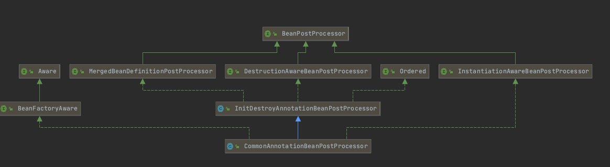

# 160-Java通用注解注入原理

## 目录

- [先入为主的核心类](#先入为主的核心类)

## 先入为主的核心类

- CommonAnnotationBeanPostProcessor

  - 注入注解
    - javax.xml.ws.WebServiceRef
    - java.ejb.EJB
    - java.annotation.Resource

  - 声明周期注解
    - java.annotation.PostConstruct
    - java.annotation.PreDestory

## 什么是Java通用注解

Java6之后的通用注解,而不是JavaEE 相关的注解



- InitDestroyAnnotationBeanPostProcessor 提供了default 方法


## 构造方法

```java
	static {
		try {
      //支持WebServiceRef接口
      
			@SuppressWarnings("unchecked")
			Class<? extends Annotation> clazz = (Class<? extends Annotation>)
					ClassUtils.forName("javax.xml.ws.WebServiceRef", CommonAnnotationBeanPostProcessor.class.getClassLoader());
			webServiceRefClass = clazz;
		}
		catch (ClassNotFoundException ex) {
			webServiceRefClass = null;
		}

		try {
      
      //支持 EJB 接口
			@SuppressWarnings("unchecked")
			Class<? extends Annotation> clazz = (Class<? extends Annotation>)
					ClassUtils.forName("javax.ejb.EJB", CommonAnnotationBeanPostProcessor.class.getClassLoader());
			ejbRefClass = clazz;
		}
		catch (ClassNotFoundException ex) {
			ejbRefClass = null;
		}

		resourceAnnotationTypes.add(Resource.class);
		if (webServiceRefClass != null) {
			resourceAnnotationTypes.add(webServiceRefClass);
		}
		if (ejbRefClass != null) {
			resourceAnnotationTypes.add(ejbRefClass);
		}
	}
```


```java
//生命周期的方法
public CommonAnnotationBeanPostProcessor() {
   setOrder(Ordered.LOWEST_PRECEDENCE - 3);
  //初始化的注解
   setInitAnnotationType(PostConstruct.class);
  //销毁的注解支持
   setDestroyAnnotationType(PreDestroy.class);
   ignoreResourceType("javax.xml.ws.WebServiceContext");
}
```

#### 注入的核心逻辑

```java
@Override
	public PropertyValues postProcessProperties(PropertyValues pvs, Object bean, String beanName) {
		InjectionMetadata metadata = findResourceMetadata(beanName, bean.getClass(), pvs);
		try {
			metadata.inject(bean, beanName, pvs);
		}
		catch (Throwable ex) {
			throw new BeanCreationException(beanName, "Injection of resource dependencies failed", ex);
		}
		return pvs;
	}
```

重写了父子属性merge 逻辑

```
	@Override
	public void postProcessMergedBeanDefinition(RootBeanDefinition beanDefinition, Class<?> beanType, String beanName) {
		super.postProcessMergedBeanDefinition(beanDefinition, beanType, beanName);
		//获取Common关注的资源元信息
		InjectionMetadata metadata = findResourceMetadata(beanName, beanType, null);
		metadata.checkConfigMembers(beanDefinition);
	}
	
	
	//
	private InjectionMetadata findResourceMetadata(String beanName, final Class<?> clazz, @Nullable PropertyValues pvs) {
		// Fall back to class name as cache key, for backwards compatibility with custom callers.
		String cacheKey = (StringUtils.hasLength(beanName) ? beanName : clazz.getName());
		// Quick check on the concurrent map first, with minimal locking.
		InjectionMetadata metadata = this.injectionMetadataCache.get(cacheKey);
		if (InjectionMetadata.needsRefresh(metadata, clazz)) {
			synchronized (this.injectionMetadataCache) {
				metadata = this.injectionMetadataCache.get(cacheKey);
				if (InjectionMetadata.needsRefresh(metadata, clazz)) {
					if (metadata != null) {
						metadata.clear(pvs);
					}
					metadata = buildResourceMetadata(clazz);
					this.injectionMetadataCache.put(cacheKey, metadata);
				}
			}
		}
		return metadata;
	}
```

