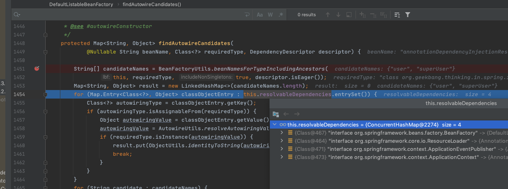

# 依赖注入来源-非Spring容器管理对象

ResolvableDependency(非Spring容器管理对象,游离对象)

- 支持依赖注入
- 不支持依赖查找

 [030-第三步-prepareBeanFactory-填充容器属性.md](../080-Spring拓展点/030-第三步-prepareBeanFactory-填充容器属性.md) 

```java
	/**
	 * 配置工厂的标准特性,例如上下文的加载器,以及后置处理器
	 */
	protected void prepareBeanFactory(ConfigurableListableBeanFactory beanFactory) {
    //设置beanFactory的classloader 为当前的classLoader
		beanFactory.setBeanClassLoader(getClassLoader());
    //设置beanFactory的表达式语言处理器,Spring3增加了表达式语言的支持
    //默认可以使用#{bean.xxx}的形式来调用相关的属性
		beanFactory.setBeanExpressionResolver(new StandardBeanExpressionResolver(beanFactory.getBeanClassLoader()));
    //为beanfactory设置一个PropertyEditor, 这个主要是对bean的属性等设置管理的一个工具
		beanFactory.addPropertyEditorRegistrar(new ResourceEditorRegistrar(this, getEnvironment()));

		// 添加bean的 后置处理器
		beanFactory.addBeanPostProcessor(new ApplicationContextAwareProcessor(this));
    // 设置几个忽略自动装配的接口
		beanFactory.ignoreDependencyInterface(EnvironmentAware.class);
		beanFactory.ignoreDependencyInterface(EmbeddedValueResolverAware.class);
		beanFactory.ignoreDependencyInterface(ResourceLoaderAware.class);
		beanFactory.ignoreDependencyInterface(ApplicationEventPublisherAware.class);
		beanFactory.ignoreDependencyInterface(MessageSourceAware.class);
		beanFactory.ignoreDependencyInterface(ApplicationContextAware.class);

		// 设置几个自动装配的特殊规则
    //自动绑定的时候的游离对象
		beanFactory.registerResolvableDependency(BeanFactory.class, beanFactory);
    //游离对象,只能依赖注入,不能依赖注入
		beanFactory.registerResolvableDependency(ResourceLoader.class, this);
    //游离对象,只能依赖注入,不能依赖注入
		beanFactory.registerResolvableDependency(ApplicationEventPublisher.class, this);
    //游离对象,只能依赖注入,不能依赖注入
		beanFactory.registerResolvableDependency(ApplicationContext.class, this);


		beanFactory.addBeanPostProcessor(new ApplicationListenerDetector(this));

		// 增加对AspectJ的支持
		if (beanFactory.containsBean(LOAD_TIME_WEAVER_BEAN_NAME)) {
			beanFactory.addBeanPostProcessor(new LoadTimeWeaverAwareProcessor(beanFactory));
			// loadTimeWeaver
			beanFactory.setTempClassLoader(new ContextTypeMatchClassLoader(beanFactory.getBeanClassLoader()));
		}

		//添加默认的系统bean
		if (!beanFactory.containsLocalBean(ENVIRONMENT_BEAN_NAME)) {
      //environment
			beanFactory.registerSingleton(ENVIRONMENT_BEAN_NAME, getEnvironment());
		}
		if (!beanFactory.containsLocalBean(SYSTEM_PROPERTIES_BEAN_NAME)) {
      //systemProperties
			beanFactory.registerSingleton(SYSTEM_PROPERTIES_BEAN_NAME, getEnvironment().getSystemProperties());
		}
		if (!beanFactory.containsLocalBean(SYSTEM_ENVIRONMENT_BEAN_NAME)) {
      //systemEnvironment
			beanFactory.registerSingleton(SYSTEM_ENVIRONMENT_BEAN_NAME, getEnvironment().getSystemEnvironment());
		}
	}


```

```java
		// 设置几个自动装配的特殊规则
    //自动绑定的时候的游离对象
		beanFactory.registerResolvableDependency(BeanFactory.class, beanFactory);
    //游离对象,只能依赖注入,不能依赖注入
		beanFactory.registerResolvableDependency(ResourceLoader.class, this);
    //游离对象,只能依赖注入,不能依赖注入
		beanFactory.registerResolvableDependency(ApplicationEventPublisher.class, this);
    //游离对象,只能依赖注入,不能依赖注入
		beanFactory.registerResolvableDependency(ApplicationContext.class, this);
```

上面注入的游离镀锡爱哪个,在进行依赖注入的时候会额外进行注入,除了BeanFactory ,

- ResourceLoader  就是我们用的ApplicatonContext  (只能依赖注入,不能依赖查找)
- ApplicationEventPublisher 就是我们用的ApplicatonContext (只能依赖注入,不能依赖查找)
- ApplicationContext (只能依赖注入,不能依赖查找)
- beanFactory 就是聚合模式的BeanFactory(DefaultListableBeanFactory) (只能依赖注入,不能依赖查找)




## 代码实例

```java
/**
 * 依赖来源示例
 */
public class DependencySourceDemo {

    // 注入在 postProcessProperties 方法执行，早于 setter注入，也早于 @PostConstruct
  	// BeanFactory 实际上就是DefaultListableBeanFactory,能够 
  	@Autowired
    private BeanFactory beanFactory; 

  	//实际上就是 AnnotationConfigApplicationContext 对象 ,能依赖注入,但是不能依赖查找,属于游离对象
    @Autowired
    private ResourceLoader resourceLoader;

  	//实际上就是 AnnotationConfigApplicationContext 对象 ,能依赖注入,但是不能依赖查找,属于游离对象
    @Autowired
    private ApplicationContext applicationContext;

    //实际上就是 AnnotationConfigApplicationContext 对象 ,能依赖注入,但是不能依赖查找,属于游离对象
    @Autowired
    private ApplicationEventPublisher applicationEventPublisher;

    @PostConstruct
    public void initByInjection() {
    
        System.out.println("beanFactory == applicationContext " + (beanFactory == applicationContext));  //false
        System.out.println("beanFactory == applicationContext.getBeanFactory() " + (beanFactory == applicationContext.getAutowireCapableBeanFactory()));  //true
        System.out.println("resourceLoader == applicationContext " + (resourceLoader == applicationContext));  //true
        System.out.println("ApplicationEventPublisher == applicationContext " + (applicationEventPublisher == applicationContext));  //true
    }

    @PostConstruct
    public void initByLookup() {
        getBean(BeanFactory.class);
        getBean(ApplicationContext.class);
        getBean(ResourceLoader.class);
        getBean(ApplicationEventPublisher.class);
    }

    private <T> T getBean(Class<T> beanType) {
        try {
            return beanFactory.getBean(beanType);
        } catch (NoSuchBeanDefinitionException e) {
            System.err.println("当前类型" + beanType.getName() + " 无法在 BeanFactory 中查找!");
        }
        return null;
    }


    public static void main(String[] args) {
        // 创建 BeanFactory 容器
        AnnotationConfigApplicationContext applicationContext = new AnnotationConfigApplicationContext();
        // 注册 Configuration Class（配置类） -> Spring Bean
        applicationContext.register(DependencySourceDemo.class);
        // 启动 Spring 应用上下文
        applicationContext.refresh();

        // 依赖查找 DependencySourceDemo Bean
        DependencySourceDemo demo = applicationContext.getBean(DependencySourceDemo.class);

        // 显示地关闭 Spring 应用上下文
        applicationContext.close();
    }
}
```

#### 

|      |      |      |      |      |
| ---- | ---- | ---- | ---- | ---- |
|      |      |      |      |      |
|      |      |      |      |      |
|      |      |      |      |      |

- [SpringBeanDefinition作为依赖来源](#游离对象作为依赖来源)
- [单例对象作为依赖来源](#游离对象作为依赖来源)
- [游离对象作为依赖来源](#游离对象作为依赖来源)

## 