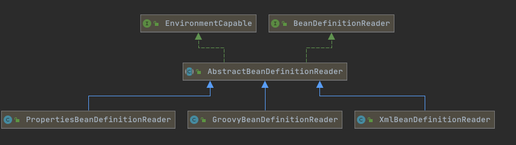

# 020-SpringBean元信息解析阶段.md

[TOC]

## 简介

- 面向资源BeanDefinition的解析
  - [BeanDefinitionReader](#BeanDefinitionReader)
  - XML解析-BeanDefinitionParser
- 面向注解BeanDefinition的解析
  - [AnnotatedBeanDefinitionReader](#AnnotatedBeanDefinitionReader)

## BeanDefinitionReader

Bean的解析过程非常复杂，功能被分得很细，因为这里需要被扩展的地方很多，必须保证足够的灵活性，以应对可能的变化。Bean的解析主要就是对Spring配置文件的解析。这个解析过程主要通过BeanDefinitionReader来完成



我们可以看到BeanDefinitionReader 是基于资源的, Spring中海油一个是基于注解扫描的AnnotatedBeanDefinitionReader

```java
public interface BeanDefinitionReader {
	//聚合模式,获取注册中心
	BeanDefinitionRegistry getRegistry();
	//获取资源加载器
	@Nullable
	ResourceLoader getResourceLoader();
  //获取Bean类加载器
	@Nullable
	ClassLoader getBeanClassLoader();
  //获取名称生成器
	BeanNameGenerator getBeanNameGenerator();
  //加载
	int loadBeanDefinitions(Resource resource) throws BeanDefinitionStoreException;
	int loadBeanDefinitions(Resource... resources) throws BeanDefinitionStoreException;
	int loadBeanDefinitions(String location) throws BeanDefinitionStoreException;
	int loadBeanDefinitions(String... locations) throws BeanDefinitionStoreException;
}
```

## XML解析-BeanDefinitionParser

```java
public class AnnotatedBeanDefinitionParsingDemo {

    public static void main(String[] args) {
        DefaultListableBeanFactory beanFactory = new DefaultListableBeanFactory();
        // 基于 Java 注解的 AnnotatedBeanDefinitionReader 的实现
        AnnotatedBeanDefinitionReader beanDefinitionReader = new AnnotatedBeanDefinitionReader(beanFactory);
        int beanDefinitionCountBefore = beanFactory.getBeanDefinitionCount();
        // 注册当前类（非 @Component class）
        beanDefinitionReader.register(AnnotatedBeanDefinitionParsingDemo.class);
        int beanDefinitionCountAfter = beanFactory.getBeanDefinitionCount();
        int beanDefinitionCount = beanDefinitionCountAfter - beanDefinitionCountBefore;
        System.out.println("已加载 BeanDefinition 数量：" + beanDefinitionCount);
        // 普通的 Class 作为 Component 注册到 Spring IoC 容器后，通常 Bean 名称为 annotatedBeanDefinitionParsingDemo
        // Bean 名称生成来自于 BeanNameGenerator，注解实现 AnnotationBeanNameGenerator
        AnnotatedBeanDefinitionParsingDemo demo = beanFactory.getBean("annotatedBeanDefinitionParsingDemo",
                AnnotatedBeanDefinitionParsingDemo.class);
        System.out.println(demo);
    }
}
```

## AnnotatedBeanDefinitionReader

AnnotatedBeanDefinitionReader并没有实现接口 BeanDefinitionReader , 是因为 BeanDefinitionReader 都是基于Resource资源进行注册的,而AnnotatedBeanDefinitionReader 不基于Resource资源,而仅仅依赖于扫描

主要负责对指定路径下的文件扫描是否包含BeanDefinition,然后使用API方式进行注册

```java
/**
 * 注解 BeanDefinition 解析示例
 */
public class AnnotatedBeanDefinitionParsingDemo {

    public static void main(String[] args) {
        DefaultListableBeanFactory beanFactory = new DefaultListableBeanFactory();
        // 基于 Java 注解的 AnnotatedBeanDefinitionReader 的实现
        AnnotatedBeanDefinitionReader beanDefinitionReader = new AnnotatedBeanDefinitionReader(beanFactory);
        int beanDefinitionCountBefore = beanFactory.getBeanDefinitionCount();
        // 注册当前类（非 @Component class）
        beanDefinitionReader.register(AnnotatedBeanDefinitionParsingDemo.class);
        int beanDefinitionCountAfter = beanFactory.getBeanDefinitionCount();
        int beanDefinitionCount = beanDefinitionCountAfter - beanDefinitionCountBefore;
        System.out.println("已加载 BeanDefinition 数量：" + beanDefinitionCount);
        // 普通的 Class 作为 Component 注册到 Spring IoC 容器后，通常 Bean 名称为 annotatedBeanDefinitionParsingDemo
        // Bean 名称生成来自于 BeanNameGenerator，注解实现 AnnotationBeanNameGenerator
        AnnotatedBeanDefinitionParsingDemo demo = beanFactory.getBean("annotatedBeanDefinitionParsingDemo",
                AnnotatedBeanDefinitionParsingDemo.class);
        System.out.println(demo);
    }
}
```

小细节

```java
public class AnnotatedBeanDefinitionReader {

	private final BeanDefinitionRegistry registry;
	//5.2之后使用了单例的方式
	private BeanNameGenerator beanNameGenerator = AnnotationBeanNameGenerator.INSTANCE;

	private ScopeMetadataResolver scopeMetadataResolver = new AnnotationScopeMetadataResolver();

	private ConditionEvaluator conditionEvaluator;
}
```

注册bean时如果没有指定,则使用这个方式获取JavaBean的Bean名称

```java
org.springframework.context.annotation.AnnotationBeanNameGenerator#buildDefaultBeanName(BeanDefinition)
```

#### 具体注册的逻辑

```java
private <T> void doRegisterBean(Class<T> beanClass, @Nullable String name,
                                @Nullable Class<? extends Annotation>[] qualifiers, @Nullable Supplier<T> supplier,
                                @Nullable BeanDefinitionCustomizer[] customizers) {

  AnnotatedGenericBeanDefinition abd = new AnnotatedGenericBeanDefinition(beanClass);
  if (this.conditionEvaluator.shouldSkip(abd.getMetadata())) {
    return;
  }
  abd.setInstanceSupplier(supplier);
  ScopeMetadata scopeMetadata = this.scopeMetadataResolver.resolveScopeMetadata(abd);
  abd.setScope(scopeMetadata.getScopeName());
  String beanName = (name != null ? name : this.beanNameGenerator.generateBeanName(abd, this.registry));

  AnnotationConfigUtils.processCommonDefinitionAnnotations(abd);
  if (qualifiers != null) {
    for (Class<? extends Annotation> qualifier : qualifiers) {
      if (Primary.class == qualifier) {
        abd.setPrimary(true);
      }
      else if (Lazy.class == qualifier) {
        abd.setLazyInit(true);
      }
      else {
        abd.addQualifier(new AutowireCandidateQualifier(qualifier));
      }
    }
  }
  if (customizers != null) {
    for (BeanDefinitionCustomizer customizer : customizers) {
      customizer.customize(abd);
    }
  }
  //封装成BeanDefinitionHolder
  BeanDefinitionHolder definitionHolder = new BeanDefinitionHolder(abd, beanName);
  definitionHolder = AnnotationConfigUtils.applyScopedProxyMode(scopeMetadata, definitionHolder, this.registry);
  //注册到容器
  BeanDefinitionReaderUtils.registerBeanDefinition(definitionHolder, this.registry);
}
```


