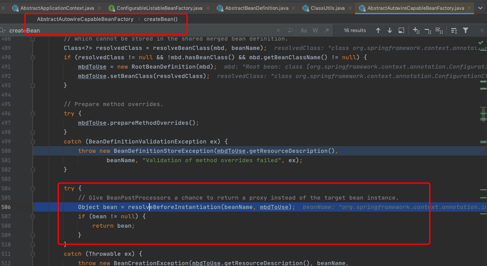

# 060-SpringBean实例化前阶段

## 目录

---

[TOC]

## 一言蔽之

实例化前阶段是一个非主流阶段，它主要通过后置处理器InstantiationAwareBeanPostProcessor

的实现，通常情况下我们根据bean的名称和BeanDefinition 可以返回一个bean的代理，后续就不执行实例化阶段

```java
Object InstantiationAwareBeanPostProcessor#postProcessBeforeInstantiation
```

## DEMO

```java
@Override
public Object postProcessBeforeInstantiation(Class<?> beanClass, String beanName) throws BeansException {
  if (ObjectUtils.nullSafeEquals(beanName, "superClass") && SuperUser.class.equals(beanClass)) {
    System.out.println("postProcessBeforeInstantiation");
    //把配置完成 superUser Bean 覆盖
    return new SuperUser();
  }
  //保持 Spring IoC 容器的实例化操作
  return null;
}
```

## 简介

实例化前阶段的调用入口，下图可以看出在`AbstractAutowireCapableBeanFactory`的createBean方法中，会调用



Spring实例化前阶段是一个非主流阶段- Bean实例化前阶段,这个阶段的在工作中很少使用,主要入口是

```java
Object InstantiationAwareBeanPostProcessor#postProcessBeforeInstantiation
```

返回的Object可以是Bean的包装,相当于是对Bean实例的拦截

## 先入为主核心类

- ConfigurableListableBeanFactory赋予了容器在结束时确保所有**[非延迟初始化]**的单例都初始化

## ConfigurableListableBeanFactory如何提供[非延迟初始化]单例的初始化操作

ConfigurableListableBeanFactory赋予了容器在结束时确保所有**[非延迟初始化]**的单例都初始化

确保所有非延迟初始化单例化都已实例化，同时也要考虑factorybean。如果需要，通常在工厂设置结束时调用。

在AbstractApplicationContext中,我们都知道refresh方法实际上是初始化操作,在第十一步中

[110-第十一步-初始化所有剩余的非lazy单例Bean.md](../080-Spring拓展点/110-第十一步-初始化所有剩余的非lazy单例Bean.md) 

```java
@Override
public void refresh() throws BeansException, IllegalStateException {
  synchronized (this.startupShutdownMonitor) {
    //....忽略 
    // 11、初始化所有剩余的单例Bean
    finishBeanFactoryInitialization(beanFactory);
    //....忽略
  }
}
```

进行预实例化处理

```java
//对配置了lazy-init属性的Bean进行预实例化处理
protected void finishBeanFactoryInitialization(ConfigurableListableBeanFactory beanFactory) {
  ///...其他操作
  // Instantiate all remaining (non-lazy-init) singletons.
  //对配置了lazy-init属性的单态模式Bean进行预实例化处理
  beanFactory.preInstantiateSingletons();
}
```

## InstantiationAwareBeanPostProcessor注册阶段

```java
private static void executeBeanFactory() {
  DefaultListableBeanFactory beanFactory = new DefaultListableBeanFactory();
  BeanDefinitionReader beanDefinitionReader = new XmlBeanDefinitionReader(beanFactory);
  final int i = beanDefinitionReader.loadBeanDefinitions("META-INF/dependency-lookup-context.xml");
  
	// --->添加自定义的实例化前置处理器
  beanFactory.addBeanPostProcessor(new MyInstantiationAwareBeanPostProcessor());
  	// --->添加自定义的实例化前置处理器
  
  System.out.println("Bean实例个数:" + i);
  //----调用初始化非延迟bean的逻辑
  beanFactory.preInstantiateSingletons();
  User user = beanFactory.getBean("user", User.class);
  System.out.println(user);
}
```

## InstantiationAwareBeanPostProcessor执行阶段

执行流程如图所示


具体的执行逻辑

```java
@Nullable
protected Object applyBeanPostProcessorsBeforeInstantiation(Class<?> beanClass, String beanName) {
  for (BeanPostProcessor bp : getBeanPostProcessors()) {
    if (bp instanceof InstantiationAwareBeanPostProcessor) {
      InstantiationAwareBeanPostProcessor ibp = (InstantiationAwareBeanPostProcessor) bp;
      Object result = ibp.postProcessBeforeInstantiation(beanClass, beanName);
      if (result != null) {
        return result;
      }
    }
  }
  return null;
}
```

在任何bean初始化回调之后(如初始化bean的afterPropertiesSet或自定义的init方法)，将此BeanPostProcessor应用到给定的新bean实例。bean已经填充了属性值。返回的bean实例可能是原始bean的包装器。

对于FactoryBean，这个回调将同时为FactoryBean实例和由FactoryBean创建的对象(从Spring 2.0开始)调用。后处理器可以决定是应用到FactoryBean还是创建的对象，或者通过相应的FactoryBean instanceof检查两者都应用。

