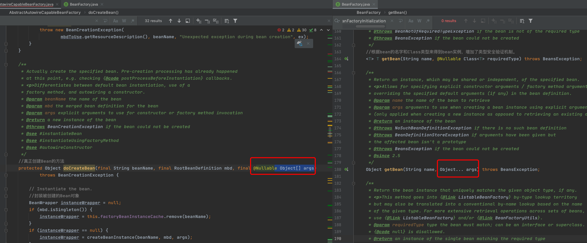

# 070-SpringBean实例化阶段

## 一言蔽之

Bean实例化阶段实际上是依赖查找或者依赖注入的时候，通过Bean的名称、BeanDefinition和构造参数，创建一个代理对BeanWrapper对象的过程

代理对象可以是JDK代理（默认），如果没有接口会使用Cglib代理

## 目录

- [简介](#简介)
- [实例化方式](#实例化方式)
  - [传统实例化方式](#传统实例化方式)
  - [构造器依赖注入](#构造器依赖注入)

## 简介

入口

```
org.springframework.beans.factory.support.AbstractAutowireCapableBeanFactory#doCreateBean
```



值得注意的是,当我们在进行依赖查找的时候,传入的覆盖构造器的参数会传入到AbstractAutowireCapableBeanFactory 中的创建bean方法参数中doCreateBean

## 实例化方式

#### 传统实例化方式

- 实例化策略 - InstantiationStrategy

#### 构造器依赖注入

入口，创建bean的实例

```java
protected Object doCreateBean(final String beanName, final RootBeanDefinition mbd, final @Nullable Object[] args) throws BeanCreationException {

    // Instantiate the bean.
    BeanWrapper instanceWrapper = null;
    if (mbd.isSingleton()) {
        //如果是单例，则移除工厂的缓存
        instanceWrapper = this.factoryBeanInstanceCache.remove(beanName);
    }
    if (instanceWrapper == null) {
        //创建实例的具体的方法
        instanceWrapper = createBeanInstance(beanName, mbd, args);
    }
  //暂时忽略后续...
}
```

```java
protected BeanWrapper createBeanInstance(String beanName, RootBeanDefinition mbd, @Nullable Object[] args) {
    // Make sure bean class is actually resolved at this point.
    Class<?> beanClass = resolveBeanClass(mbd, beanName);
	//省略。。。
		
    // Preferred constructors for default construction?
    ctors = mbd.getPreferredConstructors();
    if (ctors != null) {
        //根据构造器方式进行实例化Bean，当我们在xml文件中配置了
        return autowireConstructor(beanName, mbd, ctors, null);
    }
		
    // No special handling: simply use no-arg constructor.
    //简单使用无参构造器创建
    return instantiateBean(beanName, mbd);
}
```

## 使用默认的无参构造器创建对象

```java
//使用默认的无参构造方法实例化Bean对象
protected BeanWrapper instantiateBean(final String beanName, final RootBeanDefinition mbd) {
  try {
    Object beanInstance;
    final BeanFactory parent = this;
    //获取系统的安全管理接口，JDK标准的安全管理API
    if (System.getSecurityManager() != null) {
      //这里是一个匿名内置类，根据实例化策略创建实例对象
      beanInstance = AccessController.doPrivileged((PrivilegedAction<Object>) () ->
                                                   getInstantiationStrategy().instantiate(mbd, beanName, parent),
                                                   getAccessControlContext());
    }
    else {
      //将实例化的对象封装起来
      beanInstance = getInstantiationStrategy().instantiate(mbd, beanName, parent);
    }
    BeanWrapper bw = new BeanWrapperImpl(beanInstance);
    initBeanWrapper(bw);
    return bw;
  }
  catch (Throwable ex) {
    throw new BeanCreationException(
      mbd.getResourceDescription(), beanName, "Instantiation of bean failed", ex);
  }
}
```

## 自动注入构造

```java
protected BeanWrapper autowireConstructor(
      String beanName, RootBeanDefinition mbd, @Nullable Constructor<?>[] ctors, @Nullable Object[] explicitArgs) {

   return new ConstructorResolver(this).autowireConstructor(beanName, mbd, ctors, explicitArgs);
}
```