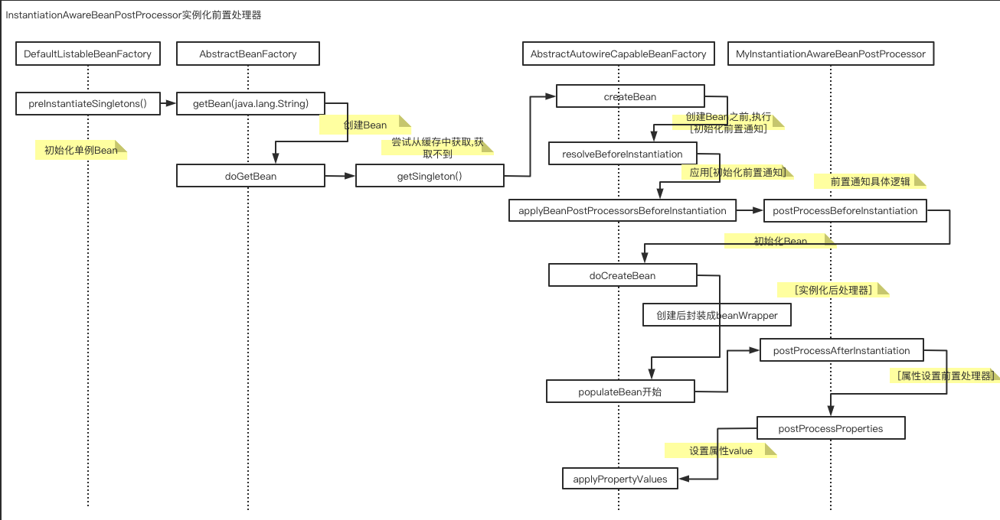
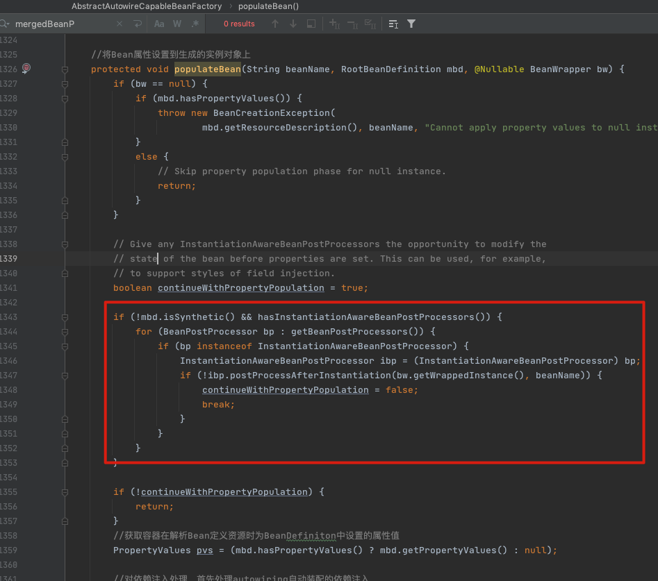

# 080-SpringBean实例化后阶段

## 目录

[TOC]

## 一言蔽之

Spring提供了一种在实例化后监听器的机制,可在Bean

- bean实例化后
- bean初始化前

执行指定逻辑

实例化后置处理器的执行方法为

```java
boolean InstantiationAwareBeanPostProcessor#postProcessAfterInstantiation(Object bean, String beanName);
```

在实例化后,初始化bean之前进行调用,我们可以使用这个机制自定义我们对bean的赋值操作,进而自定义Bean

- 返回true, 执行后续populate
- 返回false, 不执行后续populate

## DEMO

```java
public class SpringBeanAfterInstantiationDemo {
  public static void main(String[] args) {
    DefaultListableBeanFactory beanFactory = new DefaultListableBeanFactory();
    XmlBeanDefinitionReader reader = new XmlBeanDefinitionReader(beanFactory);
    final int i = reader.loadBeanDefinitions(new ClassPathResource("lifecycle/beforeInitilization/spring-bean-lifecycle-before-initialization.xml"));
    beanFactory.addBeanPostProcessor(new InstantiationAwareBeanPostProcessor() {
      @Override
      public boolean postProcessAfterInstantiation(Object bean, String beanName) throws BeansException {
        System.out.println("bean :" + bean);//bean :DemoBean{name='null'} 可以看出这里只是初始化了,没有populate
        System.out.println("beanName :" + beanName);
        if (ObjectUtils.nullSafeEquals("demoBean", beanName) && DemoBean.class.equals(bean.getClass())) {
          DemoBean bean1 = (DemoBean) bean;
          bean1.setName("changed bean");
          // "user" 对象不允许属性赋值（填入）（配置元信息 -> 属性值） 这个时候就不会走populate逻辑了
          return false;
        }
        //使用Spring配置对Bean进行配置
        return true;
      }
    });
    final DemoBean bean = beanFactory.getBean(DemoBean.class);
    System.out.println(bean);
  }
}
```

## Bean属性赋值(populate)判断

在Bean的实例被初始化以后(可以是通过构造器或者是工厂方法), 但是在实例的属性被设置之前,执行这个方法

通常用语

- 在Spring自动装配开始之前，这是在给定bean实例上执行定制字段注入的理想回调。
- 默认的值是ture

```java
//org.springframework.beans.factory.config.InstantiationAwareBeanPostProcessor
boolean InstantiationAwareBeanPostProcessor#postProcessAfterInstantiation(Object bean, String beanName)
```

- 如果返回true, 则执行Spring对Bean属性的设置
- 如果返回false,则跳过Spring对Bean属性的设置

## 源码分析

#### 调用流程



可以从流程中看出,进行赋值操作之前,执行实例化后置处理器,这个处理器允许我们自己设置属性

