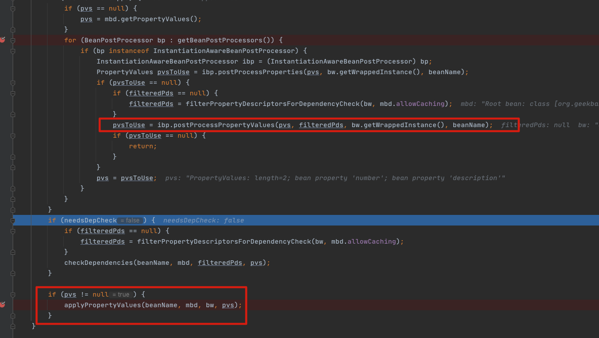

# 090-SpringBean属性赋值前阶段

## 一言蔽之

SpringBean属性赋值前回调是SpringBean在创建后,属性赋值前的一种拦截机制,目的是可以

根据

- PropertyValues pvs : 属性值 
- Object bean :  实例化后的BeanWarpper
- String beanName :  Bean的名称

转换成

- PropertyValues 

返回后的PropertyValues 会被应用到属性赋值阶段

## 目录

- [Bean属性值元信息](#Bean属性值元信息)
- [Bean属性赋值前回调](#Bean属性赋值前回调)
- [调用流程](#调用流程)

## Bean属性值元信息

- PropertyValues

## Bean属性赋值前回调

- Spring1.2-5.0 : InstantiationAwareBeanPostProcessor#postProcessPropertyValues
- Spring5.1 :InstantiationAwareBeanPostProcessor#postProcessProperties

```
Post-process the given property values before the factory applies them to the given bean. Allows for checking whether all dependencies have been satisfied, for example based on a "Required" annotation on bean property setters.
Also allows for replacing the property values to apply, typically through creating a new MutablePropertyValues instance based on the original PropertyValues, adding or removing specific values.
The default implementation returns the given pvs as-is.
```

数据从配置文件读出来,我可以在Spring设置到Bean之前进行设置

## 调用流程


从图中可以看出,调用,在创建完bean之后,封装成为 BeanWrapper,然后调用属性赋值前回调

```java
PropertyValues InstantiationAwareBeanPostProcessor#postProcessProperties
```

回调完成后,返回 PropertyValues 应用于bean的实例上

```java
class MyInstantiationAwareBeanPostProcessor implements InstantiationAwareBeanPostProcessor {

    // user 是跳过 Bean 属性赋值（填入）
    // superUser 也是完全跳过 Bean 实例化（Bean 属性赋值（填入））
    // userHolder

    @Override
    public PropertyValues postProcessProperties(PropertyValues pvs, Object bean, String beanName)
            throws BeansException {
        // 对 "userHolder" Bean 进行拦截
        if (ObjectUtils.nullSafeEquals("userHolder", beanName) && UserHolder.class.equals(bean.getClass())) {
// 假设 <property name="number" value="1" /> 配置的话，那么在 PropertyValues 就包含一个 PropertyValue(number=1)
            final MutablePropertyValues propertyValues;
            if (pvs instanceof MutablePropertyValues) {
                propertyValues = (MutablePropertyValues) pvs;
            } else {
                propertyValues = new MutablePropertyValues();
            }
            // 等价于 <property name="number" value="1" />
            propertyValues.addPropertyValue("number", "1");
            // 原始配置 <property name="description" value="The user holder" />
            // 如果存在 "description" 属性配置的话
            if (propertyValues.contains("description")) {
                // PropertyValue value 是不可变的
                propertyValues.removePropertyValue("description");
                propertyValues.addPropertyValue("description", "The user holder V2");
            }
            return propertyValues;
        }
        return null;
    }
}
```

## 返回后生效



## 应用属性值

```java
protected void applyPropertyValues(String beanName, BeanDefinition mbd, BeanWrapper bw, PropertyValues pvs) {
  if (pvs.isEmpty()) {
    return;
  }

  if (System.getSecurityManager() != null && bw instanceof BeanWrapperImpl) {
    ((BeanWrapperImpl) bw).setSecurityContext(getAccessControlContext());
  }

  MutablePropertyValues mpvs = null;
  List<PropertyValue> original;

  if (pvs instanceof MutablePropertyValues) {
    mpvs = (MutablePropertyValues) pvs;
    if (mpvs.isConverted()) {
      // Shortcut: use the pre-converted values as-is.
      try {
        bw.setPropertyValues(mpvs);
        return;
      }
      catch (BeansException ex) {
        throw new BeanCreationException(
          mbd.getResourceDescription(), beanName, "Error setting property values", ex);
      }
    }
    original = mpvs.getPropertyValueList();
  }
  else {
    original = Arrays.asList(pvs.getPropertyValues());
  }

  TypeConverter converter = getCustomTypeConverter();
  if (converter == null) {
    converter = bw;
  }
  BeanDefinitionValueResolver valueResolver = new BeanDefinitionValueResolver(this, beanName, mbd, converter);

  // Create a deep copy, resolving any references for values.
  List<PropertyValue> deepCopy = new ArrayList<>(original.size());
  boolean resolveNecessary = false;
  for (PropertyValue pv : original) {
    if (pv.isConverted()) {
      deepCopy.add(pv);
    }
    else {
      String propertyName = pv.getName();
      Object originalValue = pv.getValue();
      if (originalValue == AutowiredPropertyMarker.INSTANCE) {
        Method writeMethod = bw.getPropertyDescriptor(propertyName).getWriteMethod();
        if (writeMethod == null) {
          throw new IllegalArgumentException("Autowire marker for property without write method: " + pv);
        }
        originalValue = new DependencyDescriptor(new MethodParameter(writeMethod, 0), true);
      }
      Object resolvedValue = valueResolver.resolveValueIfNecessary(pv, originalValue);
      Object convertedValue = resolvedValue;
      boolean convertible = bw.isWritableProperty(propertyName) &&
        !PropertyAccessorUtils.isNestedOrIndexedProperty(propertyName);
      if (convertible) {
        convertedValue = convertForProperty(resolvedValue, propertyName, bw, converter);
      }
      // Possibly store converted value in merged bean definition,
      // in order to avoid re-conversion for every created bean instance.
      if (resolvedValue == originalValue) {
        if (convertible) {
          pv.setConvertedValue(convertedValue);
        }
        deepCopy.add(pv);
      }
      else if (convertible && originalValue instanceof TypedStringValue &&
               !((TypedStringValue) originalValue).isDynamic() &&
               !(convertedValue instanceof Collection || ObjectUtils.isArray(convertedValue))) {
        pv.setConvertedValue(convertedValue);
        deepCopy.add(pv);
      }
      else {
        resolveNecessary = true;
        deepCopy.add(new PropertyValue(pv, convertedValue));
      }
    }
  }
  if (mpvs != null && !resolveNecessary) {
    mpvs.setConverted();
  }

  // Set our (possibly massaged) deep copy.
  try {
    bw.setPropertyValues(new MutablePropertyValues(deepCopy));
  }
  catch (BeansException ex) {
    throw new BeanCreationException(
      mbd.getResourceDescription(), beanName, "Error setting property values", ex);
  }
}
```

