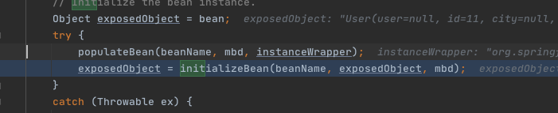
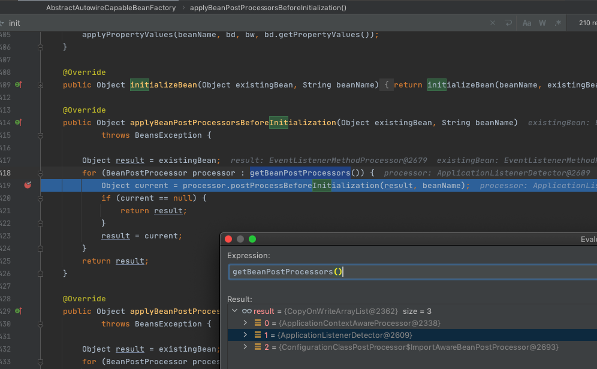

# 100-SpringBean初始化阶段-Aware接口回调

## 目录

------

[TOC]

## Aware相关Bean

1. [BeanNameAware](#BeanNameAware)
2. [BeanClassLoaderAware](#BeanClassLoaderAware)
3. [BeanFactoryAware](#BeanFactoryAware)
4. [EnvironmentAware](#EnvironmentAware)
5. [EmbeddedValueResolverAware](#EmbeddedValueResolverAware)
6. [ResourceLoaderAware](#ResourceLoaderAware)
7. [ApplicationEventPublisherAware](#ApplicationEventPublisherAware)
8. [MessageSourceAware](#MessageSourceAware)
9. [ApplicationContextAware](#ApplicationContextAware)
10. [ServletContextAware](#ServletContextAware)

## 细分

- BeanFactory生命周期中自带的aware
  - [BeanNameAware](#BeanNameAware)
  - [BeanClassLoaderAware](#BeanClassLoaderAware)
  - [BeanFactoryAware](#BeanFactoryAware)
- ApplicationContext声明周期中的aware
  - BeanFactory生命周期中自带的aware

BeanFactory生命周期中自带的aware

- [BeanNameAware](#BeanNameAware)
- [BeanClassLoaderAware](#BeanClassLoaderAware)
- [BeanFactoryAware](#BeanFactoryAware)

#### BeanFactory生命周期中自带的aware注册时机

无需注册,hardcode编写的初始化方式

```java
AbstractAutowireCapableBeanFactory#invokeAwareMethods
```

#### BeanFactory生命周期中自带的aware调用时机

在填充完Bean的属性之后,也就是属性赋值阶段后,立马进行实例化Bean的操作



```java
protected Object initializeBean(final String beanName, final Object bean, @Nullable RootBeanDefinition mbd) {
  if (System.getSecurityManager() != null) {
    AccessController.doPrivileged((PrivilegedAction<Object>) () -> {

      //----------------------本章关注点----调用各类Aware接口-----------------------------------------//
      //属性赋值完成后,初始化Bean的第一步就是调用各类Aware接口
            invokeAwareMethods(beanName, bean);
      //----------------------本章关注点----调用各类Aware接口-----------------------------------------//

      return null;
    }, getAccessControlContext());
  }
  else {
    //属性赋值完成后,初始化Bean的第一步就是调用各类Aware接口
    invokeAwareMethods(beanName, bean);
  }
  Object wrappedBean = bean;
  if (mbd == null || !mbd.isSynthetic()) {
    //应用BeanPostProcessors, 其中ApplicationContext相关声明周期回调就使用ApplicatoonContextAwareProcessor实现
    wrappedBean = applyBeanPostProcessorsBeforeInitialization(wrappedBean, beanName);
  }

  try {
    //调用初始化方法
    invokeInitMethods(beanName, wrappedBean, mbd);
  }
  catch (Throwable ex) {
    throw new BeanCreationException(
      (mbd != null ? mbd.getResourceDescription() : null),
      beanName, "Invocation of init method failed", ex);
  }
  if (mbd == null || !mbd.isSynthetic()) {
    //应用初始化
    wrappedBean = applyBeanPostProcessorsAfterInitialization(wrappedBean, beanName);
  }

  return wrappedBean;
}

```

可以看出下面是哪个`invokeAwareMethods` 实际上执行了三个Aware接口

```java
private void invokeAwareMethods(final String beanName, final Object bean) {
  if (bean instanceof Aware) {
    //第1个执行BeanNameAware 
    if (bean instanceof BeanNameAware) {
      ((BeanNameAware) bean).setBeanName(beanName);
    }
    //第2个执行BeanClassLoaderAware
    if (bean instanceof BeanClassLoaderAware) {
      ClassLoader bcl = getBeanClassLoader();
      if (bcl != null) {
        ((BeanClassLoaderAware) bean).setBeanClassLoader(bcl);
      }
    }
    //第3个执行BeanFactoryAware
    if (bean instanceof BeanFactoryAware) {
      ((BeanFactoryAware) bean).setBeanFactory(AbstractAutowireCapableBeanFactory.this);
    }
  }
}
```

可以看出实际上BeanFactory阶段仅仅调用3个声明周期回调

##### BeanNameAware

```
void setBeanName(String name);
```

##### BeanClassLoaderAware

```java
void setBeanClassLoader(ClassLoader classLoader);
```

##### BeanFactoryAware

```java
void setBeanFactory(BeanFactory beanFactory) throws BeansException;
```

## ApplicationContext生命周期中自带的aware调用时机



从上图中可以看出,调用了`getBeanPostProcessors()`三个方法获取了第一个叫做`org.springframework.context.support.ApplicationContextAwareProcessor`

的初始化前置处理器,它就是用于进行ApplicationContext相关初始化的类

#### ApplicationContextAwareProcessor注册时机

在ApplicationContext的refresh方法操作时,第三步,初始化BeanFactory中注册了这个[初始化前置处理器]

 [030-第三步-prepareBeanFactory-填充容器属性.md](../080-Spring拓展点/030-第三步-prepareBeanFactory-填充容器属性.md) 

```java
protected void prepareBeanFactory(ConfigurableListableBeanFactory beanFactory) {
  // Tell the internal bean factory to use the context's class loader etc.
  beanFactory.setBeanClassLoader(getClassLoader());
  beanFactory.setBeanExpressionResolver(new StandardBeanExpressionResolver(beanFactory.getBeanClassLoader()));
  beanFactory.addPropertyEditorRegistrar(new ResourceEditorRegistrar(this, getEnvironment()));

  // Configure the bean factory with context callbacks.
  //加入了ApplicationContext相关的回调
  beanFactory.addBeanPostProcessor(new ApplicationContextAwareProcessor(this));
  beanFactory.ignoreDependencyInterface(EnvironmentAware.class);
  beanFactory.ignoreDependencyInterface(EmbeddedValueResolverAware.class);
  beanFactory.ignoreDependencyInterface(ResourceLoaderAware.class);
  beanFactory.ignoreDependencyInterface(ApplicationEventPublisherAware.class);
  beanFactory.ignoreDependencyInterface(MessageSourceAware.class);
  beanFactory.ignoreDependencyInterface(ApplicationContextAware.class);
	//	...
}
```

#### ApplicationContextAwareProcessor执行

```java
//org.springframework.context.support.ApplicationContextAwareProcessor	

@Override
@Nullable
public Object postProcessBeforeInitialization(final Object bean, String beanName) throws BeansException {
  AccessControlContext acc = null;

  //如果 是 EnvironmentAware 的实现类
  if (System.getSecurityManager() != null &&
      (bean instanceof EnvironmentAware || bean instanceof EmbeddedValueResolverAware ||
       bean instanceof ResourceLoaderAware || bean instanceof ApplicationEventPublisherAware ||
       bean instanceof MessageSourceAware || bean instanceof ApplicationContextAware)) {
    acc = this.applicationContext.getBeanFactory().getAccessControlContext();
  }

  if (acc != null) {
    AccessController.doPrivileged((PrivilegedAction<Object>) () -> {
      //调用接口们
      invokeAwareInterfaces(bean);
      return null;
    }, acc);
  }
  else {
          //调用接口们
    invokeAwareInterfaces(bean);
  }

  return bean;
}
```

调用接口们正式的实现

```java
//调用接口们正式的实现
private void invokeAwareInterfaces(Object bean) {
  if (bean instanceof Aware) {
    if (bean instanceof EnvironmentAware) {
      ((EnvironmentAware) bean).setEnvironment(this.applicationContext.getEnvironment());
    }
    if (bean instanceof EmbeddedValueResolverAware) {
      ((EmbeddedValueResolverAware) bean).setEmbeddedValueResolver(this.embeddedValueResolver);
    }
    if (bean instanceof ResourceLoaderAware) {
      ((ResourceLoaderAware) bean).setResourceLoader(this.applicationContext);
    }
    if (bean instanceof ApplicationEventPublisherAware) {
      ((ApplicationEventPublisherAware) bean).setApplicationEventPublisher(this.applicationContext);
    }
    if (bean instanceof MessageSourceAware) {
      ((MessageSourceAware) bean).setMessageSource(this.applicationContext);
    }
    if (bean instanceof ApplicationContextAware) {
      ((ApplicationContextAware) bean).setApplicationContext(this.applicationContext);
    }
  }
}
```

#### EnvironmentAware

```java
void setEnvironment(Environment environment);
```

#### EmbeddedValueResolverAware

实现该接口能够获取Spring EL解析器，用户的自定义注解需要支持spel表达式的时候可以使用，非常方便。

```java
void setEmbeddedValueResolver(StringValueResolver resolver);
```

#### ResourceLoaderAware

```java
void setResourceLoader(ResourceLoader resourceLoader);
```

#### ApplicationEventPublisherAware

```java
void setApplicationEventPublisher(ApplicationEventPublisher applicationEventPublisher);
```

#### MessageSourceAware

```java
void setMessageSource(MessageSource messageSource);
```

#### ApplicationContextAware

```java
void setApplicationContext(ApplicationContext applicationContext) throws BeansException;
```

#### ServletContextAware

```java
//package org.springframework.context;
void setServletContext(ServletContext servletContext);
```

## 调用顺序


| 序号 | Aware Group1         | 调用的方法         |      |
| ---- | -------------------- | ------------------ | ---- |
| 1    | BeanNameAware        | setBeanName        | ALL  |
| 2    | BeanClassLoaderAware | setBeanClassLoader | ALL  |
| 3    | BeanFactoryAware     | setBeanFactory     | ALL  |

### 

| 序号 | Aware Group2                                       | 调用的方法                      |         |                                                              |
| ---- | -------------------------------------------------- | ------------------------------- | ------- | ------------------------------------------------------------ |
| 4    | EnvironmentAware                                   | setEnvironment                  | ALL     |                                                              |
| 5    | EmbeddedValueResolverAware                         | setEmbeddedValueResolver        | ALL     | 实现该接口能够获取Spring EL解析器，用户的自定义注解需要支持spel表达式的时候可以使用，非常方便。 |
| 6    | ResourceLoaderAware                                | setResourceLoader               | ALL     |                                                              |
| 7    | ApplicationEventPublisherAware                     | setApplicationEventPublisher    | ALL     |                                                              |
| 8    | MessageSourceAware                                 | setMessageSource                | ALL     |                                                              |
| 9    | ApplicationContextAware                            | setApplicationContext           | ALL     |                                                              |
| 10   | ServletContextAware                                | setServletContext               | web应用 |                                                              |
| 11   | BeanPostProcessors#postProcessBeforeInitialization | postProcessBeforeInitialization | ALL     |                                                              |
| 12   | InitializingBean                                   | afterPropertiesSet              | ALL     |                                                              |
| 13   | 自定义 init-method 方法                            | init-method                     | ALL     |                                                              |
| 14   | BeanPostProcessors#postProcessAfterInitialization  | postProcessAfterInitialization  | ALL     |                                                              |