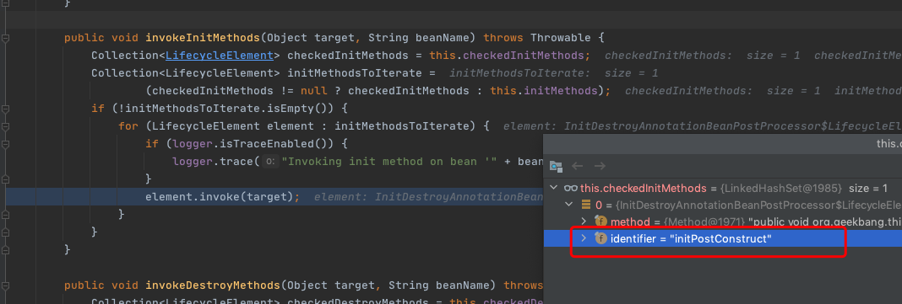

# 120-SpringBean初始化阶段

## 一言蔽之

初始化阶段主要包括三种初始化方式

- @PostConstruct(依赖注解驱动)
- 实现InitializingBean接口的afterPropertiesSet()方法
- 自定义初始化方法

## 目录

- [简介](#简介)
- [实现实例](#二级目录)
- [@PostConstruct(依赖注解驱动)](#@PostConstruct(依赖注解驱动))
- [实现InitializingBean接口的afterPropertiesSet()方法](#实现InitializingBean接口的afterPropertiesSet()方法)
- [自定义初始化方法](#自定义初始化方法)

## 简介

初始化阶段主要涉及到三个步骤,回调的顺序:

- @PostConstruct(依赖注解驱动)
- 实现InitializingBean接口的afterPropertiesSet()方法
- 自定义初始化方法

## 实现实例

```java
public class UserHolder implements InitializingBean {
    private final User user;
    public UserHolder(User user) {
        this.user = user;
    }
    /**
     * 依赖于注解驱动
     * 当前场景：BeanFactory
     */
    @PostConstruct
    public void initPostConstruct() {
        // postProcessBeforeInitialization V3 -> initPostConstruct V4
        this.description = "The user holder V4";
        System.out.println("initPostConstruct() = " + description);
    }
    @Override
    public void afterPropertiesSet() throws Exception {
        // initPostConstruct V4 -> afterPropertiesSet V5
        this.description = "The user holder V5";
        System.out.println("afterPropertiesSet() = " + description);
    }
    /**
     * 自定义初始化方法
     */
    public void init() {
        // initPostConstruct V5 -> afterPropertiesSet V6
        this.description = "The user holder V6";
        System.out.println("init() = " + description);
    }
}

```

## @PostConstruct(依赖注解驱动)

执行原理,通过CommonAnnotationBeanPostProcessor后置处理器完成 

[160-Java通用注解注入原理.md](../005-SpringIoC依赖注入/160-Java通用注解注入原理.md) 

```java
//org.springframework.beans.factory.support.AbstractAutowireCapableBeanFactory#initializeBean(String, Object, RootBeanDefinition)
//初始化方法
protected Object initializeBean(final String beanName, final Object bean, @Nullable RootBeanDefinition mbd) {
  if (System.getSecurityManager() != null) {
    AccessController.doPrivileged((PrivilegedAction<Object>) () -> {
      //执行aware相关操作
      invokeAwareMethods(beanName, bean);
      return null;
    }, getAccessControlContext());
  }
  else {
    //执行aware相关操作
    invokeAwareMethods(beanName, bean);
  }

  Object wrappedBean = bean;
  if (mbd == null || !mbd.isSynthetic()) {
    //应用实例化前置处理器, @PostConstruct 就是使用实例化前置处理器
    wrappedBean = applyBeanPostProcessorsBeforeInitialization(wrappedBean, beanName);
  }

  try {
    //执行初始化方法 //afterPropertiesSet方法是在这里处理的
    invokeInitMethods(beanName, wrappedBean, mbd);
  }
  catch (Throwable ex) {
    throw new BeanCreationException(
      (mbd != null ? mbd.getResourceDescription() : null),
      beanName, "Invocation of init method failed", ex);
  }
  if (mbd == null || !mbd.isSynthetic()) {
    wrappedBean = applyBeanPostProcessorsAfterInitialization(wrappedBean, beanName);
  }

  return wrappedBean;
}
```

applyBeanPostProcessorsBeforeInitialization

```java
@Override
public Object applyBeanPostProcessorsBeforeInitialization(Object existingBean, String beanName)
  throws BeansException {

  Object result = existingBean;
  for (BeanPostProcessor processor : getBeanPostProcessors()) {
    //执行 CommonAnnotationBeanPostProcessor前置处理器
    Object current = processor.postProcessBeforeInitialization(result, beanName);
    if (current == null) {
      return result;
    }
    result = current;
  }
  return result;
}
```

```java
//org.springframework.beans.factory.annotation.InitDestroyAnnotationBeanPostProcessor#postProcessBeforeInitialization	
@Override
public Object postProcessBeforeInitialization(Object bean, String beanName) throws BeansException {
 	//获取声明周期的原信息
  LifecycleMetadata metadata = findLifecycleMetadata(bean.getClass());
  try {
    //调用初始化方法
    metadata.invokeInitMethods(bean, beanName);
  }
	//...忽略
  return bean;
}
```

执行具体的初始化逻辑




## 实现InitializingBean接口的afterPropertiesSet()方法

```java
protected void invokeInitMethods(String beanName, final Object bean, @Nullable RootBeanDefinition mbd)throws Throwable {
  //判断是否有InitializingBean 接口
  boolean isInitializingBean = (bean instanceof InitializingBean);
  if (isInitializingBean && (mbd == null || !mbd.isExternallyManagedInitMethod("afterPropertiesSet"))) {
  		//忽略...
    //具体执行的逻辑
      ((InitializingBean) bean).afterPropertiesSet();
    //忽略..
  }

  if (mbd != null && bean.getClass() != NullBean.class) {
    String initMethodName = mbd.getInitMethodName();
    if (StringUtils.hasLength(initMethodName) &&
        !(isInitializingBean && "afterPropertiesSet".equals(initMethodName)) &&
        !mbd.isExternallyManagedInitMethod(initMethodName)) {
      //执行自定义的逻辑
      invokeCustomInitMethod(beanName, bean, mbd);
    }
  }
}
```


## 自定义初始化方法

```java
//org.springframework.beans.factory.support.AbstractAutowireCapableBeanFactory#invokeCustomInitMethod
protected void invokeCustomInitMethod(String beanName, final Object bean, RootBeanDefinition mbd)
  throws Throwable {
	//获取Bean定义的初始化方法
  String initMethodName = mbd.getInitMethodName();
  Assert.state(initMethodName != null, "No init method set");
  Method initMethod = (mbd.isNonPublicAccessAllowed() ?
                       BeanUtils.findMethod(bean.getClass(), initMethodName) :
                       ClassUtils.getMethodIfAvailable(bean.getClass(), initMethodName));

  if (initMethod == null) {
    if (mbd.isEnforceInitMethod()) {
      throw new BeanDefinitionValidationException("Could not find an init method named '" +
                                                  initMethodName + "' on bean with name '" + beanName + "'");
    }
    else {
      if (logger.isTraceEnabled()) {
        logger.trace("No default init method named '" + initMethodName +
                     "' found on bean with name '" + beanName + "'");
      }
      // Ignore non-existent default lifecycle methods.
      return;
    }
  }

  if (logger.isTraceEnabled()) {
    logger.trace("Invoking init method  '" + initMethodName + "' on bean with name '" + beanName + "'");
  }
  Method methodToInvoke = ClassUtils.getInterfaceMethodIfPossible(initMethod);

  if (System.getSecurityManager() != null) {
    AccessController.doPrivileged((PrivilegedAction<Object>) () -> {
      ReflectionUtils.makeAccessible(methodToInvoke);
      return null;
    });
    try {
      AccessController.doPrivileged((PrivilegedExceptionAction<Object>) () ->
                                    methodToInvoke.invoke(bean), getAccessControlContext());
    }
    catch (PrivilegedActionException pae) {
      InvocationTargetException ex = (InvocationTargetException) pae.getException();
      throw ex.getTargetException();
    }
  }
  else {
    try {
      ReflectionUtils.makeAccessible(methodToInvoke);
      //执行方法
      methodToInvoke.invoke(bean);
    }
    catch (InvocationTargetException ex) {
      throw ex.getTargetException();
    }
  }
}

```

