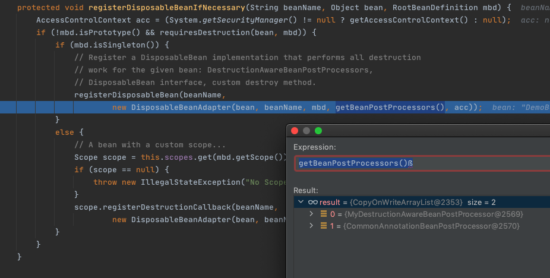
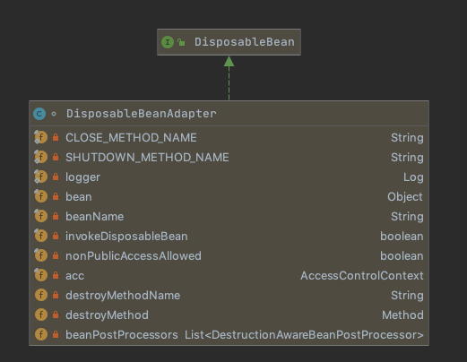

# 150-SpringBean销毁前阶段

## 目录

------

[TOC]

## 一言蔽之

SpringBean的生命周期当容器调动

```
beanFactory.destroySingleton("demoBean");
```

的时候,在销毁前,会调用DestructionAwareBeanPostProcessor实现类的postProcessBeforeDestruction方法销毁前回调

我们可以在这个方法里面做一些销毁前的操作

值得注意的是CommonAnnotationBeanPostProcessor就是实现了DestructionAwareBeanPostProcessor接口实现的

## 先入为主的核心类

- [DisposableBeanAdapter可销毁Bean适配器](#DisposableBeanAdapter可销毁Bean适配器)

- 销毁DestructionAwareBeanPostProcessor触发阶段)

## DestructionAwareBeanPostProcessor注册阶段

```java
public static void main(String[] args) {
  DefaultListableBeanFactory beanFactory = new DefaultListableBeanFactory();
  String location = "lifecycle/destruction/lifecycle-destruction.xml";
  XmlBeanDefinitionReader reader = new XmlBeanDefinitionReader(beanFactory);
  final int i = reader.loadBeanDefinitions(location);
  System.out.println(String.format("加载了 %s 个 bean", i));
  
  //----------------本章关注的重点------------------
  beanFactory.addBeanPostProcessor(new MyDestructionAwareBeanPostProcessor());
  //----------------本章关注的重点------------------

  final DemoBean demoBean = beanFactory.getBean("demoBean", DemoBean.class);
  System.out.println(demoBean);
  beanFactory.destroySingleton("demoBean");
}
```

这里没什么特别的,就是设置进了BeanFactory 里的一个数组里beanPostProcessors

### 堆栈信息

```
registerDisposableBeanIfNecessary:1698, AbstractBeanFactory (org.springframework.beans.factory.support)
doCreateBean:617, AbstractAutowireCapableBeanFactory (org.springframework.beans.factory.support)
createBean:498, AbstractAutowireCapableBeanFactory (org.springframework.beans.factory.support)
lambda$doGetBean$0:320, AbstractBeanFactory (org.springframework.beans.factory.support)
getObject:-1, 347978868 (org.springframework.beans.factory.support.AbstractBeanFactory$$Lambda$6)
getSingleton:222, DefaultSingletonBeanRegistry (org.springframework.beans.factory.support)
doGetBean:318, AbstractBeanFactory (org.springframework.beans.factory.support)
getBean:204, AbstractBeanFactory (org.springframework.beans.factory.support)
main:25, DestructionAwareBeanPostProcessorDemo (cn.eccto.study.springframework.lifecycle.destruction)
```

当我们去getBean的时候,创建Bean结束以后,会在doCreateBean方法中进行可销毁Bean的注册,也就是

```
registerDisposableBeanIfNecessary
```

```java
//org.springframework.beans.factory.support.AbstractAutowireCapableBeanFactory#doCreateBean
protected Object doCreateBean(final String beanName, final RootBeanDefinition mbd, final @Nullable Object[] args)
  throws BeanCreationException {
  //忽略创建过程

  // Register bean as disposable.
  try {
    //调用注册,将Bean注册为可销毁Bean,或者一次性Bean
    registerDisposableBeanIfNecessary(beanName, bean, mbd);
  }

  return exposedObject;
}
```

主要的作用是建立一个 DisposableBeanAdapter 适配器, 将销毁前回调 DestructionAwareBeanPostProcessor注册进去

```java
//org.springframework.beans.factory.support.AbstractBeanFactory#registerDisposableBeanIfNecessary
	protected void registerDisposableBeanIfNecessary(String beanName, Object bean, RootBeanDefinition mbd) {
		AccessControlContext acc = (System.getSecurityManager() != null ? getAccessControlContext() : null);
		if (!mbd.isPrototype() && requiresDestruction(bean, mbd)) {
			if (mbd.isSingleton()) {
				// Register a DisposableBean implementation that performs all destruction
				// work for the given bean: DestructionAwareBeanPostProcessors,
				// DisposableBean interface, custom destroy method.
				registerDisposableBean(beanName,
						new DisposableBeanAdapter(bean, beanName, mbd, getBeanPostProcessors(), acc));
			}
			else {
				// A bean with a custom scope...
				Scope scope = this.scopes.get(mbd.getScope());
				if (scope == null) {
					throw new IllegalStateException("No Scope registered for scope name '" + mbd.getScope() + "'");
				}
				scope.registerDestructionCallback(beanName,
						new DisposableBeanAdapter(bean, beanName, mbd, getBeanPostProcessors(), acc));
			}
		}
	}
```



可以看到,有两个Processor 

1. 我们自定义的销毁回调
2. 基于注解驱动的CommonAnnotationBeanPostProcessor,用于解析@PostDestory

### DisposableBeanAdapter可销毁Bean适配器



这显然是一个对象适配器,将bean的名称,beanDefinition 和后置处理器放入

 [01-adapter-pattern.md](../../01-design-patterns/03-structural-patterns/01-adapter-pattern.md) 

在构造方法中,涵盖了三种析构的方法

- xml配置中声明的destroy方法
- DisposableBean的destory方法
- `DestructionAwareBeanPostProcessor`前析构处理器

```java
	public DisposableBeanAdapter(Object bean, String beanName, RootBeanDefinition beanDefinition,
			List<BeanPostProcessor> postProcessors, @Nullable AccessControlContext acc) {

		Assert.notNull(bean, "Disposable bean must not be null");
		this.bean = bean;
		this.beanName = beanName;
		this.invokeDisposableBean =
				(this.bean instanceof DisposableBean && !beanDefinition.isExternallyManagedDestroyMethod("destroy"));
		this.nonPublicAccessAllowed = beanDefinition.isNonPublicAccessAllowed();
		this.acc = acc;
		String destroyMethodName = inferDestroyMethodIfNecessary(bean, beanDefinition);
		if (destroyMethodName != null && !(this.invokeDisposableBean && "destroy".equals(destroyMethodName)) &&
				!beanDefinition.isExternallyManagedDestroyMethod(destroyMethodName)) {
			this.destroyMethodName = destroyMethodName;
			this.destroyMethod = determineDestroyMethod(destroyMethodName);
			if (this.destroyMethod == null) {
				if (beanDefinition.isEnforceDestroyMethod()) {
					throw new BeanDefinitionValidationException("Could not find a destroy method named '" +
							destroyMethodName + "' on bean with name '" + beanName + "'");
				}
			}
			else {
				Class<?>[] paramTypes = this.destroyMethod.getParameterTypes();
				if (paramTypes.length > 1) {
					throw new BeanDefinitionValidationException("Method '" + destroyMethodName + "' of bean '" +
							beanName + "' has more than one parameter - not supported as destroy method");
				}
				else if (paramTypes.length == 1 && boolean.class != paramTypes[0]) {
					throw new BeanDefinitionValidationException("Method '" + destroyMethodName + "' of bean '" +
							beanName + "' has a non-boolean parameter - not supported as destroy method");
				}
			}
		}
    //仅仅将DestructionAwareBeanPostProcessor过滤出来存储
		this.beanPostProcessors = filterPostProcessors(postProcessors, bean);
	}

```

## DestructionAwareBeanPostProcessor触发阶段

```java
postProcessBeforeDestruction:17, MyDestructionAwareBeanPostProcessor (cn.eccto.study.springframework.lifecycle.destruction)
destroy:240, DisposableBeanAdapter (org.springframework.beans.factory.support)
destroyBean:571, DefaultSingletonBeanRegistry (org.springframework.beans.factory.support)
destroySingleton:543, DefaultSingletonBeanRegistry (org.springframework.beans.factory.support)
destroySingleton:1052, DefaultListableBeanFactory (org.springframework.beans.factory.support)
main:27, DestructionAwareBeanPostProcessorDemo (cn.eccto.study.springframework.lifecycle.destruction)
```

可以看出调用顺序是

- 调用析构回调DestructionAwareBeanPostProcessor
  - 自定义的DestructionAwareBeanPostProcessor
  - 注解驱动的CommonAnnotationBeanPostProcessor 
- 调用接口 DisposableBean的destroy回调
- 调用xml中自定义的回调

```java
//org.springframework.beans.factory.support.DisposableBeanAdapter#destroy
@Override
	public void destroy() {
		if (!CollectionUtils.isEmpty(this.beanPostProcessors)) {
			for (DestructionAwareBeanPostProcessor processor : this.beanPostProcessors) {
        //调用析构回调
				processor.postProcessBeforeDestruction(this.bean, this.beanName);
			}
		}

		if (this.invokeDisposableBean) {
			try {
        //调用接口 DisposableBean 的destroy回调
					((DisposableBean) this.bean).destroy();
			}
		}

		if (this.destroyMethod != null) {
      //调用xml中自定义的回调
			invokeCustomDestroyMethod(this.destroyMethod);
		}
		else if (this.destroyMethodName != null) {
			Method methodToCall = determineDestroyMethod(this.destroyMethodName);
			if (methodToCall != null) {
				invokeCustomDestroyMethod(methodToCall);
			}
		}
	}
```

 [160-SpringBean销毁阶段.md](160-SpringBean销毁阶段.md) 