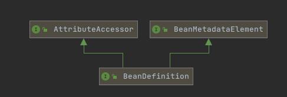

# 030-SpringBean属性元信息

## 目录

------

[TOC]

## 一言蔽之

## SpringBean属性元信息的分类

- Bean属性抽象-PropertyValues
  - 可修改实现-MutablePropertyValues
  - 元素成员-PropertyValue
- [Bean属性上下文存储-AttributeAccessor](#Bean属性上下文存储-AttributeAccessor)
- [Bean元信息元素-BeanMetadataElement](#Bean元信息元素-BeanMetadataElement)

### Bean属性抽象-PropertyValues

PropertyValues 代表Bean的属性集合, 其中集成多个PropertyValues

#### 元素成员-PropertyValue接口

PropertyValue代表了配置的bean的属性,我们可以使用以下方式设置

```java
final BeanDefinitionBuilder beanDefinitionBuilder = BeanDefinitionBuilder.genericBeanDefinition(User.class);
beanDefinitionBuilder.addPropertyValue("name", "EricChen");
```

##### 附加属性setAttribute和source的作用

```java
public static void main(String[] args) {
  // BeanDefinition 的定义（声明）
  final BeanDefinitionBuilder beanDefinitionBuilder = BeanDefinitionBuilder.genericBeanDefinition(User.class);
  beanDefinitionBuilder.addPropertyValue("name", "EricChen");
  DefaultListableBeanFactory beanFactory = new DefaultListableBeanFactory();
  // 获取 AbstractBeanDefinition
  final AbstractBeanDefinition beanDefinition = beanDefinitionBuilder.getBeanDefinition();
  
  // 附加属性（不影响 Bean populate、initialize）,主要用作上下文传递临时变量
  beanDefinition.setAttribute("name", "chengbei");
  
  // 当前 BeanDefinition 来自于何方（辅助作用）
  beanDefinition.setSource(BeanConfigurationMetadataDemo.class);
  beanFactory.registerBeanDefinition("user", beanDefinition);
  beanFactory.addBeanPostProcessor(new BeanPostProcessor() {
    @Override
    public Object postProcessAfterInitialization(Object bean, String beanName) throws BeansException {
      if (ObjectUtils.nullSafeEquals("user", beanName) && User.class.equals(bean.getClass())) {
        BeanDefinition bd = beanFactory.getBeanDefinition(beanName);
        // 通过 source 判断来
        if ( BeanConfigurationMetadataDemo.class.equals(bd.getSource())){
          // 属性（存储）上下文
          final String name = (String) bd.getAttribute("name");
          User user = (User) bean;
          user.setName(name);
          return bean;
        }
      }
      return bean;
    }
  });
  // 注册 User 的 BeanDefinition
  final User user = beanFactory.getBean("user", User.class);
  System.out.println("User = " + user);
}
```


#### 可修改实现-MutablePropertyValues

MutablePropertyValues是PropertyValues的实现类

```java
MutablePropertyValues pvs = beanDefinition.getPropertyValues();
```


### Bean属性上下文存储-AttributeAccessor

属性存储器,

接口设置的非常简单,就是对附加属性的增删改查

 附加属性（不影响 Bean populate、initialize）,主要用作上下文传递临时变量



```java
public interface AttributeAccessor {
	void setAttribute(String name, @Nullable Object value);
	@Nullable
	Object getAttribute(String name);
	@Nullable
	Object removeAttribute(String name);
	boolean hasAttribute(String name);
	String[] attributeNames();
}
```

### Bean元信息元素-BeanMetadataElement


```java
public interface BeanMetadataElement {

   /**
    * Return the configuration source {@code Object} for this metadata element
    * (may be {@code null}).
    */
   @Nullable
   Object getSource();

}
```

Source主要是用来标记当前 BeanDefinition 来自于何方（辅助作用）

```java
public static void main(String[] args) {
  // BeanDefinition 的定义（声明）
  final BeanDefinitionBuilder beanDefinitionBuilder = BeanDefinitionBuilder.genericBeanDefinition(User.class);
  beanDefinitionBuilder.addPropertyValue("name", "EricChen");
  DefaultListableBeanFactory beanFactory = new DefaultListableBeanFactory();
  // 获取 AbstractBeanDefinition
  final AbstractBeanDefinition beanDefinition = beanDefinitionBuilder.getBeanDefinition();
  // 附加属性（不影响 Bean populate、initialize）,主要用作上下文传递临时变量
  beanDefinition.setAttribute("name", "chengbei");
  // 当前 BeanDefinition 来自于何方（辅助作用）
  
  //----------↓↓↓↓↓↓-----本段关注的重点---------↓↓↓↓↓↓↓------------//
  beanDefinition.setSource(BeanConfigurationMetadataDemo.class);
  //----------↑↑↑↑↑↑-----本段关注的重点---------↑↑↑↑↑↑------------//
  
  beanFactory.registerBeanDefinition("user", beanDefinition);
  beanFactory.addBeanPostProcessor(new BeanPostProcessor() {
    @Override
    public Object postProcessAfterInitialization(Object bean, String beanName) throws BeansException {
      if (ObjectUtils.nullSafeEquals("user", beanName) && User.class.equals(bean.getClass())) {
        BeanDefinition bd = beanFactory.getBeanDefinition(beanName);
        // 通过 source 判断来
          //----------↓↓↓↓↓↓-----本段关注的重点---------↓↓↓↓↓↓↓------------//
        if ( BeanConfigurationMetadataDemo.class.equals(bd.getSource())){
            //----------↑↑↑↑↑↑-----本段关注的重点---------↑↑↑↑↑↑------------//
          // 属性（存储）上下文
          final String name = (String) bd.getAttribute("name");
          User user = (User) bean;
          user.setName(name);
          return bean;
        }
      }
      return bean;
    }
  });
  // 注册 User 的 BeanDefinition
  final User user = beanFactory.getBean("user", User.class);
  System.out.println("User = " + user);
}
```

## 演示代码

```java
public static void main(String[] args) {
  // BeanDefinition 的定义（声明）
  final BeanDefinitionBuilder beanDefinitionBuilder = BeanDefinitionBuilder.genericBeanDefinition(User.class);
  beanDefinitionBuilder.addPropertyValue("name", "EricChen");
  DefaultListableBeanFactory beanFactory = new DefaultListableBeanFactory();
  // 获取 AbstractBeanDefinition
  final AbstractBeanDefinition beanDefinition = beanDefinitionBuilder.getBeanDefinition();
  // 附加属性（不影响 Bean populate、initialize）,主要用作上下文传递临时变量
  
    //----------↓↓↓↓↓↓-----本段关注的重点---------↓↓↓↓↓↓↓------------//
	  beanDefinition.setAttribute("name", "chengbei");
    //----------↑↑↑↑↑↑-----本段关注的重点---------↑↑↑↑↑↑------------//
  // 当前 BeanDefinition 来自于何方（辅助作用）
 
  beanDefinition.setSource(BeanConfigurationMetadataDemo.class);
  
  beanFactory.registerBeanDefinition("user", beanDefinition);
  beanFactory.addBeanPostProcessor(new BeanPostProcessor() {
    @Override
    public Object postProcessAfterInitialization(Object bean, String beanName) throws BeansException {
      if (ObjectUtils.nullSafeEquals("user", beanName) && User.class.equals(bean.getClass())) {
        BeanDefinition bd = beanFactory.getBeanDefinition(beanName);
        // 通过 source 判断来
        if ( BeanConfigurationMetadataDemo.class.equals(bd.getSource())){
          // 属性（存储）上下文
         //----------↓↓↓↓↓↓-----本段关注的重点---------↓↓↓↓↓↓↓------------//
          final String name = (String) bd.getAttribute("name");
         //----------↑↑↑↑↑↑-----本段关注的重点---------↑↑↑↑↑↑------------//
          User user = (User) bean;
          user.setName(name);
          return bean;
        }
      }
      return bean;
    }
  });
  // 注册 User 的 BeanDefinition
  final User user = beanFactory.getBean("user", User.class);
  System.out.println("User = " + user);
}
```

