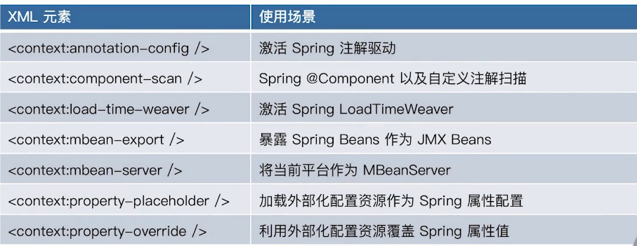

# 040-Spring容器配置元信息

---

[TOC]

## 简介

这里主要讨论的是能够修改SpringIoC或者IoC容器它的一些行为的元信息

## SpringXML配置元信息-beans元素相关

| beans元素属性               | 默认值     | 使用场景                                                     |
| --------------------------- | ---------- | ------------------------------------------------------------ |
| profile                     | null(留空) | Spring Profiles 配置值                                       |
| default-lazy-init           | default    | 当outter beans "default-lazy-init" 属性存在时,继承该值,否则为false |
| default-merge               | default    | 当outter beans "default-merge" 属性存在时,继承该值,否则为false |
| default-autowire            | default    | 当outter beans "default-autowire" 属性存在时,继承该值,否则为"no" |
| default-autowire-candidates | null(留空) | 默认SpringBeans 的名称 parttern                              |
| default-init-method         | null(留空) | 默认SpringBean自定义初始化方法                               |
| default-destory-method      | null(留空) | 默认SpringBean自定义销毁方法                                 |

## SpringXML配置元信息-beans相关配置解析源码

##### 核心类BeanDefinitionParserDelegate

```java
org.springframework.beans.factory.xml.BeanDefinitionParserDelegate#populateDefaults
```

`populateDefaults`方法职责是移植或者填充默认值

```java
protected void populateDefaults(DocumentDefaultsDefinition defaults, @Nullable DocumentDefaultsDefinition parentDefaults, Element root) {
  //获取default-lazy-init默认值
  String lazyInit = root.getAttribute(DEFAULT_LAZY_INIT_ATTRIBUTE);
  if (DEFAULT_VALUE.equals(lazyInit)) {
    // Potentially inherited from outer <beans> sections, otherwise falling back to false.
    lazyInit = (parentDefaults != null ? parentDefaults.getLazyInit() : FALSE_VALUE);
  }
  defaults.setLazyInit(lazyInit);
	
  //获取default-merge默认值
  String merge = root.getAttribute(DEFAULT_MERGE_ATTRIBUTE);
  if (DEFAULT_VALUE.equals(merge)) {
    // Potentially inherited from outer <beans> sections, otherwise falling back to false.
    merge = (parentDefaults != null ? parentDefaults.getMerge() : FALSE_VALUE);
  }
  defaults.setMerge(merge);
  String autowire = root.getAttribute(DEFAULT_AUTOWIRE_ATTRIBUTE);
  if (DEFAULT_VALUE.equals(autowire)) {
    // Potentially inherited from outer <beans> sections, otherwise falling back to 'no'.
    autowire = (parentDefaults != null ? parentDefaults.getAutowire() : AUTOWIRE_NO_VALUE);
  }
  defaults.setAutowire(autowire);

	...
  defaults.setSource(this.readerContext.extractSource(root));
}
```

## SpringXML配置元信息-context上下文相关



## 