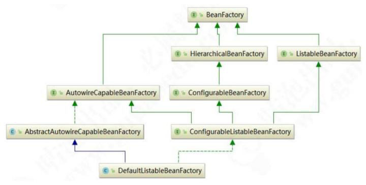

# BeanFactory

- [BeanFactory继承结构](#BeanFactory继承结构)
- [BeanFactory的三个重要子类](#BeanFactory的三个重要子类)
- [默认的最终实现类](#默认的最终实现类) 
- [BeanFactory源码](#BeanFactory源码)
- [ApplicationContext](#ApplicationContext)

## BeanFactory继承结构

Spring中Bean的创建是典型的工厂模式，这一系列的Bean工厂，即IoC容器，为开发者管理对象之间的依赖关系提供了很多便利和基础服务，在Spring中有许多IoC容器的实现供用户选择

BeanFactory作为最顶层的一个接口类，定义了IoC容器的基本功能规范

## BeanFactory有三个重要的子类

- ListableBeanFactory :  表示这些Bean可列表化

- HierarchicalBeanFactory : 表示这些Bean 是有继承关系的，也就是每个 Bean 可能有父 Bean。

- AutowireCapableBeanFactory : 定义Bean的自动装配规则

每个接口都有它的使用场合，主要是为了区分在Spring内部操作过程中对象的传递和转化，对对象的数据访问所做的限制这三个接口共同定义了Bean的集合、Bean之间的关系及Bean行为

## 默认的最终实现类

实现了所有的接口,集完全宠爱于一身

- [DefaultListableBeanFactory](020-核心类/001-DefaultListableBeanFactory.md) 

## BeanFactory源码

在BeanFactory里只对IoC容器的基本行为做了定义
要知道工厂是如何产生对象的，我们需要看具体的IoC容器实现，Spring提供了许多IoC容器实现，比如GenericApplicationContext、ClasspathXmlApplicationContext等。

## ApplicationContext

ApplicationContext是Spring提供的一个高级的IoC容器，它除了能够提供IoC容器的基本功能，还为用户提供了以下附加服务。

- 支持信息源，可以实现国际化 [020-MessageSource-国际化消息机制](../090-Spring机制/020-MessageSource-国际化消息机制) 

- 访问资源（实现ResourcePatternResolver接口)  [010-Resource机制](../090-Spring机制/010-Resource机制) 

- 支持应用事件（实现ApplicationEventPublisher接口） [0ApplicationEvent-事件机制](../090-Spring机制/030-ApplicationEvent-事件机制) 

