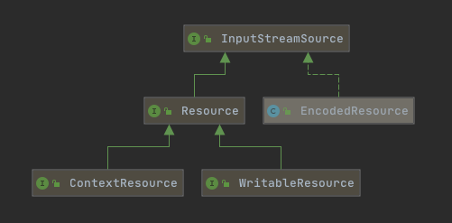

# 030-Spring资源接口-Resource

[TOC]

## 内建接口图示


## 核心接口



|                   | 接口类型   | 接口                                                |
| ----------------- | ---------- | --------------------------------------------------- |
| InputStreamSource | 输入流     | org.springframework.core.io.InputStreamSource       |
| Resource          | 只读资源   | org.springframework.core.io.Resource                |
| WritableResource  | 可写资源   | org.springframework.core.io.WritableResource        |
| EncodedResource   | 编码资源   | org.springframework.core.io.support.EncodedResource |
| ContextResource   | 上下文资源 | org.springframework.core.io.ContextResource         |

### InputStreamSource:输入流的支持

输入流

```java
public interface InputStreamSource {
	//获取输入流
	InputStream getInputStream() throws IOException;
}
```

作为Spring资源机制的顶层接口,它规定了获取输入流的方法,也就是一种对流读取的方法,概括了Resouce的最抽象的功能

`getInputStream()`方法主要作用是定位和打开一个资源，每次调用时都会返回一个新的InputStream， 调用者负责关闭流

### Resource:只读资源

只读资源,其中基本上封装了可读的Resource的总体特性

```java
public interface Resource extends InputStreamSource {
    boolean exists();
    
    boolean isOpen();
    URL getURL() throws IOException;
    //返回资源的描述，用于错误输出，通常情况下是资源URL的全限定名
    String getDescription();
    
 	/**
	 * 通过NIO channel方式读取
	 * @since 5.0
	 */
	default ReadableByteChannel readableChannel() throws IOException {
		return Channels.newChannel(getInputStream());
	}
}
```

### WritableResource:可写资源

可写的Resource抽象

```java
public interface WritableResource extends Resource {

	default boolean isWritable() {
		return true;
	}

	OutputStream getOutputStream() throws IOException;

	default WritableByteChannel writableChannel() throws IOException {
		return Channels.newChannel(getOutputStream());
	}
}
```

### EncodedResource:编码资源包装器

编码接口,是一个包装器,会根据指定的Encoiding进行操作,将inputStream->Reader

```java
package org.springframework.core.io.support;

/**
 * Holder that combines a {@link Resource} descriptor with a specific encoding
 * or {@code Charset} to be used for reading from the resource.
 *
 */
public class EncodedResource implements InputStreamSource {

	private final Resource resource;

	@Nullable
	private final String encoding;

	@Nullable
	private final Charset charset;

	//可以看出是一个包装器
	public EncodedResource(Resource resource) {
		this(resource, null, null);
	}
	public EncodedResource(Resource resource, @Nullable String encoding) {
		this(resource, encoding, null);
	}

	public EncodedResource(Resource resource, @Nullable Charset charset) {
		this(resource, null, charset);
	}

	private EncodedResource(Resource resource, @Nullable String encoding, @Nullable Charset charset) {
		super();
		Assert.notNull(resource, "Resource must not be null");
		this.resource = resource;
		this.encoding = encoding;
		this.charset = charset;
	}

	public boolean requiresReader() {
		return (this.encoding != null || this.charset != null);
	}

	/**
	 *  Open a {@code java.io.Reader} for the specified resource, using the specified
	 * {@link #getCharset() Charset} or {@linkplain #getEncoding() encoding}
	 */
	public Reader getReader() throws IOException {
		if (this.charset != null) {
			return new InputStreamReader(this.resource.getInputStream(), this.charset);
		}
		else if (this.encoding != null) {
			return new InputStreamReader(this.resource.getInputStream(), this.encoding);
		}
		else {
			return new InputStreamReader(this.resource.getInputStream());
		}
	}
	@Override
	public InputStream getInputStream() throws IOException {
		return this.resource.getInputStream();
	}
}

```

### ContextResource上下文资源

ContextResource 指的是Servlet上下文,给的Servlet引擎使用的,也可以是其他引擎

```java
/**
 * Extended interface for a resource that is loaded from an enclosing
 * 'context', e.g. from a {@link javax.servlet.ServletContext} but also
 * from plain classpath paths or relative file system paths (specified
 * without an explicit prefix, hence applying relative to the local
 * {@link ResourceLoader}'s context).
 *
 * @author Juergen Hoeller
 * @since 2.5
 * @see org.springframework.web.context.support.ServletContextResource
 */
public interface ContextResource extends Resource {

	/**
	 * Return the path within the enclosing 'context'.
	 * <p>This is typically path relative to a context-specific root directory,
	 * e.g. a ServletContext root or a PortletContext root.
	 */
	String getPathWithinContext();

}

```

