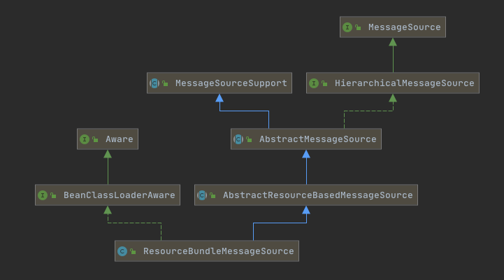

# 060-MessageSource开箱即用实现

[TOC]

## 开箱即用的实现

### ResourceBundleMessageSource-ResourceBundle支持的消息源


```
org.springframework.context.support.ResourceBundleMessageSource
```

基于ResourceBundle + MessageFormat 组合的 MessageSource实现

- 利用ResourceBoundle导入文案(作为存储介质)
- 利用MessageFormat进行文本格式的转换(格式转换)





### ReloadableResourceBundleMessageSource-可reload的实现消息源

可重载Properties + MessageFormat 组合 MessageSource实现

```
org.springframework.context.support.ReloadableResourceBundleMessageSource
```

### StaticMessageSource-静态的MessageSource

